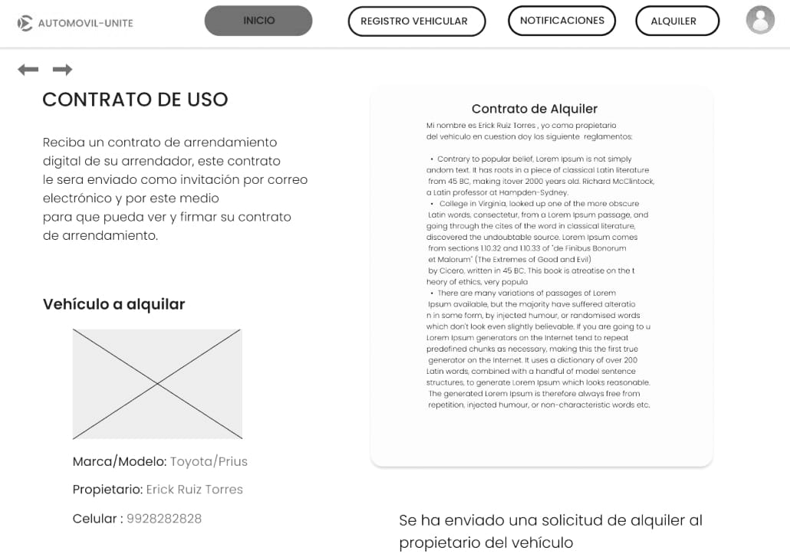
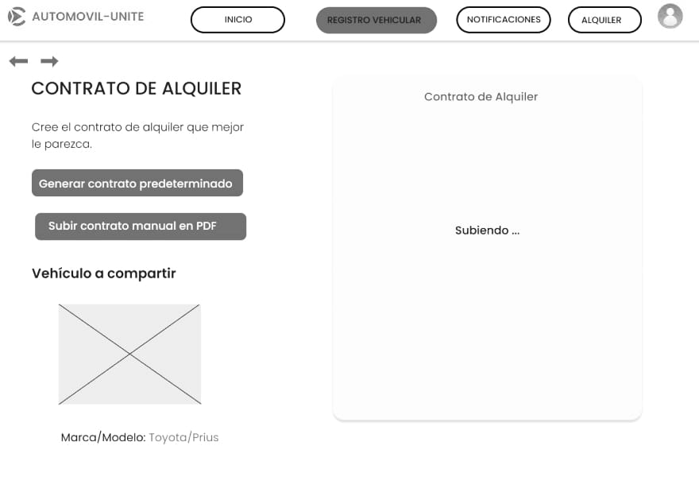
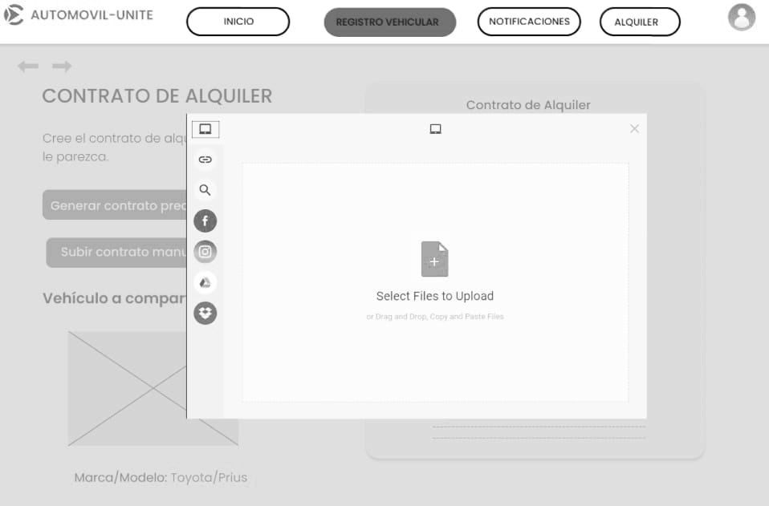
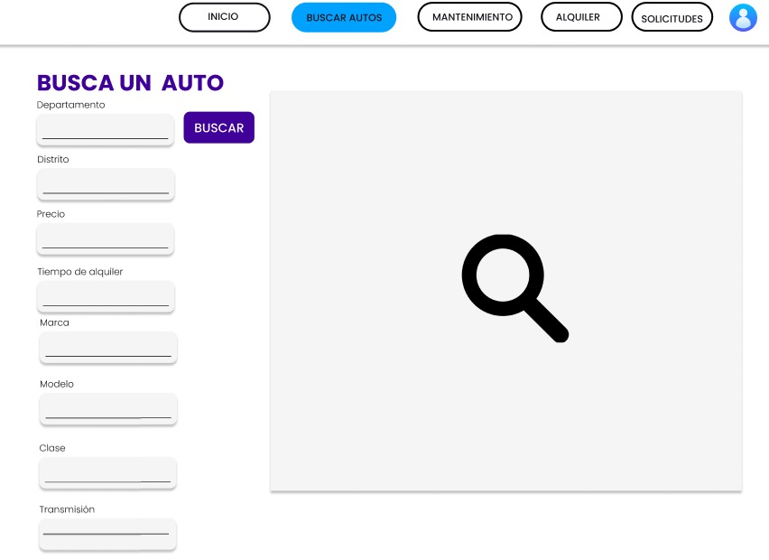
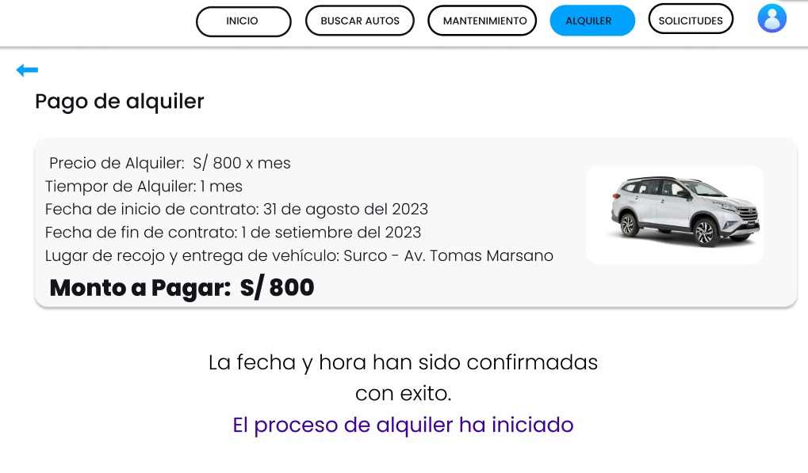
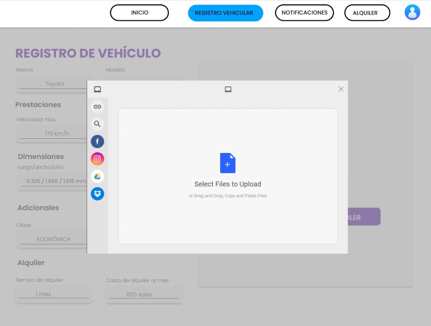

  <h1>Universidad Peruana de Ciencias Aplicadas</h1>
  
  <h2 >Carrera: de Ingeniería de Software</h2>
  <h2 >Ciclo: 2025-01</h2>
   
  <h2 >Curso: Desarrollo de Aplicaciones Open Source </h2>
  <h2 >Sección: 4341</h2>
   
  <h2 >Informe del TB1</h2>
  <h2 >Startup: NovaCode </h2>
  <h2 >Producto: Automovil-Unite </h2>
   
  <h2 >Integrantes:</h2>
  <ul style="list-style: none; padding: 0;">
      <li><h3>Josue Gonzalo Paiva Quispe</h3></li>
      <li><h3>Alejandro Torres Alva</h3></li>

  </ul>
   
  <h4>Abril del 2025</h4>

## Registro de Versiones del Informe

| Versión | Fecha | Autor | Descripción de modificación |
|---------|-------|-------|-----------------------------|
| 0.1     |       |       |                             |

| URL de la organización del proyecto |                      URL del repositorio del reporte                       |
|:-----------------------------------:|:--------------------------------------------------------------------------:|
|             https://github.com/Grupo-4-Open-Source                        |               https://github.com/Grupo-4-Open-Source/Report                |

- [Student Outcome](#student-outcome)

- [Capítulo I: Introducción](#cap1)
    - [1.1. Startup Profile](#11-startup-profile)
        - [1.1.1. Descripción de la Startup](#111-descripción-de-la-startup)
        - [1.1.2. Perfiles de integrantes del equipo](#112-perfiles-de-integrantes-del-equipo)
    - [1.2. Solution Profile](#12-solution-profile)
        - [1.2.1 Antecedentes y problemática](#121-antecedentes-y-problemática)
        - [1.2.2 Lean UX Process](#122-lean-ux-process)
            - [1.2.2.1. Lean UX Problem Statements](#1221-lean-ux-problem-statements)
            - [1.2.2.2. Lean UX Assumptions](#1222-lean-ux-assumptions)
            - [1.2.2.3. Lean UX Hypothesis Statements](#1223-lean-ux-hypothesis-statements)
            - [1.2.2.4. Lean UX Canvas](#1224-lean-ux-canvas)
    - [1.3. Segmentos objetivo](#13-segmentos-objetivo)

- [Capítulo II: Requirements Elicitation & Analysis](#cap2)
    - [2.1. Competidores](#21-competidores)
        - [2.1.1. Análisis competitivo](#211-análisis-competitivo)
        - [2.1.2. Estrategias y tácticas frente a competidores](#212-estrategias-y-tácticas-frente-a-competidores)
    - [2.2. Entrevistas](#22-entrevistas)
        - [2.2.1. Diseño de entrevistas](#221-diseño-de-entrevistas)
        - [2.2.2. Registro de entrevistas](#222-registro-de-entrevistas)
        - [2.2.3. Análisis de entrevistas](#223-análisis-de-entrevistas)
    - [2.3. Needfinding](#23-needfinding)
        - [2.3.1. User Personas](#231-user-personas)
        - [2.3.2. User Task Matrix](#232-user-task-matrix)
        - [2.3.3. User Journey Mapping](#233-user-journey-mapping)
        - [2.3.4. Empathy Mapping](#234-empathy-mapping)
        - [2.3.5. As-is Scenario Mapping](#235-as-is-scenario-mapping)
    - [2.4. Ubiquitous Language](#24-ubiquitous-language)

- [Capítulo III: Requirements Specification](#cap3)
    - [3.1. To-Be Scenario Mapping](#31-to-be-scenario-mapping)
    - [3.2. User Stories](#32-user-stories)
    - [3.3. Impact Mapping](#33-impact-mapping)
    - [3.4. Product Backlog](#34-product-backlog)

- [Capítulo IV: Product Design](#cap4)
    - [4.1. Style Guidelines](#41-style-guidelines)
        - [4.1.1. General Style Guidelines](#411-general-style-guidelines)
        - [4.1.2. Web Style Guidelines](#412-web-style-guidelines)
    - [4.2. Information Architecture](#42-information-architecture)
        - [4.2.1. Organization Systems](#421-organization-systems)
        - [4.2.2. Labeling Systems](#422-labeling-systems)
        - [4.2.3. SEO Tags and Meta Tags](#423-seo-tags-and-meta-tags)
        - [4.2.4. Searching Systems](#424-searching-systems)
        - [4.2.5. Navigation Systems](#425-navigation-systems)
    - [4.3. Landing Page UI Design](#43-landing-page-ui-design)
        - [4.3.1. Landing Page Wireframe](#431-landing-page-wireframe)
        - [4.3.2. Landing Page Mock-up](#432-landing-page-mock-up)
    - [4.4. Web Applications UX/UI Design](#44-web-applications-uxui-design)
        - [4.4.1. Web Applications Wireframes](#441-web-applications-wireframes)
        - [4.4.2. Web Applications Wireflow Diagrams](#442-web-applications-wireflow-diagrams)
        - [4.4.3. Web Applications Mock-ups](#443-web-applications-mock-ups)
        - [4.4.4. Web Applications User Flow Diagrams](#444-web-applications-user-flow-diagrams)
    - [4.5. Web Applications Prototyping](#45-web-applications-prototyping)
    - [4.6. Domain-Driven Software Architecture](#46-domain-driven-software-architecture)
        - [4.6.1. Software Architecture Context Diagram](#461-software-architecture-context-diagram)
        - [4.6.2. Software Architecture Container Diagrams](#462-software-architecture-container-diagrams)
        - [4.6.3. Software Architecture Components Diagrams](#463-software-architecture-components-diagrams)
    - [4.7. Software Object-Oriented Design](#47-software-object-oriented-design)
        - [4.7.1. Class Diagrams](#471-class-diagrams)
        - [4.7.2. Class Dictionary](#472-class-dictionary)
    - [4.8. Database Design](#48-database-design)
        - [4.8.1. Database Diagram](#481-database-diagram)

- [Capítulo V: Product Implementation, Validation & Deployment](#cap5)
    - [5.1. Software Configuration Management](#51-software-configuration-management)
        - [5.1.1. Software Development Environment Configuration](#511-software-development-environment-configuration)
        - [5.1.2. Source Code Management](#512-source-code-management)
        - [5.1.3. Source Code Style Guide & Conventions](#513-source-code-style-guide--conventions)
        - [5.1.4. Software Deployment Configuration](#514-software-deployment-configuration)
    - [5.2. Landing Page, Services & Applications Implementation](#52-landing-page-services--applications-implementation)
        - [5.2.1. Sprint 1](#521-sprint-1)
            - [5.2.1.1. Sprint Planning 1](#5211-sprint-planning-1)
            - [5.2.1.2. Sprint Backlog 1](#5212-sprint-backlog-1)
            - [5.2.1.3. Development Evidence for Sprint Review](#5213-development-evidence-for-sprint-review)
            - [5.2.1.4.  Suite Evidence for Sprint Review](#5214-suite-evidence-for-sprint-review)
            - [5.2.1.5. Execution Evidence for Sprint Review](#5215-execution-evidence-for-sprint-review)
            - [5.2.1.6. Services Documentation Evidence for Sprint Review](#5216-services-documentation-evidence-for-sprint-review)
            - [5.2.1.7. Software Deployment Evidence for Sprint Review](#5217-software-deployment-evidence-for-sprint-review)
            - [5.2.1.8. Team Collaboration Insights during Sprint](#5218-team-collaboration-insights-during-sprint)
        - [5.2.2. Sprint 2](#522-sprint-2)
            - [5.2.2.1. Sprint Planning 2](#5221-sprint-planning-2)
            - [5.2.2.2. Sprint Backlog 2](#5222-sprint-backlog-2)
            - [5.2.2.3. Development Evidence for Sprint Review](#5223-development-evidence-for-sprint-review)
            - [5.2.2.4. Testing Suite Evidence for Sprint Review](#5224-testing-suite-evidence-for-sprint-review)
            - [5.2.2.5. Execution Evidence for Sprint Review](#5225-execution-evidence-for-sprint-review)
            - [5.2.2.6. Services Documentation Evidence for Sprint Review](#5226-services-documentation-evidence-for-sprint-review)
            - [5.2.2.7. Software Deployment Evidence for Sprint Review](#5227-software-deployment-evidence-for-sprint-review)
            - [5.2.2.8. Team Collaboration Insights during Sprint](#5228-team-collaboration-insights-during-sprint)
        - [5.2.3. Sprint 3](#523-sprint-3)
            - [5.2.3.1. Sprint Planning 3](#5231-sprint-planning-3)
            - [5.2.3.2. Sprint Backlog 3](#5232-sprint-backlog-3)
            - [5.2.3.3. Development Evidence for Sprint Review](#5233-development-evidence-for-sprint-review)
            - [5.2.3.4. Testing Suite Evidence for Sprint Review](#5234-testing-suite-evidence-for-sprint-review)
            - [5.2.3.5. Execution Evidence for Sprint Review](#5235-execution-evidence-for-sprint-review)
            - [5.2.3.6. Services Documentation Evidence for Sprint Review](#5236-services-documentation-evidence-for-sprint-review)
            - [5.2.3.7. Software Deployment Evidence for Sprint Review](#5237-software-deployment-evidence-for-sprint-review)
            - [5.2.3.8. Team Collaboration Insights during Sprint](#5238-team-collaboration-insights-during-sprint)
            - [5.2.4. Sprint 4](#524-sprint-4)
            - [5.2.4.1. Sprint Planning 4](#5241-sprint-planning-4)
            - [5.2.4.2. Sprint Backlog 4](#5242-sprint-backlog-4)
            - [5.2.4.3. Development Evidence for Sprint Review](#5243-development-evidence-for-sprint-review)
            - [5.2.4.4. Testing Suite Evidence for Sprint Review](#5244-testing-suite-evidence-for-sprint-review)
            - [5.2.4.5. Execution Evidence for Sprint Review](#5245-execution-evidence-for-sprint-review)
            - [5.2.4.6. Services Documentation Evidence for Sprint Review](#5246-services-documentation-evidence-for-sprint-review)
            - [5.2.4.7. Software Deployment Evidence for Sprint Review](#5247-software-deployment-evidence-for-sprint-review)
            - [5.2.4.8. Team Collaboration Insights during Sprint](#5248-team-collaboration-insights-during-sprint)
    - [5.3. Validation Interviews](#53-validation-interviews)
        - [5.3.1. Diseño de Entrevistas](#531-diseño-de-entrevistas)
        - [5.3.2. Registro de Entrevistas](#532-registro-de-entrevistas)
        - [5.3.3. Evaluaciones según heurísticas](#533-evaluaciones-según-heurísticas)
    - [5.4. Video About-the-Product](#54-video-about-the-product)
- [Conclusiones](#conclusiones)
- [Bibliografía](#bibliografía)
- [Anexos](#anexos)

## Student Outcome

El curso contribuye al cumplimiento del Student Outcome ABET:

**ABET – EAC - Student Outcome 3**

**Criterio:** *Capacidad de comunicarse efectivamente con un rango de audiencias.*
En el siguiente cuadro se describe las acciones realizadas y enunciados de
conclusiones por parte del grupo, que permiten sustentar el haber alcanzado el logro
del ABET – EAC - Student Outcome 3.

<table>
  <tr>
    <th>Criterio específico</th>
    <th>Acciones realizadas</th>
    <th>Conclusiones</th>
  </tr>
  <tr>
    <td>Comunica oralmente con efectividad a diferentes rangos de audiencia.</td>
    <td>
 
 
 
 
    <td>
</td>
  </tr>
  <tr>
    <td>Comunica por escrito con efectividad a diferentes rangos de audiencia.</td>
    <td>
 
 
 
    </td>
    <td>
</td>
  </tr>
</table>

## Capítulo I: Introducción 

### 1.1. Startup Profile
#### 1.1.1. Descripción de la Startup
Automovil-Unite es una plataforma creada por estudiantes de la carrera de Ingeniería de Software de la Universidad Peruana de Ciencias Aplicadas del Perú. Esta estaría facilitando el alquiler de vehículos tanto para propietarios como para usuarios.

Nuestro servicio permite que los propietarios de vehículos registrar y gestionar fácilmente sus flotas, mediante un intuitivo panel de control, los propietarios pueden monitorear el estado de sus vehículos y recibir puntuaciones y comentarios de los usuarios. Además, para los usuarios que desean alquilar podrán buscar vehículos de manera simplificada según sus características. Una vez seleccionado su vehículo ideal, los usuarios pueden reservarlo con fechas de inicio y finalización, realizando pagos de manera seguro y acceder a un historial detallado de reservas donde también podrás compartir tus experiencias a través de reseñas.

**Misión**: Facilitar el acceso al alquiler de vehículos de forma seguro, conectando a propietarios y usuarios mediante una plataforma digital intuitiva.

**Visión**: Ser la plataforma líder de alquiler de vehículos en Lima, reconocido por su confiabilidad y compromiso con una experiencia de usuarios de calidad.

#### 1.1.2. Perfiles de integrantes del equipo

### 1.2. Solution Profile
#### 1.2.1 Antecedentes y problemática

###### What

- ¿Cuál es el problema?

Existe una falta de acceso eficiente y confiable al alquiler de vehículos en Lima. Los usuarios tienen dificultades para encontrar opciones adecuadas a sus necesidades, mientras que los propietarios carecen de canales accesibles y seguros para ofrecer sus vehículos en alquiler.

###### When

- ¿Cuándo sucede el problema?

El problema se da cuando una persona desea alquilar o la otra persona no tiene un contacto para poder alquilar su vehículo por un lugar seguro y así evitar alguna estafa.

###### Where

- ¿Dónde se presenta el problema de negocio?

El problema se manifiesta en Lima Metropolitana, donde el tráfico y la demanda de transporte alternativo se complica, aún más el acceso rápido a servicios de alquiler confiables.

##### Who

- ¿Quiénes están involucrados?

Estarían involucrados los usuarios que necesitan alquilar un vehículo y no encuentran un lugar confiable, y los propietarios de vehículos que desean generar ingresos adicionales alquilando sus autos, pero no tienen una plataforma efectiva para hacerlo.

##### Why

- ¿Por qué se origina el problema?

El problema se da por la falta de una plataforma digitalizada que conecten eficientemente la oferta y demanda de vehículos en alquilar, así como por la desconfianza en los procesos actuales, que suelen ser informales, inseguros o pocos transparentes.

##### How

- ¿Cómo afecta este problema a las personas involucradas?

Esto genera frustración en los usuarios al no encontrar vehículos adecuados, aumenta el riesgo de fraudes o malas experiencias, y limita las oportunidades económicas para propietarios que podrían aprovechar sus vehículos sin uso para generar ingresos.

##### How much

- ¿Cuánto impacto genera el problema en la sociedad?

Aunque no hay un número exacto de problemas afectados por las estafas al momento de la alquilación de vehículos o que los arrendadores de vehículos regresando el choche en pésimas condiciones, estos casos son comunes en Lima debido a la informalidad del sector.

#### 1.2.2 Lean UX Process
##### 1.2.2.1. Lean UX Problem Statements

Los usuarios en Lima que necesitan alquilar vehículos tienen dificultades para encontrar opciones confiables, seguras y acordes a sus necesidades, debido a la informalidad del mercado, la falta de filtros personalizados, y procesos poco transparentes. Esto genera desconfianza y experiencia negativas tanto en arrendadores como en propietarios.

##### 1.2.2.2. Lean UX Assumptions
###### **Supuestos del Negocio:**

**Creo que mis usuarios necesitan** una aplicación web que funcionaria como una interfaz para los arrendadores y los propietarios de vehículos más confiable.

**Esas necesidades se pueden resolver** mediante una plataforma digital que ofrezca filtros personalizados, pagos seguros y un panel de reseñas para generar confianza.

**Mis clientes iniciales** serán personas entre 25 y 45 años que residan en Lima Metropolitana, que no cuentan con vehículo propio, pero necesitan uno de forma temporal; y también propietarios con 1 o más vehículos en desuso que deseen generar ingresos extra.

**El valor #1 que el cliente requiere de mi servicio** es la confianza y seguridad en el proceso de alquiler.

**El cliente también puede obtener estos servicios adicionales** como el historial de reservas, clasificaciones y reseñas, soporte ate incidentes, opciones de seguro y promociones en temporadas específicas.

**Voy a adquirir a mis clientes a través de** publicidad en redes sociales como Instagram, Facebook y TikTok. Además, se podría publicitar en talleres, grifos o negocios locales.

**Mi competencia en el mercado** serán empresas tradicionales de alquiler de autos y también alquileres informales por vía Facebook Marketplace o grupos de WhatsApp.

**Los venceremos debido a** una experiencia digital centrada en el usuarios, precios más accesibles y mayor variedad de vehículos.

**Mis mayores riesgos de producto** son la baja confianza inicial entre usuarios y propietarios.

**Resolveremos esto** mediante una verificación de identidad y contratos digitales.

###### **Supuestos del Cliente:**

**¿Quién es el cliente?**

Personas entre 25 y 45 años residentes en Lima Metropolitana.

**¿Dónde encaja nuestro producto en su vida?**

Cuando necesiten independencia y comodidad para desplazarse y también para generar un ingreso adicional mediante un vehículo que normalmente estaría en desuso.

**¿Qué problemas soluciona nuestro producto?**

Para los usuarios solucionaría la dificultad para encontrar vehículos adecuados al precio y falta de confianza en alquileres informales.

Para los propietarios tendrían una plataforma que les permita alquilar con seguridad, y ya no habría riesgos de fraudes o daños al vehículo.

**¿Cuándo y cómo se utiliza nuestro producto?**

Se utilizaría cuando el cliente necesita alquilar un vehículo por días o fines de semana, también cuando un propietario quiera utilizar la app para registrar su vehículo

**¿Qué características son importantes?**

Filtros avanzados en la búsqueda de vehículos, reservas con fechas y horas específicas, pago seguro dentro de la plataforma y un sistema de calificaciones.

**¿Cómo debería verse y comportarse nuestro producto?**

Debe ser intuitivo, confiable y rápido, para que así se vea visualmente limpio, fácil de navegar y accesible desde cualquier dispositivo móvil.

##### 1.2.2.3. Lean UX Hypothesis Statements
###### **Hipótesis 1:**

**Creemos que** los usuarios que buscan alquilar un vehículo necesitan una plataforma confiable y con filtros personalizados para lograr encontrar opciones adecuadas de forma rápida y segura.

**Sabremos que esto es cierto cuando veamos** al menos un 60% de los usuarios completan una reserva después de su primera búsqueda.

###### **Hipótesis 2:**

**Creemos que** los propietarios de vehículos necesitan una herramienta para gestionar sus autos en alquiler, ver su historial y calificaciones para lograr mayor confianza y control sobre transacciones.

**Sabremos que esto es cierto cuando veamos** al menos más del 50% de los propietarios registrados publican más de un vehículo o lo mantienen activo al menos por 3 meses.

###### **Hipótesis 3:**

**Creemos que** ambos grupos necesitan una sección de reseñas y calificaciones para lograr una relación de confianza mutua.

**Sabremos que esto sea cierto cuando veamos** al menos más del 70% de los usuarios y propietarios dejan una reseña después de cada alquiler.

##### 1.2.2.4. Lean UX Canvas

## Capítulo II: Requirements Elicitation & Analysis 

### 2.1. Competidores
Previo al desarrollo de la aplicacion, hicimos una busqueda de las opciones que ya existen en el mercado, para ver que es lo que ofrecen y como podemos diferenciarnos de ellos.
- **Kayak:**
Kayak es una de las plataformas de búsqueda de viajes más grandes del mundo. Permite a los usuarios buscar y comparar precios de vuelos, hoteles y alquiler de coches en una sola plataforma. Kayak también ofrece herramientas para planificar viajes, como alertas de precios y recomendaciones personalizadas.

- **Peru Rent A Car:**
Esta plataforma se especializa en el alquiler de coches en Perú. Ofrece una amplia gama de vehículos y opciones de alquiler, así como información sobre destinos turísticos en Perú. La plataforma también permite a los usuarios comparar precios y reservar coches en línea.

- **Budget Car Rental Peru:**
A diferencia de Peru Rent A Car, Budget Car Rental es una empresa internacional que ofrece servicios de alquiler de coches en Perú. La plataforma permite a los usuarios buscar y comparar precios de coches de alquiler en diferentes ubicaciones y reservar en línea. Budget Car Rental también ofrece opciones de alquiler a largo plazo y programas de fidelización.

#### 2.1.1. Análisis competitivo
#### 2.1.2. Estrategias y tácticas frente a competidores.
### 2.2. Entrevistas.
#### 2.2.1. Diseño de entrevistas

##### Segmento 1 (Dueño de vehiculo):
###### Preguntas de Información General:
1. ¿Cuál es tu nombre?
2. ¿Cuántos años tienes?
3. ¿En qué distrito vives?
4. ¿A qué te dedicas actualmente?

#### Preguntas sobre el alquiler de sus vehículos:
5. ¿Que tipo de documento exiges para proceder con el alquiler?
6. ¿Que tipo de vehiculo ofreces para el alquiler?
7. ¿Cual es la cantidad minima y maxima de tiempo que permites alquilar tu vehiculo?
8. ¿Como llevas la cuenta de todos tus vehiculos, tanto alquilados como sin alquilar?}

#### Preguntas sobre la plataforma:
9. ¿Que tipo de plataforma usas para ofrecer tu vehiculo?
10. ¿En que dispositivos accedes a dichas plataformas?
11. ¿Consideras que las aplicaciones te dan facilidades para identificar clientes confiables?
13. ¿Estarias dispuesto a ofrecer tus vehiculos en una nueva plataforma que te permita consultar reseñas de un cliente previo al alquiler?
14. ¿Estarias dispuesto a ofrecer tus vehiculos en una nueva plataforma que te ofrezca un panel donde registrar tus vehiculos y consultar su estado?
15. ¿Estarias dispuesto a ofrecer tus vehiculos en una nueva plataforma que te permita reseñar a los clientes?
##### Segmento 2 (Usuario que busca alquilar un vehiculo):
###### Preguntas de Información General:
1. ¿Cuál es tu nombre?
2. ¿Cuántos años tienes?
3. ¿En qué distrito vives?
4. ¿A qué te dedicas actualmente?

#### Preguntas sobre el alquiler de sus vehículos:
5. ¿Que tipo de documento te exigen para proceder con el alquiler?
6. ¿Que tipo de vehiculo buscas alquilar?
7. ¿Que documentos te suelen pedir previo al alquiler del vehiculo?
8. ¿Que restricciones se te imponen previo al alquiler del vehiculo?
9. 
#### Preguntas sobre la plataforma:
9. ¿Que tipo de plataforma usas para buscar vehiculos?
10. ¿En que dispositivos accedes a dichas plataformas?
11. ¿Consideras que las aplicaciones te dan facilidades para identificar vehiculos o arrendadores confiables?
12. ¿Estarias dispuesto a migrar a una nueva plataforma que te permita consultar reseñas de arrendadores antes de alquilar?
13. ¿Estarias dispuesto a usar una nueva plataforma que te permita reservar un vehiculo en unas fechas concretas antes de alquilarlo?
14. ¿Estarias dispuesto a usar una nueva plataforma que te permita reseñar a los arrendadores?

## Capítulo IV: Product Design
### 4.1. Style Guidelines.
En esta sección, presentaremos nuestro plan para el diseño, estilo y apariencia de nuestra página web y las páginas de nuestra aplicación. Nuestro objetivo es garantizar que los usuarios disfruten de una interfaz intuitiva y amigable. Para lograrlo, hemos optado por utilizar elementos visuales que sean claros y estéticamente agradables, y hemos establecido restricciones para evitar la inclusión de gráficos poco atractivos.
#### 4.1.1. General Style Guidelines.
**Branding:** Creamos un logotipo distintivo y memorable que representa la identidad de nuestra plataforma de alquiler de autos entre particulares. Incorporamos elementos visuales relacionados con el mundo automotriz, como coches, colores asociados con la confianza y la movilidad, para reflejar el tema del alquiler de vehículos.

<td colspan="1" rowspan="6">

#### 4.1.2. Web Style Guidelines.
**Tipografía**
La tipografía seleccionada es Open Sans, que será utilizada en todos los textos de la aplicación. Este estilo tipográfico ofrece una excelente legibilidad y una apariencia moderna. El tamaño de fuente debe ajustarse automáticamente según el dispositivo, para asegurar que tanto en dispositivos móviles como en escritorio, la lectura sea óptima.

<td colspan="1" rowspan="6">

**Colores**
El esquema de colores de la aplicación está basado en tres tonos principales, cuidadosamente seleccionados para dar una apariencia limpia y profesional.

<td colspan="1" rowspan="6">

-**Color Primario:**
Azul Brillante (#3083FF)
Este color será el más predominante en el diseño. Ideal para encabezados, enlaces principales, botones destacados y navegación. Aporta una sensación de tecnología, confianza y dinamismo.

-**Colores Secundarios:**
Azul Claro (#E0ECFF)
Utilizado para fondos suaves, tarjetas informativas o secciones secundarias del diseño. Este tono sirve para equilibrar visualmente el diseño sin competir con el color primario.

Azul Oscuro (#112E59)
Ideal para textos destacados, encabezados o fondos secundarios que requieren mayor contraste. También puede reforzar el color primario en componentes más formales o elegantes.

-**Colores Neutros (Complementarios):**
Gris Claro (#EBECF1)
Se empleará en fondos, bordes, líneas divisorias o componentes secundarios que no deben destacar. Perfecto para mantener una jerarquía visual limpia.

Gris Muy Claro (#E1E2E9)
Útil para fondos de formularios, tarjetas o contenedores. Ayuda a mantener el diseño minimalista y ordenado.

**Texto**
Todos los textos de la aplicación serán de color negro, para asegurar un alto contraste y mejorar la legibilidad en cualquier tipo de fondo.

**Tarjetas de Carros**
Las tarjetas están diseñadas para mostrar de forma clara y visual la información más relevante de cada vehículo disponible para alquiler. Incluyen:

- Imagen del auto como elemento principal.

- Nombre del modelo y precio por día destacados.

- Distribución limpia y espaciada para facilitar la lectura.

<td colspan="1" rowspan="6">

**Botones**
Los botones siguen una línea visual coherente con el diseño general:

- Botón primario en azul brillante (#3083FF) para llamadas a la acción como “Reservar” o “Ver más”.

- Se destacan visualmente con buen contraste sobre fondos claros.

- Estado hover sugerido con efectos de sombra o cambio de tonalidad para mejorar la interactividad.

<td colspan="1" rowspan="6">

**Iconografía**
La iconografía acompaña la experiencia del usuario reforzando el significado visual de acciones o datos:

- Estilo lineal y moderno.

- Colores: azul oscuro (#112E59) para elementos pasivos y azul brillante para acciones activas.

- Uso propuesto en: ubicación del vehículo, tipo de transmisión, combustible, fecha de alquiler, etc.

<td colspan="1" rowspan="6">

### 4.2. Information Architecture.
El objetivo principal de la arquitectura de la información es crear una estructura lógica y amigable para el usuario que les permita encontrar, comprender y navegar el contenido de manera eficiente

#### 4.2.1. Organization Systems.

Como grupo, hemos llegado a la conclusión de adoptar un formato jerárquico estándar, similar al enfoque organizativo que se encuentra en la mayoría de las páginas. Este enfoque de formato puede ser descrito como:

**Home/Header:** En esta sección se encuentra el nombre "Automovil Unite", el logo y la navegación principal del sitio. Incluye también una imagen destacada de un automóvil y un mensaje introductorio junto con un botón de llamada a la acción.

**Cómo funciona:** Esta sección explica el proceso de uso de la plataforma Automovil Unite, detallando los pasos que siguen los usuarios desde que ingresan hasta que completan una transacción o servicio.

**¿Por qué elegirnos?:** Aquí se presentan las ventajas competitivas y beneficios principales de utilizar Automovil Unite frente a otras alternativas del mercado automotriz.

**Carros populares:** Esta sección muestra una selección de vehículos destacados o más buscados en la plataforma, probablemente con imágenes, características básicas y posiblemente precios.

**Testimonios:** Contiene comentarios y valoraciones de clientes satisfechos que han utilizado la plataforma, aportando credibilidad y confianza a potenciales nuevos usuarios.

**Contacto/Footer:** Incluye información para comunicarse con Automovil Unite, enlaces a redes sociales y posiblemente un formulario de contacto o suscripción.

#### 4.2.2. Labeling Systems.
Los "Labeling Systems" (Sistemas de Etiquetado) son un conjunto de prácticas y estrategias utilizadas para asignar nombres, etiquetas o títulos descriptivos a elementos y secciones dentro de una interfaz digital, como un sitio web, una aplicación móvil o una plataforma en línea.

  <strong>Landing page</strong>

Resulta vital que las etiquetas presentes en la landing page no difieran de las que se describen en la estructura que previamente hemos mencionado. Este enfoque se deriva de la facilidad de navegación que nuestra landing page ofrece, gracias a su diseño de simple. Además, no se tiene la intención de incorporar múltiples opciones que requerirían.

#### 4.2.3. SEO Tags and Meta Tags
Las SEO tags y meta tags son elementos HTML utilizados en el código de una página web para proporcionar información adicional sobre el contenido de la página a los motores de búsqueda y a los usuarios.

  <strong>Landing page</strong>

**SEO Tags:**

* Title Tag:
~~~
<title>Automovil-Unit</title>
~~~

* Meta Description Tag:
~~~
<meta name="description" content="Encuentra, reserva y alquila un coche fácilmente. Consigue un coche donde y cuando lo necesites con tu dispositivo iOS y Android.">
~~~

**Meta Tags:**

* Charset Meta Tag:
~~~
<meta charset="UTF-8">
~~~

* Viewport Meta Tag:
~~~
<meta name="viewport" content="width=device-width, initial-scale=1.0">
~~~

* Author Meta Tag:
~~~
<meta name="author" content="Automovil-Unite">
~~~

* Keywords Meta Tag (opcional):
~~~
<meta name="keywords" content="Alquiler de autos,
Rentar vehículos,
Arriendo de coches,
Autos de alquiler,
Alquiler de carros,
Vehículos en alquiler,
Rent a car Lima">
~~~

#### 4.2.4. Searching Systems
La landing page actual no incluye un sistema de búsqueda interna (dado que es una página estática enfocada en conversión), por otro lado la aplicación web si dispone de iteraciones: una barra de búsqueda para que los usuarios puedan acceder rápidamente a información específica, como el tipo de vehículos disponibles o servicios adicionales. Para garantizar que los usuarios encuentren lo que necesitan de manera rápida y eficiente, las secciones están diseñadas para ser escaneables con títulos y subtítulos claros. La navegación es sencilla, lo que reduce la necesidad de una barra de búsqueda avanzada en esta primera etapa.

#### 4.2.5. Navigation Systems
Los "Navigation Systems" (Sistemas de Navegación) se refieren a las estrategias y elementos utilizados en un diseño web o interfaz para guiar a los usuarios a través de la estructura y el contenido de un sitio web, aplicación u otra plataforma digital. Estos sistemas están diseñados para hacer que la navegación sea más intuitiva, eficiente y agradable para los usuarios, permitiéndoles encontrar la información que buscan y moverse entre diferentes secciones con facilidad.

  <strong>Landing page</strong>

**1. Barra de Menú Superior:** En la parte superior de la página, encontrarás una barra de menú que te permite navegar directamente a las diferentes secciones clave. Los enlaces en el menú te llevarán a: **Home**, **How it works**, **Why Choose Us**, **Popular Cars**, **Testimonials**

**2. Navegación a través de Botones:** En la sección de **"Home"**, un botón **"Regístrate"** te llevará directamente a la web application. Esto garantiza una navegación rápida hacia la acción principal que deseamos que los usuarios tomen.

**3. Footer - Navegación Rápida:** En la parte inferior de la página, el footer incluye una sección de navegación rápida. Aquí encontrarás botones que te llevarán a las secciones clave, como "Home", "How it works", "Why Choose Us", "Popular Cars" y "Testimonials".

**4. Scroll Suave:** Implementa un scroll suave para que, al hacer clic en un enlace del menú o un botón en el footer, los usuarios sean llevados suavemente a la sección correspondiente en lugar de un salto abrupto.

**5. Navegación a Través de Carrusel:** En la sección de "Popular Cars" y "Testimonials" se usa un carrusel para resaltar diferentes ventajas y para que los usuarios puedan explorar de manera ordenada.

### 4.3. Landing Page UI Design
#### 4.3.1. Landing Page Wireframes

<td colspan="1" rowspan="6">

<td colspan="1" rowspan="6">

<td colspan="1" rowspan="6">

<td colspan="1" rowspan="6">

<td colspan="1" rowspan="6">

<td colspan="1" rowspan="6">

#### 4.3.2. Landing Page Mock-up

<td colspan="1" rowspan="6">

<td colspan="1" rowspan="6">

<td colspan="1" rowspan="6">

<td colspan="1" rowspan="6">

<td colspan="1" rowspan="6">

<td colspan="1" rowspan="6">

### 4.4. Web Applications UX/UI Design
#### 4.4.1. Web Applications Wireframes

**NOTA:** El usuario tiene la opción de elegir su tipo de registro, pudiendo ser Arrendatario o Propietario.

**ARRENDATARIO (Persona que alquilará un vehículo):**

**PERFIL DE USUARIO:** En esta sección, el usuario podrá visualizar su información personal como nombre, apellido, número de celular, correo electrónico y la cantidad de autos que ha alquilado. También tendrá la posibilidad de cambiar su foto de perfil mediante el botón Cambiar foto de perfil, actualizar sus datos con el botón Actualizar Datos y cerrar sesión en su cuenta presionando el botón Cerrar Sesión.

<td colspan="1" rowspan="6">

<td colspan="1" rowspan="6">

<td colspan="1" rowspan="6">

<td colspan="1" rowspan="6">

El botón más relevante en esta sección es el de *Subir documentos de Antecedentes Penales*. Al hacer clic en este botón, el usuario podrá cargar desde su computadora los archivos requeridos para validar su información. Una vez completada la carga, el botón cambiará su nombre a *Actualizar documentos de Antecedentes Penales*.

<td colspan="1" rowspan="6">

<td colspan="1" rowspan="6">

**LOGIN:** En esta sección, el usuario deberá iniciar sesión haciendo clic en el botón *Acceder*. En caso de no estar registrado, deberá seleccionar el botón *Inscríbete* para crear una cuenta.

<td colspan="1" rowspan="6">

**REGISTRO:** En esta sección, los usuarios que aún no se han registrado deberán completar sus datos y hacer clic en el botón *Registrarse como arrendatario* para crear su cuenta.

<td colspan="1" rowspan="6">

**INICIO:** En esta sección, el usuario encontrará todas las opciones disponibles dentro de la plataforma, así como herramientas adicionales que puedan serle útiles, como la visualización de notificaciones recientes. También estará disponible la opción *Compartir tu auto*, que redirige a una ventana dedicada a la búsqueda de vehículos para alquilar. Las funcionalidades accesibles desde aquí incluyen *Registro vehicular*, *Notificaciones* y *Alquiler*.

<td colspan="1" rowspan="6">

**BUSCAR AUTOS:** En esta sección, el usuario podrá aplicar filtros según sus preferencias para encontrar el tipo de auto que desea alquilar. Los criterios a ingresar incluyen ubicación, precio, duración del alquiler, marca, modelo, clase y tipo de transmisión. Una vez completados los campos, deberá hacer clic en el botón *Buscar* para iniciar la búsqueda. Los resultados mostrarán la información del vehículo, los datos del propietario y el estado del anuncio (Disponible o No Disponible). Además, dentro de los resultados estará disponible el botón *Ver contrato de alquiler*.

<td colspan="1" rowspan="6">

El usuario deberá revisar el contrato de alquiler que ha sido publicado por el propietario del vehículo. Si, tras verificarlo, decide continuar con el proceso, deberá generar su firma digital haciendo clic en el botón *Generar firma digital* y luego presionar el botón *Solicitar Alquiler* para enviar la solicitud correspondiente al propietario con el fin de concretar el alquiler.

<td colspan="1" rowspan="6">

<td colspan="1" rowspan="6">

<td colspan="1" rowspan="6">

**MANTENIMIENTO:** En esta sección, el usuario podrá comunicarse directamente con el propietario del vehículo a través de un mensaje enviado a su correo electrónico, con el fin de reportar algún problema o hacer una sugerencia. Para ello, primero deberá buscar al titular usando el botón *Buscar*. También tiene la opción de adjuntar imágenes haciendo clic en *Agregar fotos*. Luego de completar los datos solicitados, deberá presionar el botón *Enviar*.

<td colspan="1" rowspan="6">

<td colspan="1" rowspan="6">

<td colspan="1" rowspan="6">

<td colspan="1" rowspan="6">

**SOLICITUDES:** En esta sección, el usuario podrá consultar el estado de sus solicitudes de alquiler, ya sea si están en espera, han sido aceptadas o rechazadas por el propietario del vehículo. En caso de que la solicitud haya sido aceptada, el usuario tendrá la opción de hacer clic en el botón *Pagar*.

<td colspan="1" rowspan="6">

<td colspan="1" rowspan="6">

**ALQUILER:** En esta sección, el usuario tendrá acceso a toda la información relacionada con los procesos de alquiler que ha realizado. Podrá visualizar cada vehículo que haya solicitado y, si la solicitud fue aceptada, tendrá la opción de presionar el botón *Pagar*. Además, si desea añadir otro vehículo al proceso, podrá hacerlo haciendo clic en el botón *Agregar otro vehículo*.

<td colspan="1" rowspan="6">

<td colspan="1" rowspan="6">

<td colspan="1" rowspan="6">

Al hacer clic en el botón *Pagar*, se abrirá una nueva ventana para realizar el pago. En esta sección, se ofrecerá la opción de pago en efectivo. También se mostrará información detallada sobre el precio del alquiler, la duración del alquiler, la fecha de inicio y fin del contrato, así como el lugar de recogida del vehículo.

Una vez que el usuario presione el botón *Confirmar hora de alquiler*, aparecerá una ventana de *Confirmación de Pago*.

<td colspan="1" rowspan="6">

<td colspan="1" rowspan="6">

**ARRENDADOR (Persona que comparte su auto para alquiler)**

**PERFIL DE USUARIO:** En esta sección, el usuario podrá visualizar su información personal, como nombre, apellido, número de celular, correo electrónico y la cantidad de vehículos compartidos. También tendrá la opción de cambiar su foto de perfil haciendo clic en el botón *Cambiar foto de perfil*, actualizar sus datos presionando el botón *Actualizar Datos* y cerrar sesión en su cuenta mediante el botón *Cerrar Sesión*.

<td colspan="1" rowspan="6">

<td colspan="1" rowspan="6">

<td colspan="1" rowspan="6">

<td colspan="1" rowspan="6">

**LOGIN:** Aquí el usuario debera iniciar sesión presionando el boton Acceder , si no esta registrado, debera presionar el botón Inscríbete.

<td colspan="1" rowspan="6">

**REGISTRO:** En esta sección, el usuario que aún no se haya registrado deberá completar sus datos y hacer clic en el botón *Registrarse como arrendatario* para crear su cuenta.

<td colspan="1" rowspan="6">

**INICIO:** En esta sección, el usuario encontrará todas las opciones disponibles en la plataforma, además de herramientas adicionales que podrían ser útiles, como la visualización de notificaciones recientes. Dentro de esta ventana, también estará la opción *Compartir tu auto*, que redirige a otra sección destinada a la búsqueda de vehículos para alquilar. Las opciones accesibles incluyen *Registro vehicular*, *Notificaciones* y *Alquiler*.

<td colspan="1" rowspan="6">

**REGISTRO DE VEHÍCULO:** En esta sección, el usuario podrá registrar el vehículo que desea compartir. Los datos a ingresar incluyen marca, modelo, velocidad máxima, consumo, dimensiones (largo, ancho, alto), peso, clase, transmisión, tiempo de alquiler, costo de alquiler mensual y lugar de recogida del vehículo. Una vez completados los campos, el usuario deberá presionar el botón *Crear contrato de alquiler* para activar la opción de *Registrar*.

<td colspan="1" rowspan="6">

Al hacer clic en el botón *Crear contrato de alquiler*, se abrirá una nueva ventana en la cual el usuario podrá elegir entre presionar el botón *Generar contrato predeterminado* o *Subir contrato manual en PDF*. Al seleccionar *Generar contrato predeterminado*, se creará automáticamente un contrato con condiciones generales. Después de generarlo, el usuario deberá hacer clic en el botón *Subir contrato* para completar el proceso.

<td colspan="1" rowspan="6">

<td colspan="1" rowspan="6">

<td colspan="1" rowspan="6">

Al hacer clic en *Subir contrato manual en PDF*, se abrirá una ventana donde el usuario podrá cargar los documentos en formato PDF. Además, se generará automáticamente un contrato predeterminado con condiciones generales. Una vez generado el contrato, el usuario deberá presionar el botón *Subir contrato* para finalizar el proceso.

<td colspan="1" rowspan="6">

<td colspan="1" rowspan="6">

Después de seleccionar cualquiera de las dos opciones, aparecerá una ventana con un botón *Regresar al registro*, que servirá como redireccionamiento a la ventana principal del *Registro de Vehículo*.

<td colspan="1" rowspan="6">

**NOTIFICACIONES:** En esta sección, el usuario podrá ver las notificaciones de las solicitudes que los arrendatarios hayan generado. Al hacer clic en una notificación, se mostrarán los detalles de la solicitud correspondiente.

<td colspan="1" rowspan="6">

**ALQUILER:** En esta sección se mostrarán todos los autos que se hayan compartido. También se podrá consultar el estado del alquiler, un botón para eliminar la publicación y, si el alquiler ya está marcado como *Pagado*, el usuario podrá ver la hora de recogida del vehículo indicada por el arrendatario. Además, estará disponible el botón *Afiliar cuenta Banco con MODO*, que permitirá al usuario vincular una cuenta bancaria, facilitando así el proceso de verificación de pagos.

<td colspan="1" rowspan="6">

<td colspan="1" rowspan="6">

<td colspan="1" rowspan="6">

Al hacer clic en el cuadro del auto compartido, se mostrarán todas las solicitudes que se hayan revisado para ese vehículo. El usuario podrá revisar cada solicitud. Al seleccionar una solicitud, aparecerán los datos de la persona que desea alquilar el auto. Dentro de esta ventana, el propietario del vehículo podrá consultar los antecedentes penales del arrendatario presionando el botón *Verificar Antecedentes Penales*. Una vez verificado, se indicará al lado del botón si el documento fue *Aceptado* o *Rechazado*.

<td colspan="1" rowspan="6">

<td colspan="1" rowspan="6">

<td colspan="1" rowspan="6">

En esta ventana también estarán disponibles los botones *Aceptar Alquiler* y *Rechazar Alquiler*, donde el propietario del vehículo podrá seleccionar, según la verificación realizada, si desea o no alquilar el vehículo a esa persona. Si el alquiler es aceptado, al presionar el botón *Aceptar Alquiler* aparecerá el mensaje *Estado de Pago pendiente*, lo que indica que el arrendatario aún no ha realizado el pago. Si el mensaje muestra *Estado de Pago Pagado*, significa que el arrendatario ya ha completado el pago del alquiler.

<td colspan="1" rowspan="6">

<td colspan="1" rowspan="6">

<td colspan="1" rowspan="6">

#### 4.4.2. Web Applications Wireflow Diagrams
A continuación se muestra una imagen:

<td colspan="1" rowspan="6">

- **Login**

<td colspan="1" rowspan="6">

- **Registro**

<td colspan="1" rowspan="6">

- **Buscar autos**

<td colspan="1" rowspan="6">

- **Alquiler**

<td colspan="1" rowspan="6">

- **Mantenimiento**

<td colspan="1" rowspan="6">

- **Solictudes**

<td colspan="1" rowspan="6">

- **Perfil de usuario**

<td colspan="1" rowspan="6">

#### 4.4.3. Web Applications Mock-ups

**ARRENDATARIO (Persona que va a alquilar un auto)**

- **Login**

<td colspan="1" rowspan="6">

- **Registro**

<td colspan="1" rowspan="6">

- **Buscar autos**

<td colspan="1" rowspan="6">

<td colspan="1" rowspan="6">

<td colspan="1" rowspan="6">

<td colspan="1" rowspan="6">

<td colspan="1" rowspan="6">

<td colspan="1" rowspan="6">

- **Alquiler**

<td colspan="1" rowspan="6">

<td colspan="1" rowspan="6">

<td colspan="1" rowspan="6">

- **Solicitudes**

<td colspan="1" rowspan="6">

<td colspan="1" rowspan="6">

- **Mantenimiento**

<td colspan="1" rowspan="6">

<td colspan="1" rowspan="6">

<td colspan="1" rowspan="6">

<td colspan="1" rowspan="6">

<td colspan="1" rowspan="6">

<td colspan="1" rowspan="6">

- **Perfil de usuario**

<td colspan="1" rowspan="6">

<td colspan="1" rowspan="6">

<td colspan="1" rowspan="6">

<td colspan="1" rowspan="6">

<td colspan="1" rowspan="6">

<td colspan="1" rowspan="6">

<td colspan="1" rowspan="6">

**ARRENDADOR (Persona que comparte su auto para alquiler)**

- **Login**

<td colspan="1" rowspan="6">

- **Registro**

<td colspan="1" rowspan="6">

- **Inicio**

<td colspan="1" rowspan="6">

- **Registro del vehículo**

<td colspan="1" rowspan="6">

<td colspan="1" rowspan="6">

<td colspan="1" rowspan="6">

<td colspan="1" rowspan="6">

<td colspan="1" rowspan="6">

<td colspan="1" rowspan="6">

<td colspan="1" rowspan="6">

<td colspan="1" rowspan="6">

<td colspan="1" rowspan="6">

<td colspan="1" rowspan="6">

- **Alquiler**

<td colspan="1" rowspan="6">

<td colspan="1" rowspan="6">

<td colspan="1" rowspan="6">

<td colspan="1" rowspan="6">

<td colspan="1" rowspan="6">

<td colspan="1" rowspan="6">

<td colspan="1" rowspan="6">

- **Notificaciones**

<td colspan="1" rowspan="6">

- **Perfil de usuario**

<td colspan="1" rowspan="6">

<td colspan="1" rowspan="6">

<td colspan="1" rowspan="6">

<td colspan="1" rowspan="6">

<td colspan="1" rowspan="6">

#### 4.4.4. Web Applications User Flow Diagrams

**ARRENDATARIO (Persona que va a alquilar un auto)**

**Inicio de sesión**

<td colspan="1" rowspan="6">

**Objetivo del usuario:** Como usuario, quiero poder iniciar sesión de forma fácil y rápida.  
**Caminos felices:** El usuario inicia sesión ingresando su correo y contraseña.  
**Caminos no felices:** El usuario intenta iniciar sesión sin completar los campos obligatorios.

**Registro**

<td colspan="1" rowspan="6">

**Objetivo del usuario:** Como usuario, quiero registrarme y poder acceder a la plataforma.  
**Caminos felices:** El usuario se registra ingresando su correo, nombre, apellido, número de teléfono, país y contraseña.  
**Caminos no felices:** El usuario intenta registrarse sin llenar los campos necesarios.

**Inicio Principal**

<td colspan="1" rowspan="6">

**Objetivo del usuario:** Como usuario, quiero acceder fácilmente a las opciones para utilizar todas las funciones que ofrece la plataforma.  
**Caminos felices:** El usuario, al iniciar la plataforma, ve en la parte superior las diferentes opciones disponibles.  
**Caminos no felices:** El usuario hace clic en una herramienta externa de la plataforma, como un anuncio de accesorios para conducir.

**Buscar autos**

<td colspan="1" rowspan="6">

**Objetivo del usuario:** Como usuario, quiero poder buscar cualquier vehículo de mi interés.  
**Caminos felices:** El usuario puede filtrar la búsqueda para obtener mejores resultados.  
**Caminos no felices:** El usuario consulta el contrato publicado por el propietario.

**Mantenimiento**

<td colspan="1" rowspan="6">

**Objetivo del usuario:** Como usuario, quiero poder enviar mensajes al propietario del vehículo para reportar problemas o sugerencias.  
**Caminos felices:** El usuario también puede adjuntar fotos para proporcionar detalles adicionales.  
**Caminos no felices:** El mensaje llega tanto al correo del propietario como a su sección de notificaciones. Para una mejor comunicación, el usuario debería llamarlo por teléfono.

**Alquiler**

<td colspan="1" rowspan="6">

**Objetivo del usuario:** Como usuario, quiero poder ver las solicitudes de alquiler y realizar el pago del alquiler.  
**Caminos felices:** El usuario puede pagar el alquiler tras la aceptación, ya sea en efectivo o en línea.  
**Caminos no felices:** El usuario necesita registrar sus datos bancarios para realizar el pago correspondiente.

**Solicitudes**

<td colspan="1" rowspan="6">

**Objetivo del usuario:** Como usuario, quiero poder ver el estado de las solicitudes que he enviado.  
**Caminos felices:** El usuario puede ver el estatus de su solicitud y realizar el pago al presionar el botón *Pagar*.  
**Caminos no felices:** El usuario puede volver a la página anterior presionando la flecha superior izquierda.

**Perfil del usuario**

<td colspan="1" rowspan="6">

**Objetivo del usuario:** Como usuario, quiero ver mis datos, actualizarlos y cargar mis documentos de antecedentes penales fácilmente.  
**Caminos felices:** El usuario puede actualizar sus datos o cambiar su foto de perfil.  
**Caminos no felices:** El usuario necesita subir sus documentos de antecedentes penales.

**ARRENDADOR**

**Inicio de sesión**

<td colspan="1" rowspan="6">

**Objetivo del usuario:** Como usuario, quiero poder iniciar sesión de forma fácil y rápida.  
**Caminos felices:** El usuario inicia sesión ingresando su correo y contraseña.  
**Caminos no felices:** El usuario intenta iniciar sesión sin completar los campos obligatorios.

**Registro**

<td colspan="1" rowspan="6">

**Objetivo del usuario:** Como usuario, quiero registrarme y luego acceder a la plataforma.  
**Caminos felices:** El usuario se registra ingresando su correo, nombre, apellido, número de teléfono, país y contraseña.  
**Caminos no felices:** El usuario intenta registrarse sin llenar los campos necesarios.

**Inicio Principal**

<td colspan="1" rowspan="6">

**Objetivo del usuario:** Como usuario, quiero acceder de forma sencilla a todas las opciones disponibles para usar las facilidades de la plataforma.  
**Caminos felices:** El usuario ve en la parte superior las diversas opciones disponibles al ingresar a la plataforma.  
**Caminos no felices:** El usuario hace clic en una herramienta externa de la plataforma, como un anuncio de accesorios para conducir.

**Registrar vehículos**

<td colspan="1" rowspan="6">

**Objetivo del usuario:** Como usuario, quiero registrar mi vehículo de manera sencilla.  
**Caminos felices:** El usuario ingresa todos los datos necesarios para registrar el vehículo.  
**Caminos no felices:** El usuario sigue los pasos para crear el contrato, pero no lo completa correctamente.

**Notificaciones**

<td colspan="1" rowspan="6">

**Objetivo del usuario:** Como usuario, quiero ver todas las notificaciones de forma fácil.  
**Caminos felices:** Al hacer clic en *Ver solicitud*, el usuario es redirigido a la ventana de *Alquiler* para revisar las solicitudes.  
**Caminos no felices:** El usuario ve notificaciones con contenido limitado.

**Alquiler**

<td colspan="1" rowspan="6">

**Objetivo del usuario:** Como usuario, quiero ver los autos que he puesto en alquiler, las solicitudes que han recibido y también poder verificar los antecedentes penales de los arrendatarios.  
**Caminos felices:** El usuario puede verificar los antecedentes penales del arrendatario.  
**Caminos no felices:** El usuario acepta o rechaza la solicitud del arrendatario sin realizar la verificación adecuada.

**Perfil de usuario**

<td colspan="1" rowspan="6">

**Objetivo del usuario:** Como usuario, quiero ver y actualizar mis datos de manera sencilla.  
**Caminos felices:** El usuario puede actualizar sus datos y cambiar su foto de perfil.  
**Caminos no felices:** El usuario puede cerrar sesión presionando el botón *Cerrar Sesión*.