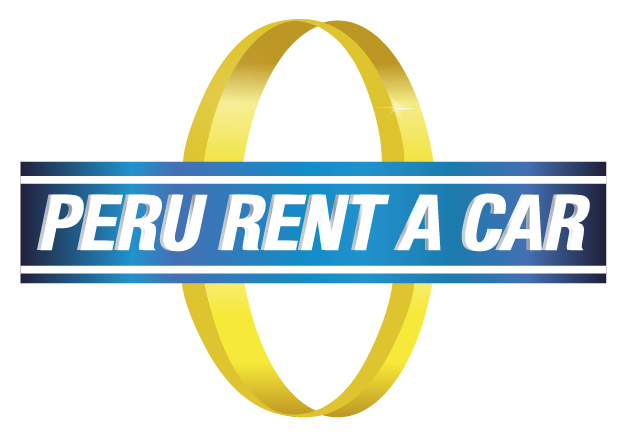
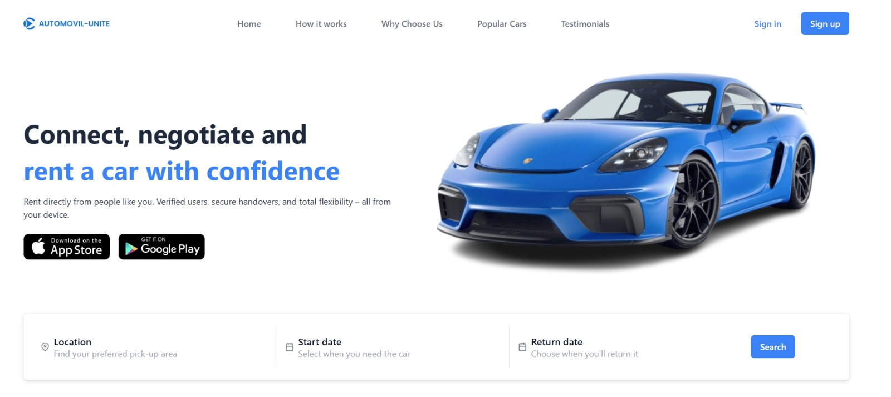
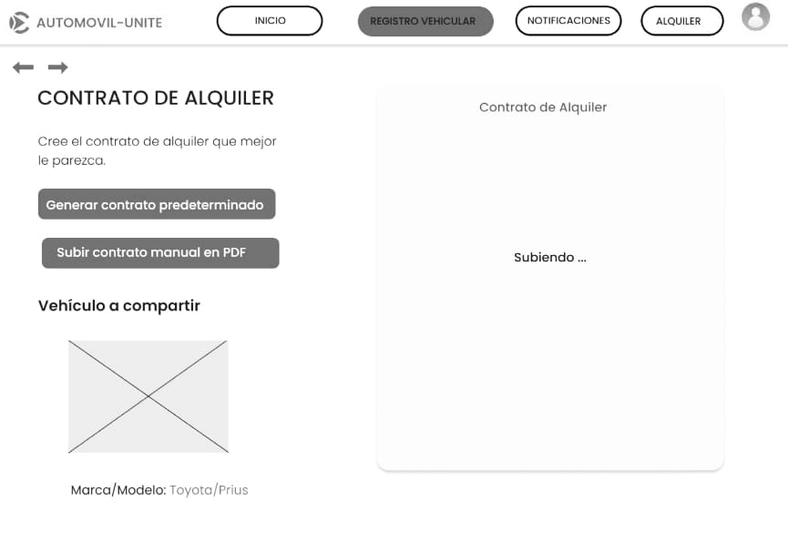
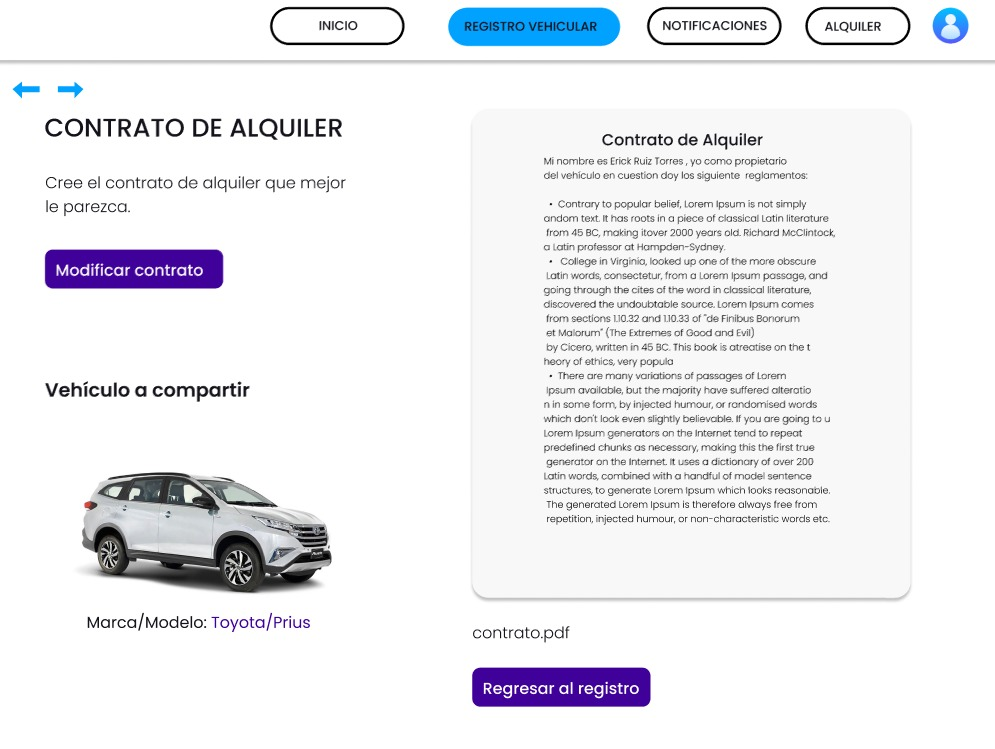
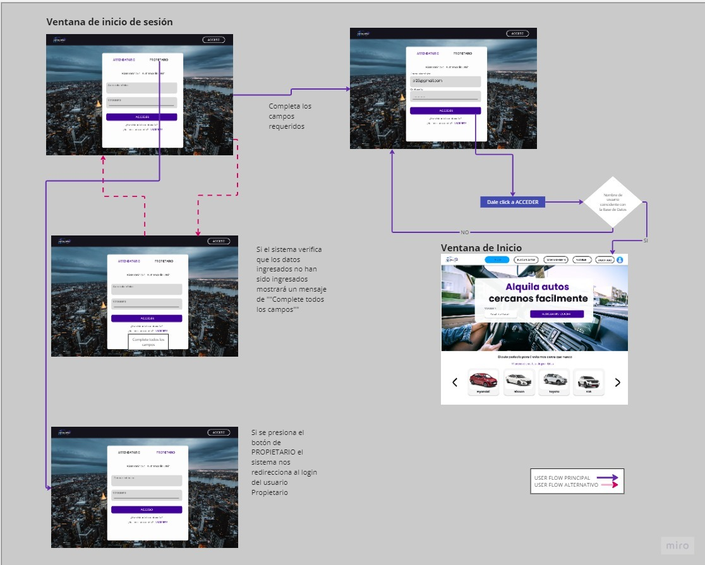
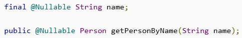
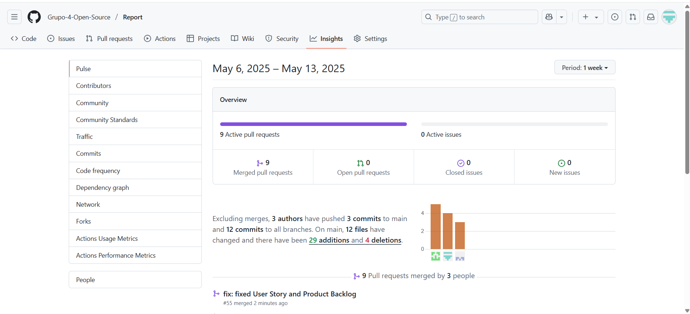
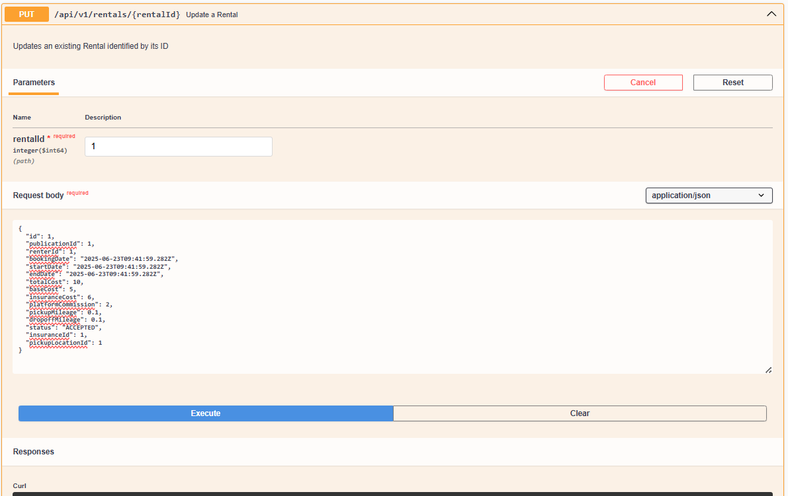

  <h1>Universidad Peruana de Ciencias Aplicadas</h1>
  
  <h2 >Carrera: de Ingeniería de Software</h2>
  <h2 >Ciclo: 2025-01</h2>
   
  <h2 >Curso: Desarrollo de Aplicaciones Open Source </h2>
  <h2 >Sección: 4341</h2>
   
  <h2 >Informe del TB2</h2>
  <h2 >Startup: NovaCode </h2>
  <h2 >Producto: Automovil-Unite </h2>
   
  <h2 >Integrantes:</h2>
  <ul style="list-style: none; padding: 0;">
      <li><h3>Josue Gonzalo Paiva Quispe</h3></li>
       <li><h3>Kenyi Efraín Ramírez Cabrera</h3></li>

  </ul>
   
  <h4>Junio del 2025</h4>

## Registro de Versiones del Informe

| Versión | Fecha | Autor                      | Descripción de modificación       |
|---------|-------|----------------------------|-----------------------------------|
| 0.1     | 23/04 | Todos los integrantes      | Primera entrega del informe (TB1) |
| 1.0     | 23/04 | Todos los integrantes      | Primera entrega del informe (TP1) |
| 2.0     | 23/06 | Josue Paiva, Kenyi Ramirez | Primera entrega del informe (TB2) |
| 2.1     | 24/06 | Josue Paiva, Kenyi Ramirez | Segunda entrega del informe (TB2) |
| 3       | 07/07 | Josue Paiva, Kenyi Ramirez   | Segunda entrega del informe (TF) |

## Project Report Collaboration Insights

|  URL de la organización del proyecto   |        URL del repositorio del reporte        |
|:--------------------------------------:|:---------------------------------------------:|
| https://github.com/Grupo-4-Open-Source | https://github.com/Grupo-4-Open-Source/Report |

|             URL del repositorio del frontend             |             URL del repositorio del backend             |
|:--------------------------------------------------------:|:-------------------------------------------------------:|
| https://github.com/Grupo-4-Open-Source/OpenNova-Frontend | https://github.com/Grupo-4-Open-Source/OpenNova-Backend |

Se han realizado todas las tareas asignadas para la entrega del TB2, las cuales se encuentran registradas en el repositorio de Github de la organización del equipo.}

- [Student Outcome](#student-outcome)

- [Capítulo I: Introducción](#cap1)
    - [1.1. Startup Profile](#11-startup-profile)
        - [1.1.1. Descripción de la Startup](#111-descripción-de-la-startup)
        - [1.1.2. Perfiles de integrantes del equipo](#112-perfiles-de-integrantes-del-equipo)
    - [1.2. Solution Profile](#12-solution-profile)
        - [1.2.1 Antecedentes y problemática](#121-antecedentes-y-problemática)
        - [1.2.2 Lean UX Process](#122-lean-ux-process)
            - [1.2.2.1. Lean UX Problem Statements](#1221-lean-ux-problem-statements)
            - [1.2.2.2. Lean UX Assumptions](#1222-lean-ux-assumptions)
            - [1.2.2.3. Lean UX Hypothesis Statements](#1223-lean-ux-hypothesis-statements)
            - [1.2.2.4. Lean UX Canvas](#1224-lean-ux-canvas)
    - [1.3. Segmentos objetivo](#13-segmentos-objetivo)

- [Capítulo II: Requirements Elicitation & Analysis](#cap2)
    - [2.1. Competidores](#21-competidores)
        - [2.1.1. Análisis competitivo](#211-análisis-competitivo)
        - [2.1.2. Estrategias y tácticas frente a competidores](#212-estrategias-y-tácticas-frente-a-competidores)
    - [2.2. Entrevistas](#22-entrevistas)
        - [2.2.1. Diseño de entrevistas](#221-diseño-de-entrevistas)
        - [2.2.2. Registro de entrevistas](#222-registro-de-entrevistas)
        - [2.2.3. Análisis de entrevistas](#223-análisis-de-entrevistas)
    - [2.3. Needfinding](#23-needfinding)
        - [2.3.1. User Personas](#231-user-personas)
        - [2.3.2. User Task Matrix](#232-user-task-matrix)
        - [2.3.3. User Journey Mapping](#233-user-journey-mapping)
        - [2.3.4. Empathy Mapping](#234-empathy-mapping)
        - [2.3.5. As-is Scenario Mapping](#235-as-is-scenario-mapping)
    - [2.4. Ubiquitous Language](#24-ubiquitous-language)

- [Capítulo III: Requirements Specification](#cap3)
    - [3.1. To-Be Scenario Mapping](#31-to-be-scenario-mapping)
    - [3.2. User Stories](#32-user-stories)
    - [3.3. Impact Mapping](#33-impact-mapping)
    - [3.4. Product Backlog](#34-product-backlog)

- [Capítulo IV: Product Design](#cap4)
    - [4.1. Style Guidelines](#41-style-guidelines)
        - [4.1.1. General Style Guidelines](#411-general-style-guidelines)
        - [4.1.2. Web Style Guidelines](#412-web-style-guidelines)
    - [4.2. Information Architecture](#42-information-architecture)
        - [4.2.1. Organization Systems](#421-organization-systems)
        - [4.2.2. Labeling Systems](#422-labeling-systems)
        - [4.2.3. SEO Tags and Meta Tags](#423-seo-tags-and-meta-tags)
        - [4.2.4. Searching Systems](#424-searching-systems)
        - [4.2.5. Navigation Systems](#425-navigation-systems)
    - [4.3. Landing Page UI Design](#43-landing-page-ui-design)
        - [4.3.1. Landing Page Wireframe](#431-landing-page-wireframe)
        - [4.3.2. Landing Page Mock-up](#432-landing-page-mock-up)
    - [4.4. Web Applications UX/UI Design](#44-web-applications-uxui-design)
        - [4.4.1. Web Applications Wireframes](#441-web-applications-wireframes)
        - [4.4.2. Web Applications Wireflow Diagrams](#442-web-applications-wireflow-diagrams)
        - [4.4.3. Web Applications Mock-ups](#443-web-applications-mock-ups)
        - [4.4.4. Web Applications User Flow Diagrams](#444-web-applications-user-flow-diagrams)
    - [4.5. Web Applications Prototyping](#45-web-applications-prototyping)
    - [4.6. Domain-Driven Software Architecture](#46-domain-driven-software-architecture)
        - [4.6.1. Software Architecture Context Diagram](#461-software-architecture-context-diagram)
        - [4.6.2. Software Architecture Container Diagrams](#462-software-architecture-container-diagrams)
        - [4.6.3. Software Architecture Components Diagrams](#463-software-architecture-components-diagrams)
    - [4.7. Software Object-Oriented Design](#47-software-object-oriented-design)
        - [4.7.1. Class Diagrams](#471-class-diagrams)
        - [4.7.2. Class Dictionary](#472-class-dictionary)
    - [4.8. Database Design](#48-database-design)
        - [4.8.1. Database Diagram](#481-database-diagram)

- [Capítulo V: Product Implementation, Validation & Deployment](#c5)
    - [5.1. Software Configuration Management](#51-software-configuration-management)
        - [5.1.1. Software Development Environment Configuration](#511-software-development-environment-configuration)
        - [5.1.2. Source Code Management](#512-source-code-management)
        - [5.1.3. Source Code Style Guide & Conventions](#513-source-code-style-guide--conventions)
        - [5.1.4. Software Deployment Configuration](#514-software-deployment-configuration)
    - [5.2. Landing Page, Services & Applications Implementation](#52-landing-page-services--applications-implementation)
        - [5.2.1. Sprint 1](#521-sprint-1)
            - [5.2.1.1. Sprint Planning 1](#5211-sprint-planning-1)
            - [5.2.1.2. Aspect Leaders and Collaborators](#5212-aspect-leaders-and-collaborators)
            - [5.2.1.3. Sprint Backlog 1](#5213-sprint-backlog-1)
            - [5.2.1.4. Development Evidence for Sprint Review](#5214-development-evidence-for-sprint-review)
            - [5.2.1.5. Execution Evidence for Sprint Review](#5215-execution-evidence-for-sprint-review)
            - [5.2.1.6. Services Documentation Evidence for Sprint Review](#5216-services-documentation-evidence-for-sprint-review)
            - [5.2.1.7. Software Deployment Evidence for Sprint Review](#5217-software-deployment-evidence-for-sprint-review)
            - [5.2.1.8. Team Collaboration Insights during Sprint](#5218-team-collaboration-insights-during-sprint)
        - [5.2.2. Sprint 2](#522-sprint-2)
            - [5.2.2.1. Sprint Planning 2](#5221-sprint-planning-2)
            - [5.2.2.2. Aspect Leaders and Collaborators](#5222-aspect-leaders-and-collaborators)
            - [5.2.2.3. Sprint Backlog 2](#5223-sprint-backlog-2)
            - [5.2.2.4. Development Evidence for Sprint Review](#5224-development-evidence-for-sprint-review)
            - [5.2.2.5. Execution Evidence for Sprint Review](#5225-execution-evidence-for-sprint-review)
            - [5.2.2.6. Services Documentation Evidence for Sprint Review](#5226-services-documentation-evidence-for-sprint-review)
            - [5.2.2.7. Software Deployment Evidence for Sprint Review](#5227-software-deployment-evidence-for-sprint-review)
            - [5.2.2.8. Team Collaboration Insights during Sprint](#5228-team-collaboration-insights-during-sprint)
        - [5.2.3. Sprint 3](#523-sprint-3)
            - [5.2.3.1. Sprint Planning 3](#5231-sprint-planning-3)
            - [5.2.3.2. Aspect Leaders and Collaborators](#5232-aspect-leaders-and-collaborators)
            - [5.2.3.3. Sprint Backlog 3](#5233-sprint-backlog-3)
            - [5.2.3.4. Development Evidence for Sprint Review](#5234-development-evidence-for-sprint-review)
            - [5.2.3.5. Execution Evidence for Sprint Review](#5235-execution-evidence-for-sprint-review)
            - [5.2.3.6. Services Documentation Evidence for Sprint Review](#5236-services-documentation-evidence-for-sprint-review)
            - [5.2.3.7. Software Deployment Evidence for Sprint Review](#5237-software-deployment-evidence-for-sprint-review)
            - [5.2.3.8. Team Collaboration Insights during Sprint](#5238-team-collaboration-insights-during-sprint)
        - [5.2.4. Sprint 4](#524-sprint-4)
            - [5.2.4.1. Sprint Planning 4](#5241-sprint-planning-4)
            - [5.2.4.2. Aspect Leaders and Collaborators](#5242-aspect-leaders-and-collaborators)
            - [5.2.4.3. Sprint Backlog 4](#5243-sprint-backlog-4)
            - [5.2.4.4. Development Evidence for Sprint Review](#5244-development-evidence-for-sprint-review)
            - [5.2.4.5. Execution Evidence for Sprint Review](#5245-execution-evidence-for-sprint-review)
            - [5.2.4.6. Services Documentation Evidence for Sprint Review](#5246-services-documentation-evidence-for-sprint-review)
            - [5.2.4.7. Software Deployment Evidence for Sprint Review](#5247-software-deployment-evidence-for-sprint-review)
            - [5.2.4.8. Team Collaboration Insights during Sprint](#5248-team-collaboration-insights-during-sprint)
    - [5.3. Validation Interviews](#53-validation-interviews)
        - [5.3.1. Diseño de Entrevistas](#531-diseño-de-entrevistas)
        - [5.3.2. Registro de Entrevistas](#532-registro-de-entrevistas)
        - [5.3.3. Evaluaciones según heurísticas](#533-evaluaciones-según-heurísticas)
    - [5.4. Video About-the-Product](#54-video-about-the-product)
- [Conclusiones](#conclusiones)
- [Bibliografía](#bibliografía)
- [Anexos](#anexos)

## Student Outcome

El curso contribuye al cumplimiento del Student Outcome ABET:

**ABET – EAC - Student Outcome 3**

**Criterio:** *Capacidad de comunicarse efectivamente con un rango de audiencias.*
En el siguiente cuadro se describe las acciones realizadas y enunciados de
conclusiones por parte del grupo, que permiten sustentar el haber alcanzado el logro
del ABET – EAC - Student Outcome 3.

<table>
  <tr>
    <th>Criterio específico</th>
    <th>Acciones realizadas</th>
    <th>Conclusiones</th>
  </tr>
  <tr>
    <td>Comunica oralmente con efectividad a diferentes rangos de audiencia.</td>
    <td>
        <strong>Josue Paiva</strong> 
        <strong>TB1:</strong>Me involucre de manera integral en el desarrollo del primer entregable, pues asumí el rol de team leader, me encargue de organizar las reuniones, definir fechas de entrega de avance y la logística respectiva para concluir a tiempo el entregable. 
        <strong>TP:</strong>En este entregable me concentré en el bounded context de la navegación de vehículos, asi como de la definición de endpoints para el resto de bounded context, el set up del repositorio y el despliegue de la app 
        <strong>TB2:</strong>En el TB2 me encargué de la elaboración del bounded context de vehicles en el backend con sus 4 operaciones POST, GET, DELETE y PUT 
        <strong>TF:</strong>Para el último entregable desarrollé el IAM del lado del backend y desplegue todos los servicios de nuestros repositorios 
        <strong>Kenyi Ramírez</strong> 
        <strong>TB1:</strong>Colaboré de manera activa con mi equipo en la elaboración de este informe asistiendo en todas las reuniones de equipo, comunicando y entendiendo de forma efectiva los aspectos a desarrollar. Diseñé y expliqué la estructura de los diagramas de Domain-Driven Design (contexto, contenedor y componente), así como el diseño de clases y base de datos. 
        <strong>TP:</strong>Colaboré de manera activa con mi equipo en corregir este informe asistiendo en todas las reuniones de equipo, comunicando y entendiendo de forma efectiva los aspectos a editar. También participé activamente en el frontend en la elaboración del bounded context Dashboard, explicando y mostrando a mis compañeros cómo funciona. Lo he diseñado de acuerdo a las historias de usuario y diagrama de clases/base de datos  
        <strong>TB2:</strong>Colaboré de manera activa con mi equipo en la elaboración de este informe asistiendo en todas las reuniones de equipo, comunicando y entendiendo de forma efectiva los aspectos a desarrollar. Corregí la estructura de las User Stories y Product Backlog. Desarrollé las secciones de Sprint Backlog 3, Deployment, Execution Evidence, Video About the Product, Service Documentation y Validación de entrevistas. 
        <strong>TF:</strong>En la etapa final del desarrollo del producto finalicé la elaboracion de servicios como Locations e Insurance, ademas de implementar el IAM en el frontend de la aplicacion 
 
 
 
 
    <td>
Como conclusion de la aplicación realizada, considero que logramos implementar una propuesta solida, con un core de negocio claro y definido
y atacando una problematica real, donde el alquilado de vehiculos esta monopolizado por empresas grandes y que no tienen un servicio personalizado.
En cuanto al desarrollo, este fue continuo y progresivo, la perdida de integrantes reforzo la necesidad de una buena comunicacion y trabajo en equipo, lo que nos permitio avanzar de manera satisfactoria en el desarrollo de la plataforma.
</td>
  </tr>
  <tr>
    <td>Comunica por escrito con efectividad a diferentes rangos de audiencia.</td>
    <td>
        <strong>Josue Paiva</strong> 
        <strong>TB1:</strong> Me encargué del desarrollo del capítulo II en su totalidad, además de desarrollar las historias de usuario con sus respectivas épicas, finalmente contribuí con el despliegue de la landing page  
        <strong>TP:</strong>Fui el responsable del correcto despliegue de la landing page y su mock server, para asi poder realizar correctamente la presentación de la app 
        <strong>TB2:</strong>Con la reestructuración del equipo reasigné las prioridades a los bounded context de publicación y reservas, pues son los core de negocio de nuestra aplicación 
        <strong>TF:</strong>Para concluir la producción del producto considere pertinente desplegar todos los servicios e implementar comunicacion entre los mismos, asi como tener una base de datos online 24/7 para realiazr pruebas y registros 
        <strong>Kenyi Ramírez</strong> 
        <strong>TB1:</strong> Me encargué del desarrollo de los diagramas de context, container y component en modelo C4. También de los diagramas de clases y base de datos. Estos diagramas son fundamentales para visualizar y comprender la arquitectura del sistema, proporcionando una representación clara de los diferentes niveles de la plataforma que desarrollaremos a lo largo del curso. 
        <strong>TP:</strong> Me encargué de la corrección de los diagramas de context, container y component en modelo C4. También de los diagramas de clases y base de datos. También corregí las User Stories junto con el Product Backlog. En cuanto al proyecto frontend, me encargué de crear e implementar la sección Dashboard y agregar algunos botones en el menú principal. 
        <strong>TB2:</strong>Me encargué de corregír la estructura de las User Stories y Product Backlog. Desarrollé las secciones de Sprint Backlog 3, Deployment, Execution Evidence, Video About the Product, Service Documentation y Validación de entrevistas. En cuanto al desarrollo de la plataforma, me encargué de realizar los bounded context de Publication Management, Rental Management y Dashboard y Vehicles solo en el frontend. 
        <strong>TF:</strong>Me encargué de pulir los ultimos servicios Locations e Insurance, implementacion de registro y login, etc. 

 
 
 
    </td>
    <td>
Culminar los dos servicios de la aplicación nos permitió realizar una presentación coherente y ordenada, pues presentar la propuesta es tan importante como implementarla,
entre los 2 hemos progresado de manera constante, con buena comunicación y trabajo en equipo, lo que nos ha permitido avanzar en el desarrollo de la plataforma.
Finalmente a modo de autocritica considero importante delimitar los bounded context de manera clara para no tener inconvenientes a la hora de juntar ambos servicios.
</td>
  </tr>
</table>

## Capítulo I: Introducción 

### 1.1. Startup Profile
#### 1.1.1. Descripción de la Startup
Automovil-Unite es una plataforma creada por estudiantes de la carrera de Ingeniería de Software de la Universidad Peruana de Ciencias Aplicadas del Perú. Esta estaría facilitando el alquiler de vehículos tanto para propietarios como para usuarios.

Nuestro servicio permite a los propietarios de vehículos registrar y gestionar fácilmente sus flotas, mediante un intuitivo panel de control, los propietarios pueden monitorear el estado de sus vehículos y recibir puntuaciones y comentarios de los usuarios. Además, para los usuarios que desean alquilar podrán buscar vehículos de manera simplificada según sus características. Una vez seleccionado su vehículo ideal, los usuarios pueden reservarlo con fechas de inicio y finalización, realizando pagos de manera seguro y acceder a un historial detallado de reservas donde también podrás compartir tus experiencias a través de reseñas.

**Misión**: Facilitar el acceso al alquiler de vehículos de forma seguro, conectando a propietarios y usuarios mediante una plataforma digital intuitiva.

**Visión**: Ser la plataforma líder de alquiler de vehículos en Lima, reconocido por su confiabilidad y compromiso con una experiencia de usuarios de calidad.

#### 1.1.2. Perfiles de integrantes del equipo

| **Integrante**  | **Josue Gonzalo Paiva Quispe**                                                                                                                                                                                                                          |
|-----------------|---------------------------------------------------------------------------------------------------------------------------------------------------------------------------------------------------------------------------------------------------------| 
| **Descripción** | Soy Josue Paiva, tengo 22 años y soy de la carrera de Ingeniería de Software, tengo conocimiento de C++, Python y SQL, me gusta mantener buena comunicación con mis commpañeros de equipo, cumplir con mis tareas y apoyar al resto cuando se requiera. |
| Foto            | 
                                                                                                                                                             |

| **Integrante**            | **Javier Oswaldo Tello Murga**                                                                                                                                                                                                                                                                                    |
|---------------------------|-------------------------------------------------------------------------------------------------------------------------------------------------------------------------------------------------------------------------------------------------------------------------------------------------------------------| 
| **Descripción**           | Soy Javier Telo, estudio la carrera de Ingeniería de Software en la Universidad Peruana de Ciencias Aplicadas. Soy una persona capaz, con muchas ganas de adquirir conocimientos, sobre todo con los temas que tenga que ver con mi carrera. Tengo conocimiento en wordprees básico, html y css intermedio y C++. |
| Foto                      | 
                                                                                                                                                                                                                     |

| **Integrante**  | **Kenyi Efrain Ramirez Cabrera**                                                                                                                                                                                                                                                                                                           |
|-----------------|--------------------------------------------------------------------------------------------------------------------------------------------------------------------------------------------------------------------------------------------------------------------------------------------------------------------------------------------|
| **Descripción** | Soy Kenyi Ramirez, estudio la carrera de Ingeniería de Software en la Universidad Peruana de Ciencias Aplicadas. Mi código de alumno es u202220138. Soy una persona comprometida y trabajadora. Poseo un nivel intermedio en los lenguajes C++, Python, Java y HTML, los cuales aplico para garantizar resultados efectivos en mis tareas. |
| Foto            | 
                                                                                                                                                                                                                                             |

| **Integrante**            | Alejandro Torres Alva                                                                                                                                                                                                                                                                  |
|---------------------------|----------------------------------------------------------------------------------------------------------------------------------------------------------------------------------------------------------------------------------------------------------------------------------------| 
| **Descripción**           | Mi nombre es Alejandro Torres Alva, soy estudiante de la carrera de Ingeniería de Software en la Universidad Peruana de Ciencias Aplicadas. Me considero una persona que apoya en todo lo que pueda al trabajo. Tengo conocimientos intermedios en los lenguajes de C++, Python y PHP. |
| Foto                      | 
                                                                                                                                                                                      |

| **Integrante**  | Fiorella Angela Vilca Valverde                                                                                                                                                                                                                                                                                                                                                                                                                                                                                                            |
|-----------------|-------------------------------------------------------------------------------------------------------------------------------------------------------------------------------------------------------------------------------------------------------------------------------------------------------------------------------------------------------------------------------------------------------------------------------------------------------------------------------------------------------------------------------------------| 
| **Descripción** | Mi nombre es Fiorella Angela Vilca Valverde, tengo 23 años y actualmente estoy cursando 5to ciclo de la carrera Ingeniería de Software en la Universidad Peruana de Ciencias Aplicadas (U.P.C). Elegí esta carrera porque siempre quería saber de las funcionalidades de la computadora y aprender cada día más sobre los lenguajes de programación. Me considero una persona muy sociable, perseverante, responsable, trabajar en equipo y sobre todo leal. Tengo conocimientos en lenguaje de programación C++, Python y Matlab Básico. |
| Foto            | 
                                                                                                                                                                                                                                                                                                                                                                                                                                          |
### 1.2. Solution Profile
#### 1.2.1 Antecedentes y problemática

###### What

- ¿Cuál es el problema?

Existe una falta de acceso eficiente y confiable al alquiler de vehículos en Lima. Los usuarios tienen dificultades para encontrar opciones adecuadas a sus necesidades, mientras que los propietarios carecen de canales accesibles y seguros para ofrecer sus vehículos en alquiler.

###### When

- ¿Cuándo sucede el problema?

El problema se da cuando una persona desea alquilar o la otra persona no tiene un contacto para poder alquilar su vehículo por un lugar seguro y así evitar alguna estafa.

###### Where

- ¿Dónde se presenta el problema de negocio?

El problema se manifiesta en Lima Metropolitana, donde el tráfico y la demanda de transporte alternativo se complica, aún más el acceso rápido a servicios de alquiler confiables.

##### Who

- ¿Quiénes están involucrados?

Estarían involucrados los usuarios que necesitan alquilar un vehículo y no encuentran un lugar confiable, y los propietarios de vehículos que desean generar ingresos adicionales alquilando sus autos, pero no tienen una plataforma efectiva para hacerlo.

##### Why

- ¿Por qué se origina el problema?

El problema se da por la falta de una plataforma digitalizada que conecten eficientemente la oferta y demanda de vehículos en alquilar, así como por la desconfianza en los procesos actuales, que suelen ser informales, inseguros o pocos transparentes.

##### How

- ¿Cómo afecta este problema a las personas involucradas?

Esto genera frustración en los usuarios al no encontrar vehículos adecuados, aumenta el riesgo de fraudes o malas experiencias, y limita las oportunidades económicas para propietarios que podrían aprovechar sus vehículos sin uso para generar ingresos.

##### How much

- ¿Cuánto impacto genera el problema en la sociedad?

Aunque no hay un número exacto de problemas afectados por las estafas al momento de la alquilación de vehículos o que los arrendadores de vehículos regresando el choche en pésimas condiciones, estos casos son comunes en Lima debido a la informalidad del sector.

#### 1.2.2 Lean UX Process
##### 1.2.2.1. Lean UX Problem Statements

Para los arrendadores de vehículos particulares en Lima, Perú, que desean generar ingresos alquilando sus autos, pero enfrentan riesgos significativos de estafas y daños, el problema es que no cuentan con una plataforma confiable que ofrezca seguridad, verificación de usuarios y respaldo legal. Esto les impide alquilar sus vehículos con confianza, limitando su capacidad de generar ingresos extras.

Para los arrendatarios que buscan alquilar un vehículo de manera temporal, que necesitan una solución rápida y segura para movilizarse, el problema es que las opciones actuales, como grupos en redes sociales o empresas informales, carecen de transparencia y garantías, lo que genera desconfianza y temor a ser estafados.

*Por ello aquí presento algunas evidencias del problema:*

- Arrendadores estafados: Casos donde propietarios entregaron sus vehículos a empresas de alquiler que luego desaparecieron con los autos, generando deudas significativas para los dueños.

- Arrendatarios engañados: Situaciones en las que personas alquilaron vehículos que resultaron ser robados o con documentos falsificados, enfrentando problemas legales y económicos.

- Falta de regulación: El gobierno peruano ha anunciado medidas para sancionar el alquiler informal, evidenciando la necesidad de plataformas que cumplan con requisitos legales y ofrezcan seguridad tanto a arrendadores como a arrendatarios.

##### 1.2.2.2. Lean UX Assumptions
###### **Supuestos del Negocio:**

**Creo que mis usuarios necesitan** una aplicación web que funcionaria como una interfaz para los arrendadores y los propietarios de vehículos más confiable.

**Esas necesidades se pueden resolver** mediante una plataforma digital que ofrezca filtros personalizados, pagos seguros y un panel de reseñas para generar confianza.

**Mis clientes iniciales** serán personas entre 25 y 45 años que residan en Lima Metropolitana, que no cuentan con vehículo propio, pero necesitan uno de forma temporal; y también propietarios con 1 o más vehículos en desuso que deseen generar ingresos extra.

**El valor #1 que el cliente requiere de mi servicio** es la confianza y seguridad en el proceso de alquiler.

**El cliente también puede obtener estos servicios adicionales** como el historial de reservas, clasificaciones y reseñas, soporte ate incidentes, opciones de seguro y promociones en temporadas específicas.

**Voy a adquirir a mis clientes a través de** publicidad en redes sociales como Instagram, Facebook y TikTok. Además, se podría publicitar en talleres, grifos o negocios locales.

**Mi competencia en el mercado** serán empresas tradicionales de alquiler de autos y también alquileres informales por vía Facebook Marketplace o grupos de WhatsApp.

**Los venceremos debido a** una experiencia digital centrada en el usuarios, precios más accesibles y mayor variedad de vehículos.

**Mis mayores riesgos de producto** son la baja confianza inicial entre usuarios y propietarios.

**Resolveremos esto** mediante una verificación de identidad y contratos digitales.

###### **Supuestos del Cliente:**

**¿Quién es el cliente?**

Personas entre 25 y 45 años residentes en Lima Metropolitana.

**¿Dónde encaja nuestro producto en su vida?**

Cuando necesiten independencia y comodidad para desplazarse y también para generar un ingreso adicional mediante un vehículo que normalmente estaría en desuso.

**¿Qué problemas soluciona nuestro producto?**

Para los usuarios solucionaría la dificultad para encontrar vehículos adecuados al precio y falta de confianza en alquileres informales.

Para los propietarios tendrían una plataforma que les permita alquilar con seguridad, y ya no habría riesgos de fraudes o daños al vehículo.

**¿Cuándo y cómo se utiliza nuestro producto?**

Se utilizaría cuando el cliente necesita alquilar un vehículo por días o fines de semana, también cuando un propietario quiera utilizar la app para registrar su vehículo

**¿Qué características son importantes?**

Filtros avanzados en la búsqueda de vehículos, reservas con fechas y horas específicas, pago seguro dentro de la plataforma y un sistema de calificaciones.

**¿Cómo debería verse y comportarse nuestro producto?**

Debe ser intuitivo, confiable y rápido, para que así se vea visualmente limpio, fácil de navegar y accesible desde cualquier dispositivo móvil.

##### 1.2.2.3. Lean UX Hypothesis Statements
###### **Hipótesis 1:**

**Creemos que** los usuarios que buscan alquilar un vehículo necesitan una plataforma confiable y con filtros personalizados para lograr encontrar opciones adecuadas de forma rápida y segura.

**Sabremos que esto es cierto cuando veamos** al menos un 60% de los usuarios completan una reserva después de su primera búsqueda.

###### **Hipótesis 2:**

**Creemos que** los propietarios de vehículos necesitan una herramienta para gestionar sus autos en alquiler, ver su historial y calificaciones para lograr mayor confianza y control sobre transacciones.

**Sabremos que esto es cierto cuando veamos** al menos más del 50% de los propietarios registrados publican más de un vehículo o lo mantienen activo al menos por 3 meses.

###### **Hipótesis 3:**

**Creemos que** ambos grupos necesitan una sección de reseñas y calificaciones para lograr una relación de confianza mutua.

**Sabremos que esto sea cierto cuando veamos** al menos más del 70% de los usuarios y propietarios dejan una reseña después de cada alquiler.

###### **Hipótesis 4:**

**Creemos que** los usuarios que alquilan vehículos necesitan medios de pago seguros e integrados

**Sabremos que esto es cierto cuando veamos** más del 65% de los usuarios completan el pago dentro de la app sin abandonar el proceso.

###### **Hipótesis 5:**

**Creemos que** los arrendadores necesitan que los usuarios pasen por un proceso de verificación de identidad (DNI, licencia de conducir, selfie, etc.)

**Sabremos que esto es cierto cuando veamos** al menos el 80% de los arrendadores declaren sentirse más seguros alquilando a usuarios verificados, y la tasa de rechazo disminuya.

##### 1.2.2.4. Lean UX Canvas

### 1.3. Segmentos objetivo

Nuestros segmentos objetivos serían dos tipos de usuarios:

**Segmento 1 (Dueño de vehículo):**

Dueños de autos que no usan su vehículo con frecuencia y desean generar ingresos extras, estos serían personas de edad entre 25 a 45 años que residen en Lima Metropolitana.

**Segmento 2 (Usuario que busca alquilar un vehículo):**

Personas que necesitan un vehículo de manera temporal que tengan edad entre 25 a 45 años con residencia en Lima Metropolitana y estos no tendrían un auto propio o profieran no usarlo todo el tiempo, así buscando una alternativa más económica y flexible frente a taxis o apps de transporte.

## Capítulo II: Requirements Elicitation & Analysis 

### 2.1. Competidores
Previo al desarrollo de la aplicacion, hicimos una busqueda de las opciones que ya existen en el mercado, para ver que es lo que ofrecen y como podemos diferenciarnos de ellos.
- **Kayak:**
  Kayak es una de las plataformas de búsqueda de viajes más grandes del mundo. Permite a los usuarios buscar y comparar precios de vuelos, hoteles y alquiler de coches en una sola plataforma. Kayak también ofrece herramientas para planificar viajes, como alertas de precios y recomendaciones personalizadas.

- **Peru Rent A Car:**
  Esta plataforma se especializa en el alquiler de coches en Perú. Ofrece una amplia gama de vehículos y opciones de alquiler, así como información sobre destinos turísticos en Perú. La plataforma también permite a los usuarios comparar precios y reservar coches en línea.

- **Budget Car Rental Peru:**
  A diferencia de Peru Rent A Car, Budget Car Rental es una empresa internacional que ofrece servicios de alquiler de coches en Perú. La plataforma permite a los usuarios buscar y comparar precios de coches de alquiler en diferentes ubicaciones y reservar en línea. Budget Car Rental también ofrece opciones de alquiler a largo plazo y programas de fidelización.

#### 2.1.1. Análisis competitivo.
<table border="1" style="text-align: center;">
	<tbody>
		<tr><td colspan="6">Análisis de competidores</td></tr>
		<tr><td colspan="2"></td><td>EasyRent</td><td>Kayak</td><td>Peru Rent A Car</td><td>Budget Car Rental Peru</td></tr>
		<tr><td rowspan="2">Perfil</td><td>Resumen</td>
			<td>Una aplicación que busca ofrecer una plataforma rápida y ágil para el alquiler de autos, con un fuerte enfoque en la seguridad de ambas partes.</td>
			<td>Kayak es una plataforma líder de búsqueda tanto de vuelos, como cuartos de hotel, alquiler de vehículos, etc.</td>
			<td>Esta plataforma web presenta parte de un catálogo establecido de vehículos para alquilar, con una atención mediante WhatsApp y dirigido solo a clientes.</td>
			<td>Plataforma de similar funcionamiento que Rent A Car Peru, orientado a clientes con un énfasis en cuidar el presupuesto de los mismos.</td></tr>
		<tr><td>Ventaja competitiva</td>
			<td>Ofrecer una plataforma tanto para dueños de vehículos como a clientes interesados en alquilar.</td>
			<td>Es la aplicación líder en la búsqueda de servicios por su variedad y robusta plataforma web.</td>
			<td>Líder local del servicio de alquiler de autos, con una amplia flota y rápida atención al usuario</td>
			<td>Ofrece una alternativa de alquiler económica velando por el bolsillo de sus clientes. </td></tr>
		<tr><td rowspan="2">Perfil de Marketing</td><td>Mercado objetivo</td>
			<td>Jóvenes y adultos desde los 20 a los 50 años.</td>
			<td>Turistas o viajeros que necesiten cualquier tipo de servicio de comodidad.</td>
			<td>Adultos peruanos que busquen alquilar un vehiculo.</td>
			<td>Adultos peruanos que busquen alquilar un vehiculo económico.</td></tr>
		<tr><td>Estrategias de marketing</td>
			<td>Marketing digital en redes sociales y colaboraciones con influencers.</td>
			<td>Alianza con Google Ads, tanto en Youtube como Chrome.</td>
			<td>Patrocinio mediante búsquedas de Chrome.</td>
			<td>Patrocinio mediante búsquedas de Chrome.</td></tr>
		<tr><td rowspan="3">Perfil de Producto</td>
			<td>Productos y Servicios</td>
			<td>Aplicación destinada a la oferta de vehículos en alquiler, como la demanda de los mismos.</td>
			<td>Aplicación móvil y web que cuenta con una enorme variedad de servicios esenciales para viajeros y turistas</td>
			<td>Aplicación web rápida e intuitiva que permite consultar parte del catálogo de vehículos disponibles para alquiler.</td>
			<td>Aplicación web ágil y amigable que permite consultar una limitada oferta de vehículos económicos en alquiler</td></tr>
		<tr><td>Precios y Costos</td>
			<td>Costos por publicación de vehículos mediante una suscripción.</td>
			<td>Modelo gratuito, con cobro de comisión a las empresas referidas.</td>
			<td>Ingreso directo mediante el alquiler.</td>
			<td>Ingreso directo mediante el alquiler.</td></tr>
		<tr><td>Canales de distribución</td>
			<td>Disponible en línea a través de la aplicación web.</td>
			<td>Descargable en Google Play y App Store y la plataforma web.</td>
			<td>Disponible en línea a través de la aplicación web.</td>
			<td>Disponible en línea a través de la aplicación web.</td></tr>
		<tr><td rowspan="4">Análisis SWOT</td><td>Fortalezas</td><td><ul>
                    <li>Orientado a jóvenes y adultos peruanos</li><li>Facilidades para alquilar, como ofrecer alquiler</li><li>Énfasis en la seguridad y garantía</li></ul></td>
			<td><ul>
                    <li>Gran cantidad de usuarios</li><li>Referente del sector</li><li>Plataformas ágiles e intuitivas</li></ul></td>
			<td><ul><li>Plataforma local</li><li>Excelente atención al cliente</li></ul></td>
			<td><ul><li>Plataforma web amigable</li><li>Todo el catálogo está disponible para cualquier usuario</li></ul></td></tr>
		<tr><td>Debilidades</td>
            <td><ul><li>Nuevo competidor</li><li>Sector con competidores fuertes ya establecidos</li></ul></td>
			<td><ul><li>Pobre atención al cliente</li></ul></td>
			<td><ul><li>Solo se puede consultar parte del catálogo de vehículos</li></ul></td>
			<td><ul><li>Opta por un nicho muy concreto</li><li>No cuenta con tanta relevancia como su competencia</li></ul></td></tr>
		<tr><td>Oportunidades</td>
            <td><ul><li>Sin competidores a nivel nacional</li><li>Ofrece servicio para ambas partes involucradas en el alquiler</li></ul></td>
			<td><ul><li>Fuerte presencia internacional</li><li>Referente del sector</li></ul></td>
			<td><ul><li>Flota amplia y en crecimiento</li><li>Atención personalizada</li></ul></td>
			<td><ul><li>Excelente interfaz</li></ul></td></tr>
		<tr><td>Amenazas</td>
            <td><ul><li>Competencia ya establecida</li><li>Sector muy competitivo</li></ul></td>
			<td><ul><li>Oferta demasiado ámplia</li><li>Sin control de calidad</li></ul></td>
			<td><ul><li>Oferta fija y poco variada</li><li>Sin opciones para dueños interesados en alquilar</li></ul></td>
<td><ul><li>Se ve opacado por la competencia</li><li>Oferta aún más limitada que la competencia</li></ul></td>
</tr></tbody></table>

#### 2.1.2. Estrategias y tácticas frente a competidores.
**Énfasis en seguridad:** Ofreceremos un sistema de verificación de identidad y contratos digitales para aumentar la confianza entre usuarios y propietarios.
**Trato Directo:** La plataforma se encargará de crear un canal de comunicación entre arrendadores y arrendatarios, evitando así la necesidad de intermediarios.
**Sistema de reseñas:** Implementaremos un sistema de reseñas y calificaciones para que los usuarios puedan evaluar a los propietarios y viceversa, lo que generará confianza y transparencia en el proceso de alquiler.
**Publicación de Vehículos:** La plataforma ofrecerá gratuitamente de manera limitada la publicación de vehículos, permitiendo a los propietarios gestionar su flota de manera eficiente y segura.

### 2.2. Entrevistas.
#### 2.2.1. Diseño de entrevistas
##### Segmento 1 (Dueño de vehiculo):
###### Preguntas de Información General:
1. ¿Cuál es tu nombre?
2. ¿Cuántos años tienes?
3. ¿En qué distrito vives?
4. ¿A qué te dedicas actualmente?

#### Preguntas sobre el alquiler de sus vehículos:
5. ¿Que tipo de documento exiges para proceder con el alquiler?
6. ¿Que tipo de vehiculo ofreces para el alquiler?
7. ¿Cual es la cantidad minima y maxima de tiempo que permites alquilar tu vehiculo?
8. ¿Como llevas la cuenta de todos tus vehiculos, tanto alquilados como sin alquilar?}

#### Preguntas sobre la plataforma:
9. ¿Que tipo de plataforma usas para ofrecer tu vehiculo?
10. ¿En que dispositivos accedes a dichas plataformas?
11. ¿Consideras que las aplicaciones te dan facilidades para identificar clientes confiables?
13. ¿Estarias dispuesto a ofrecer tus vehiculos en una nueva plataforma que te permita consultar reseñas de un cliente previo al alquiler?
14. ¿Estarias dispuesto a ofrecer tus vehiculos en una nueva plataforma que te ofrezca un panel donde registrar tus vehiculos y consultar su estado?
15. ¿Estarias dispuesto a ofrecer tus vehiculos en una nueva plataforma que te permita reseñar a los clientes?
##### Segmento 2 (Usuario que busca alquilar un vehiculo):
###### Preguntas de Información General:
1. ¿Cuál es tu nombre?
2. ¿Cuántos años tienes?
3. ¿En qué distrito vives?
4. ¿A qué te dedicas actualmente?

#### Preguntas sobre el alquiler de sus vehículos:
5. ¿Que tipo de documento te exigen para proceder con el alquiler?
6. ¿Que tipo de vehiculo buscas alquilar?
7. ¿Que documentos te suelen pedir previo al alquiler del vehiculo?
8. ¿Que restricciones se te imponen previo al alquiler del vehiculo?
9.
#### Preguntas sobre la plataforma:
9. ¿Que tipo de plataforma usas para buscar vehiculos?
10. ¿En qué dispositivos accedes a dichas plataformas?
11. ¿Consideras que las aplicaciones te dan facilidades para identificar vehiculos o arrendadores confiables?
12. ¿Estarías dispuesto a migrar a una nueva plataforma que te permita consultar reseñas de arrendadores antes de alquilar?
13. ¿Estarías dispuesto a usar una nueva plataforma que te permita reservar un vehículo en unas fechas concretas antes de alquilarlo?
14. ¿Estarías dispuesto a usar una nueva plataforma que te permita reseñar a los arrendadores?

#### 2.2.2. Registro de entrevistas
##### Entrevista #1

Nombre: Renzo Juan de Dios Meza Garay

Edad: 26

Distrito: Ate

URL: https://upcedupe-my.sharepoint.com/:v:/g/personal/u202022018_upc_edu_pe/EWu5fLUXceZGhrvD8hx7KuwBFx7mNwm1-kLnqm1efW4Ujg?e=LHdNEj

##### Entrevista #2

Nombre: Jonathan Cesar Arevalo Alva

Edad: 34

Distrito: San Martin de Porres

URL: https://upcedupe-my.sharepoint.com/:v:/g/personal/u202022018_upc_edu_pe/EfRk8-zuCyJBvGIwO-q4tfgBT_v6_FeWtZFEBdE_isoI_A?e=iGfb38

##### Entrevista #3

Nombre: Marycruz Murga

Edad: 26

Disrito: Comas

URL: https://upcedupe-my.sharepoint.com/:v:/g/personal/u202218387_upc_edu_pe/ERDAt9_BJXdDixy8u_OQpjEBIoyhwQ4gBxmNNx_RsO4g0Q?e=1c12Uz&nav=eyJyZWZlcnJhbEluZm8iOnsicmVmZXJyYWxBcHAiOiJTdHJlYW1XZWJBcHAiLCJyZWZlcnJhbFZpZXciOiJTaGFyZURpYWxvZy1MaW5rIiwicmVmZXJyYWxBcHBQbGF0Zm9ybSI6IldlYiIsInJlZmVycmFsTW9kZSI6InZpZXcifX0%3D

##### Entrevista #4

Nombre: Joaquin Pedraza Maldonado

Edad: 20

Disrito: San Miguel

URL:https://upcedupe-my.sharepoint.com/:v:/g/personal/u202218387_upc_edu_pe/EQm7Q8XZu15Lj3PscCr9CikBtEQtkpyiN4OvTcw2-vGNWw?e=UgAWr4&nav=eyJyZWZlcnJhbEluZm8iOnsicmVmZXJyYWxBcHAiOiJTdHJlYW1XZWJBcHAiLCJyZWZlcnJhbFZpZXciOiJTaGFyZURpYWxvZy1MaW5rIiwicmVmZXJyYWxBcHBQbGF0Zm9ybSI6IldlYiIsInJlZmVycmFsTW9kZSI6InZpZXcifX0%3D

##### Entrevisra #5

Nombre: Renso Julca Cruz

Edad: 20

Distrito: Carabayllo

URL: https://upcedupe-my.sharepoint.com/:v:/g/personal/u20211e417_upc_edu_pe/EVgOvuuCQthCg-yPL_Jex3wB0gJV4LiCinXOSD4q3MuUiQ?e=OofBDX&nav=eyJyZWZlcnJhbEluZm8iOnsicmVmZXJyYWxBcHAiOiJTdHJlYW1XZWJBcHAiLCJyZWZlcnJhbFZpZXciOiJTaGFyZURpYWxvZy1MaW5rIiwicmVmZXJyYWxBcHBQbGF0Zm9ybSI6IldlYiIsInJlZmVycmFsTW9kZSI6InZpZXcifX0%3D

#### 2.2.3. Análisis de entrevistas
##### Entrevista 1: Renzo Juan de Dios Meza Garay

Análisis de la entrevista:

La entrevista fue realizada a Renzo Juan de Dios Meza Garay, quien nos comenta que, para el alquiler de vehículos, solo solicita el DNI del cliente. Él se dedica al alquiler de camionetas pick-up para trabajos de carga dentro de la ciudad de Lima. La duración mínima del alquiler es de un día, y la máxima, de dos semanas.

Además, nos indica que gestiona sus registros de vehículos alquilados mediante una hoja de Excel. Para promocionar sus servicios, utiliza principalmente el Marketplace, aunque en su mayoría recibe solicitudes por recomendación de personas conocidas. Nos comenta que el dispositivo que más utiliza para gestionar estos contactos es su celular, ya que le permite estar conectado en todo momento.

También considera útil que una aplicación permita calificar a los clientes, ya que esto facilita la identificación de personas confiables y reduce el riesgo de inconvenientes. Le agrada la idea de contar con un panel dentro de una aplicación que le ayude a optimizar y centralizar sus registros de forma más práctica.

Finalmente, opina que tener una página con una red de reseñas podría contribuir a fortalecer su red de contactos y ayudar a identificar posibles clientes que podrían representar un riesgo para los vehículos.

##### Entrevista 2: Jonathan Cesar Arevalo Alva

Análisis de la entrevista:

La entrevista fue realizada a Jonathan Cesar Arevalo Alva, quien nos menciona que, para alquilar un vehículo, le exigen presentar su DNI, un recibo de agua o luz, los antecedentes penales y dejar una garantía notarial de entre 500 y 1000 soles por un periodo de seis meses. Además, señala que el tipo de vehículo que suele buscar es un sedán full equipo, que cuente con todos los permisos requeridos por el Ministerio de Transporte para operar.

Cabe resaltar que una de las principales restricciones en estos alquileres es que el vehículo no puede salir de Lima Metropolitana ni del Callao.

En cuanto a los canales de búsqueda, indica que utiliza las plataformas **NeoAuto** y **Marketplace**, a las cuales accede tanto desde su computadora como desde su celular. Afirma que estas aplicaciones le han facilitado mucho la búsqueda de vehículos, ya que antes solía acudir a mercados comerciales donde se ofrecía publicidad, lo cual hacía el proceso más complicado y lento.

Por otro lado, expresa que estaría dispuesto a migrar a una nueva plataforma, siempre que esta le facilite encontrar vehículos que cuenten con todos los documentos en regla. También le parece útil la opción de concretar fechas directamente desde la aplicación, ya que esto le permitiría planificar mejor sus actividades.

Finalmente, considera muy positiva la posibilidad de contar con una plataforma en la que ambas partes (el arrendador y el arrendatario) se vean beneficiadas y protegidas, reduciendo así la preocupación por posibles estafas.

##### Entrevista 3: Marycruz Murga

Análisis de la entrevista:

La entrevista fue realizada a Marycruz Murga, quien indica que desea alquilar su vehículo personal, una miniván, para generar ingresos adicionales. Comenta que, hasta ahora, ha considerado plataformas como el Marketplace de Facebook para ofrecer su vehículo, ya que este medio es accesible y le permite contactar directamente con posibles arrendatarios. Sin embargo, también reconoce que no siempre ofrece la seguridad ni el control deseado.

Marycruz señala que, para alquilar su miniván, solicitaría a los interesados documentos como el DNI, un recibo de servicio (agua o luz) y una garantía económica. Considera estos requisitos razonables, pero le gustaría que existiera una plataforma que centralice y formalice este proceso, brindando mayor confianza tanto para ella como para quien alquile el vehículo.

Además, destaca que le sería útil una aplicación que le permita gestionar la disponibilidad de su vehículo, establecer filtros según tipo de clientes, fechas y condiciones, así como visualizar comentarios y calificaciones de los arrendatarios. Esto último lo considera crucial para evitar experiencias negativas y proteger su vehículo.

Finalmente, menciona que valora mucho la transparencia y que una plataforma con reseñas, puntuaciones y verificación de identidad de los usuarios la haría sentir más segura. También le gustaría poder concretar el alquiler directamente desde la app, sin depender de conversaciones en otras redes sociales o medios informales.

##### Entrevista 4: Joaquin Pedraza Maldonado

Análisis de la entrevista:

La entrevista fue realizada a Joaquín Pedraza, un usuario que ha alquilado vehículos anteriormente y que actualmente busca autos amplios y familiares, con maletera espaciosa, lo cual sugiere que prioriza la comodidad y capacidad al momento de elegir un vehículo.

Joaquín menciona que para poder alquilar un vehículo, normalmente le solicitan el DNI para verificar su identidad y el brevete (licencia de conducir) como prueba de que está autorizado para manejar. También señala que se le han impuesto ciertas restricciones, como tener un brevete vigente y el compromiso de mantener el vehículo en buen estado una vez finalizado el alquiler.

En cuanto a su experiencia con plataformas de alquiler, indica que utiliza su celular como medio principal, ya que lo considera más rápido y práctico. Sin embargo, muestra desconfianza hacia las aplicaciones existentes, ya que afirma que no brindan suficiente información sobre el vehículo ni generan seguridad en el proceso. Señala que, si bien se puede conocer algunos datos del arrendador, la información sobre el estado o características del vehículo es limitada, lo cual afecta su percepción de confiabilidad.

Pese a esta experiencia, Joaquín se muestra abierto a nuevas alternativas. Afirma que estaría dispuesto a probar una plataforma que incluya reseñas de arrendadores, lo cual considera valioso para tomar decisiones más informadas. También estaría dispuesto a usar una aplicación que le permita reservar vehículos en fechas específicas y que ofrezca la posibilidad de calificar a los arrendadores, para ayudar a otros usuarios como él.

En resumen, Joaquín representa a un usuario que busca practicidad, pero que también demanda mayor transparencia y seguridad en las plataformas de alquiler. Su interés en nuevas funcionalidades como las reseñas, la reserva anticipada y la calificación de arrendadores sugiere que una plataforma confiable, bien diseñada y orientada al usuario podría captar fácilmente su interés y mejorar su experiencia de alquiler.

##### Entrevista 5: Renso Julca Cruz

Análisis de la entrevista:

La entrevista realizada a Renso nos permite entender mejor las necesidades y comportamientos de un usuario joven con experiencia en el alquiler de vehículos. Él suele alquilar autos sedán o hatchback para movilizarse dentro de Lima, priorizando la comodidad y la economía. En el caso de viajes fuera de la ciudad, consideraría alquilar una SUV, lo cual demuestra que sus preferencias varían según el contexto de uso. Este perfil nos indica que busca soluciones prácticas y adaptables, dependiendo de sus desplazamientos.

En cuanto a los requisitos previos al alquiler, Renso menciona que generalmente se le solicita su DNI, la licencia de conducir vigente y, en algunos casos, una tarjeta de crédito como garantía. También ha enfrentado ciertas restricciones, como limitaciones por edad (menos de 25 años) o por años de experiencia conduciendo, aunque ya cumple con los dos años mínimos requeridos por algunas empresas. Otro punto que señala es que en ocasiones se imponen límites de kilometraje o zonas restringidas para el uso del vehículo. Estas condiciones pueden representar barreras para ciertos usuarios, especialmente los más jóvenes.

Respecto al uso de plataformas digitales, Renso busca vehículos principalmente a través de páginas web de empresas locales o grupos de Facebook, accediendo desde su celular por comodidad, aunque usa su laptop cuando desea revisar los términos con mayor detalle. Esta conducta muestra que el usuario valora tanto la accesibilidad como el análisis antes de tomar una decisión. Sin embargo, una de sus principales observaciones es la falta de transparencia en muchas de estas plataformas, ya que pocas ofrecen reseñas u opiniones de otros usuarios. Ante esta carencia, Renso se guía por su intuición o consulta con amigos de confianza.

Al ser consultado sobre nuevas funcionalidades en una plataforma, Renso se muestra totalmente dispuesto a migrar a una que le ofrezca más seguridad y confianza, sobre todo si puede consultar reseñas de arrendadores. También valora la posibilidad de realizar reservas anticipadas, lo cual le permite planificar mejor sus actividades y asegurar la disponibilidad del vehículo. Además, le gustaría tener la opción de dejar sus propias reseñas, lo que contribuiría a mejorar la experiencia de otros usuarios y a generar una comunidad basada en la responsabilidad y la transparencia.

En conclusión, Renso representa a un usuario con experiencia moderada, que prioriza la planificación, la confianza y la facilidad de uso en el proceso de alquiler de vehículos. Su testimonio evidencia varias oportunidades para el desarrollo de una plataforma más completa y confiable. Entre ellas, destacan la integración de un sistema de reseñas, filtros por tipo de vehículo y condiciones del alquiler, compatibilidad multidispositivo, y un enfoque más amigable hacia conductores jóvenes que cumplan con los requisitos legales mínimos.

### 2.3. Needfinding.
#### 2.3.1. User Personas
A continuación presentamos los user personas identificadas basándonos en las entrevistas realizadas para ambos segmentos objetivos. Estos user personas nos ayudarán a entender mejor las necesidades y expectativas de nuestros futuros usuarios.
###### Segmento Objetivo 1 (Arrendador de vehículos)

###### Segmento Objetivo 2 (Arrendatario de vehículos)

#### 2.3.2. User Task Matrix
<table><tr><th rowspan="2" valign="top"><b><i>User Task Matrix</i></b></th>
    <th colspan="2" valign="top"><b><i>Renzo Meza</i></b></th>
    <th colspan="2" valign="top"><b><i>Jonathan Arevalo</i></b></th></tr>
  <tr><td valign="top"><b><i>Frecuencia</i></b></td>
    <td valign="top"><b><i>Importancia</i></b></td>
    <td valign="top"><b><i>Frecuencia</i></b></td>
    <td valign="top"><b><i>Importancia</i></b></td></tr>
  <tr><td>Comunicación directa con el dueño o cliente</td>
    <td><b><i>Siempre</i></b></td>
    <td><b><i>Alta</i></b></td>
    <td><b><i>A menudo</i></b></td>
    <td><b><i>Alta</i></b></td></tr>
  <tr><td>Valoración del dueño o cliente</td>
    <td><b><i>Baja</i></b></td>
    <td><b><i>Alta</i></b></td>
    <td><b><i>Baja</i></b></td>
    <td><b><i>Alta</i></b></td></tr>
  <tr><td>Historial de alquileres realizados</td>
    <td><b><i>Nunca</i></b></td>
    <td><b><i>Alta</i></b></td>
    <td><b><i>A menudo</i></b></td>
    <td><b><i>Media</i></b></td></tr>
  <tr><td>Acceso a los documentos de garantía del cliente o dueño</td>
    <td><b><i>Siempre</i></b></td>
    <td><b><i>Alta</i></b></td>
    <td><b><i>Siempre</i></b></td>
    <td><b><i>Alta</i></b></td></tr>
  <tr><td>Panel de navegación de vehículos</td>
    <td><b><i>Nunca</i></b></td>
    <td><b><i>Baja</i></b></td>
    <td><b><i>Siempre</i></b></td>
    <td><b><i>Alta</i></b></td></tr>
  <tr><td>Panel de publicación de vehículos</td>
    <td><b><i>Siempre</i></b></td>
    <td><b><i>Alta</i></b></td>
    <td><b><i>Nunca</i></b></td>
    <td><b><i>Baja</i></b></td></tr></table>

### Explicación de la User Task Matrix
- **Comunicación directa con el dueño o cliente**: Renzo y Jonathan consideran que es muy importante mantener una comunicación directa con el dueño o cliente, ya que esto les permite resolver dudas y coordinar detalles del alquiler de manera más eficiente.
- **Valoración del dueño o cliente**: Ambos usuarios consideran que la valoración del dueño o cliente es importante, sin embargo, Jonathan lo valora más debido a la cantidad de dueños con los que trabaja
- **Historial de alquileres realizados**: Renzo no considera importante tener un historial de alquileres realizados, ya que no lo utiliza para gestionar sus vehículos. Por otro lado, Jonathan considera que es relevante tener un historial de alquileres realizados para poder tener a mano la información de los arrendatarios.
- **Acceso a los documentos de garantía del cliente o dueño**: Ambos usuarios consideran que es importante tener acceso a los documentos de garantía del cliente o dueño, ya que esto les permite verificar la fidelidad del otro.
- **Panel de navegación de vehículos**: Renzo no considera importante tener un panel de navegación de vehículos porque no lo utiliza. Por otro lado, Jonathan considera fundamental un panel de navegación de vehículos para buscar opciones rápidamente.
- **Panel de publicación de vehículos**: Renzo considera importante tener un panel de publicación de vehículos para ofrecer en alquiler sus vehículos, mientras que Jonathan no lo considera relevante porque no publica vehículos.

#### 2.3.3. User Journey Mapping
###### Segmento Objetivo 1 (Arrendador de vehículos)

###### Segmento Objetivo 2 (Arrendatario de vehículos)

#### 2.3.4. Empathy Mapping
###### Segmento Objetivo 1 (Arrendador de vehículos)

###### Segmento Objetivo 2 (Arrendatario de vehículos)

#### 2.3.5. As Is Scenario Mapping
###### Segmento Objetivo 1 (Arrendador de vehículos)

En cuanto al arrendatario podemos observar frustración y resignación al optar por plataformas gratuitas, pero poco confiables, basándose luego de un plazo determinado en su experiencia personal y juicio crítico a la hora de alquilar un vehículo. Esto se traduce en una experiencia negativa,  que lo termina alejando de las plataformas de alquiler.

###### Segmento Objetivo 2 (Arrendatario de vehículos)

El arrendador por su parte termina con frustración y sentimiento de perdida de tiempo, al tener que aprender a filtrar las publicaciones fiables con base en su experiencia

### 2.4. Ubiquitous Language

#### **Términos Generales**

1. **Vehicle (Vehículo):**
    - Unidad disponible para alquilar. Puede ser un auto, camioneta, SUV, etc.

2. **Reservation (Reserva):**
    - Solicitud formal para alquilar un vehículo por un período de tiempo.

3. **Calendar (Calendario):**
    - Herramienta para seleccionar fechas de inicio y fin de una reserva.

4. **Review (Reseña):**
    - Comentario y calificación escrita sobre la experiencia del alquiler.

5. **Search Filter (Filtro de búsqueda):**
    - Criterios que el usuario puede usar para encontrar vehículos (precio, tipo, transmisión, etc.).

6. **Payment (Pago):**
    - Transacción financiera realizada por el arrendatario para confirmar la reserva.

7. **User Verification (Verificación de usuario):**
    - Proceso de validación de identidad (DNI, licencia, foto, etc.).

---

#### **Perfil de usuario - Arrendatario**

1. **User (Usuario):**
    - Persona que utiliza la app para buscar y alquilar vehículos.

2. **Verified Profile (Perfil verificado):**
    - Usuario que ha pasado por un proceso de validación de identidad.

3. **Booking History (Historial de reservas):**
    - Registro de alquileres anteriores del usuario.

4. **Payment Method (Método de pago):**
    - Medio usado para pagar: tarjeta, Yape, Plin, etc.

5. **Favorite (Favorito):**
    - Vehículo guardado por el usuario para alquilar más adelante.

6. **Cancellation (Cancelación):**
    - Acción de anular una reserva antes de su inicio.

---

#### **Perfil de usuario - Arrendador**

1. **Owner (Propietario):**
    - Persona que registra y ofrece su vehículo en alquiler.

2. **Vehicle Listing (Publicación de vehículo):**
    - Ficha donde se detallan las características, fotos y condiciones del auto.

3. **Dashboard (Dashboard):**
    - Panel con el estado de sus vehículos, reservas y calificaciones.

4. **Availability Calendar (Calendario de disponibilidad):**
    - Fechas en que su vehículo está libre o reservado.

5. **Vehicle History (Historial del vehículo):**
    - Registro de alquileres pasados de un vehículo específico.

6. **Earnings (Ganancias):**
    - Dinero generado por los alquileres realizados.

## Capítulo III: Requirements Specification 
### 3.1. To Be Scenario Mapping
Segmento Objetivo 1 (Arrendador de vehículos)

Segmento Objetivo 2 (Arrendatario de vehículos)

### 3.2. User Stories
| **Epic / Story ID** | **Título**                                                 | **Descripción**                                                                                                                                                                                                                                                                            | **Criterios de Aceptación**                                                                                                                                                                                                                                                                                                                                                                                                                                                                                                                                                                                                                                                                                                                                                                                                                                                                                                                                                                                                             | **Relacionado con (Epic ID)** |
|---------------------|------------------------------------------------------------|--------------------------------------------------------------------------------------------------------------------------------------------------------------------------------------------------------------------------------------------------------------------------------------------|:----------------------------------------------------------------------------------------------------------------------------------------------------------------------------------------------------------------------------------------------------------------------------------------------------------------------------------------------------------------------------------------------------------------------------------------------------------------------------------------------------------------------------------------------------------------------------------------------------------------------------------------------------------------------------------------------------------------------------------------------------------------------------------------------------------------------------------------------------------------------------------------------------------------------------------------------------------------------------------------------------------------------------------------|-------------------------------|
| US-01               | Registro de Usuario                                        | Como visitante, quiero registrarme en la aplicación para publicar mis vehículos o consultar opciones de alquiler.                                                                                                                                                                          | Escenario 1: **Given** el visitante accede a la lading page, **when** completa su información y selecciona "Registrar", **then** el sistema debe crear una cuenta. Escenario 2: **Given** el visitante desea registrarse, **when** completa su información de manera errónea, **then** el sistema le pedirá que ingrese sus datos correctamente.                                                                                                                                                                                                                                                                                                                                                                                                                                                                                                                                                                                                                                                                                        | EP-01                         |
| US-02               | Log In                                                     | Como usuario, quiero loguearme con mis credenciales para publicar o reservar vehículos.                                                                                                                                                                                                    | Escenario 1: **Given** el usuario ya se registro, **when** ingresa sus credenciales correctamente, **then** poder acceder a su cuenta. Escenario 2: **Given** el usuario ya se registro, **when** ingresa sus credenciales incorrectamente, **then** el sistema le pedirá volver a  ingresarlos de manera correcta.                                                                                                                                                                                                                                                                                                                                                                                                                                                                                                                                                                                                                                                                                                                     | EP-01                         |
| US-03               | Recuperación de Contraseña                                 | Como usuario, quiero solicitar una nueva contraseña para no perder acceso a mi cuenta.                                                                                                                                                                                                     | Escenario 1: **Given** el usuario perdió su contraseña, **when** ingresa la información solicitada, **then** se le enviara un link de recuperación. Escenario 2: **Given** el usuario perdió su contraseña, **when**  ingresa incorrectamente la información solicitada, **then** se le pedirá volver a intentarlo.                                                                                                                                                                                                                                                                                                                                                                                                                                                                                                                                                                                                                                                                                                                     | EP-01                         |
| US-04               | Dashboard del usuario                                      | Como usuario, quiero contar con un Dashboard para consultar información relevante rápidamente.                                                                                                                                                                                             | Escenario 1:**Given** el usuario ingresa sus credenciales, **when** selecciona "Log-In", **then** se le cargara la pestaña "Dashboard" por defecto. Escenario 2:**Given** el usuario se encuentra en otra pestaña, **when** selecciona desde el toolbar el Button "Dashboard", **then** se le redirigirá a la pestaña de Dashboard.                                                                                                                                                                                                                                                                                                                                                                                                                                                                                                                                                                                                                                                                                                     | EP-02                         |
| US-05               | Sección Destacados del Dashboard                           | Como usuario, quiero contar con una sección Destacados en el Dashboard para visualizar vehículos publicados.                                                                                                                                                                               | Escenario 1:**Given** el usuario accede a la aplicación, **when** se sitúa en la pestaña Dashboard, **then** se le sugerirán vehículos en la zona de Destacados. Escenario 2:**Given** el usuario está en la sección de Destacados, **when** selecciona la opción "Ver Mas", **then** se le redirigirá a la pestaña de navegación.                                                                                                                                                                                                                                                                                                                                                                                                                                                                                                                                                                                                                                                                                                      | EP-02                         |
| US-06               | Sección Publicados del Dashboard                           | Como usuario, quiero contar con una sección Publicados en el Dashboard para consultar mis vehículos publicados.                                                                                                                                                                            | Escenario 1:**Given** el usuario accede a la aplicación, **when** se sitúa en la pestaña Dashboard, **then**  se visualizaran sus publicaciones en la zona "Mis Publicaciones". Escenario 2:**Given** el usuario está en la sección de "Mis Publicaciones", **when** selecciona la opción "Nueva Publicación", **then** se le redirigirá a la pestaña de publicación.                                                                                                                                                                                                                                                                                                                                                                                                                                                                                                                                                                                                                                                                   | EP-02                         |
| US-07               | Cancelar reserva de vehículo                               | Como usuario, quiero cancelar una reserva desde el dashboard para gestionarla.                                                                                                                                                                                                             | Escenario 1:**Given** el usuario se encuentra en su Dashboard , **when**  selecciona en una reserva, **then** podrá elegir la opción "eliminar". Escenario 2:**Given** el usuario está en su dashboard, **when** selecciona la opción de eliminación múltiple, **then** podrá eliminar varias reservas al mismo tiempo.                                                                                                                                                                                                                                                                                                                                                                                                                                                                                                                                                                                                                                                                                                                 | EP-02                         |
| US-08               | Pestaña de Publicación                                     | Como usuario, quiero contar con una pestaña que me permita publicar vehículos y consultar los que ya están publicados para gestionarlos.                                                                                                                                                   | Escenario 1:**Given** el usuario desea crear una publicación o revisar las existentes, **when** accede a la pestaña "Publicación", **then** tendrá la opción "Nueva Publicación" y debajo la sección "Mis Publicaciones". Escenario 2:**Given** el usuario se encuentra en otra pestaña, **when** selecciona desde el toolbar el Button "Publicaciones", **then** se le redirigirá a la pestaña de Publicaciones.                                                                                                                                                                                                                                                                                                                                                                                                                                                                                                                                                                                                                       | EP-02                         |
| US-09               | Creación de publicaciones                                  | Como usuario, quiero crear publicaciones para ofrecer mis vehículos en alquiler.                                                                                                                                                                                                           | Escenario 1:**Given** el usuario está en la sección de publicaciones, **when** selecciona la opción de crear una nueva publicación, **then** deberá ingresar la información de la nueva publicación. Escenario 2:**Given** el usuario está en la sección de publicaciones, **when** selecciona una publicación ya creada, **then** podrá modificar la información de dicha publicación.                                                                                                                                                                                                                                                                                                                                                                                                                                                                                                                                                                                                                                                 | EP-03                         |
| US-10               | Visualizar una publicación                                 | Como usuario, quiero ver el estado e información de una publicación ya creada para mejorar la gestión.                                                                                                                                                                                     | Escenario 1:**Given** el usuario está en la sección de publicaciones, **when** selecciona una publicación, **then** debera poder consultar la información registrada. Escenario 2:**Given** el usuario esta consultando la información de una publicación, **when** selecciona en modificar, **then** podrá cambiar la información registrada.                                                                                                                                                                                                                                                                                                                                                                                                                                                                                                                                                                                                                                                                                          | EP-03                         |
| US-11               | Eliminar una publicación                                   | Como usuario, quiero eliminar publicaciones que ya no deseo ofrecer, para mantener actualizada mi lista.                                                                                                                                                                                   | Escenario 1:**Given** el usuario está en la sección de publicaciones, **when** selecciona una publicación, **then** podrá eliminar la publicación haciendo click en "Eliminar" . Escenario 2: **Given** el usuario está en la sección de publicaciones, **when** hace click en "Eliminar varios", **then** podrá seleccionar multiples publicaciones para eliminar.                                                                                                                                                                                                                                                                                                                                                                                                                                                                                                                                                                                                                                                                     | EP-03                         |
| US-12               | Pestaña de Navegación                                      | Como usuario, quiero acceder a la pestaña de navegación, para explorar vehículos.                                                                                                                                                                                                          | Escenario 1:**Given** el usuario desea navegar en las publicaciones ya creadas, **when** accede a la pestaña "Navegación", **then** se le mostrarán todos los alquileres ya publicados. Escenario 2:**Given** el usuario se encuentra en otra pestaña, **when** selecciona desde el toolbar el Button "Navegación", **then** se le redirigirá a la pestaña de Navegación.                                                                                                                                                                                                                                                                                                                                                                                                                                                                                                                                                                                                                                                               | EP-03                         |
| US-13               | Ordenar el precio de los alquileres                        | Como usuario, quiero ordenar los alquileres disponibles en base a su precio para mejorar la visualización                                                                                                                                                                                  | Escenario 1:**Given** el usuario está en la sección de navegación, **when** hace click en el icono de flecha, **then** los precios se ordenaran de menor a mayor.  Escenario 1:**Given** el usuario ya ordeno los precios de menor a mayor, **when** hace click en el icono de flecha nuevamente, **then** los precios se ordenaran de mayor a menor.                                                                                                                                                                                                                                                                                                                                                                                                                                                                                                                                                                                                                                                                                   | EP-04                         |
| US-14               | Filtrado de marcas                                         | Como usuario, quiero filtrar los alquileres en base a su marca para encontrar lo que busco.                                                                                                                                                                                                | Escenario 1:**Given** el usuario está en la sección de navegación, **when** ingresa su marca de preferencia en el campo respectivo, **then** solo se mostraran publicaciones de la marca ingresada.  Escenario 2:**Given** el usuario desea restablecer el filtrado, **when** hace click en el botón "Borrar Filtros", **then** se mostraran nuevamente todas las publicaciones.                                                                                                                                                                                                                                                                                                                                                                                                                                                                                                                                                                                                                                                        | EP-04                         |
| US-15               | Reseñar publicaciones de alquiler                          | Como usuario, quiero dejar reseñas sobre las publicaciones realizadas por los dueños para expresar mi experiencia con el vehículo                                                                                                                                                          | Escenario 1:**Given** el usuario está en la publicación de un alquiler, **when** elige la opción de dejar reseña, **then** podrá puntuar del 1 al 5 la publicación en cuestión Escenario 2:**Given** el usuario esta puntuando una publicación, **when** escribe un comentario, **then** podrá visualizarse en la publicación.                                                                                                                                                                                                                                                                                                                                                                                                                                                                                                                                                                                                                                                                                                          | EP-04                         |
| US-16               | Reserva de vehículo                                        | Como usuario, quiero tener la opción de reservar un vehículo para alquilarlo sin contratiempos.                                                                                                                                                                                            | Escenario 1:**Given** el usuario se encuentra en una publicación, **when**  selecciona la opción "reservar", **then** podrá elegir las fecha en las que desea reservar.                                                                                                                                                                                                                                                                                                                                                                                                                                                                                                                                                                                                                                                                                                                                                                                                                                                                 | EP-04                         |
| US-17               | Pestaña de Perfil                                          | Como usuario, quiero tener un perfil para ingresar mi información personal y mis documentos de garantía.                                                                                                                                                                                   | Escenario 1:**Given** el usuario desea consultar su perfil, **when** accede a la pestaña "Mi Perfil", **then** tendrá la opción "Crear Nuevo Perfil" o podrá modificarlo con "Modificar Perfil". Escenario 2:**Given** el usuario se encuentra en otra pestaña, **when** selecciona desde el toolbar el Button "Mi Perfil", **then** se le redirigirá a la pestaña de Publicaciones.                                                                                                                                                                                                                                                                                                                                                                                                                                                                                                                                                                                                                                                    | EP-04                         |
| US-18               | Crear Perfil                                               | Como usuario, quiero crear un perfil para ingresar mi información personal.                                                                                                                                                                                                                | Escenario 1:**Given** el usuario desea crear un perfil, **when** accede a la opción "Nuevo Perfil", **then** deberá ingresar su información en el formulario. Escenario 2:**Given** el usuario esta creando su perfil, **when** hace click en finalizar cuando hay campos vacíos, **then** se le pedirá ingresar información válida en todos los campos.                                                                                                                                                                                                                                                                                                                                                                                                                                                                                                                                                                                                                                                                                | EP-05                         |
| US-19               | Modificar Perfil                                           | Como usuario, quiero tener la opción de modificar perfil para modificar la información ingresada en mi perfil.                                                                                                                                                                             | Escenario 1:**Given** el usuario desea modificar su perfil, **when** accede a su perfil ya creado, **then** podrá modificar cada campo con "Modificar Perfil". Escenario 2:**Given** el usuario esta modificando un campo de su perfil, **when** ingresa información incorrecta, **then** se le pedirá ingresar información válida.                                                                                                                                                                                                                                                                                                                                                                                                                                                                                                                                                                                                                                                                                                     | EP-05                         |
| US-20               | Cargar documentos de garantía                              | Como usuario, quiero cargar mis documentos personales en mi perfil para alquilar o publicar vehículos.                                                                                                                                                                                     | Escenario 1:**Given** el usuario está en su perfil, **when** selecciona la opción cargar documentos, **then** podrá cargar los documentos necesarios para alquilar. Escenario 2:**Given** el usuario está en su perfil, **when** selecciona una imagen ya cargada, **then** podrá cambiar dicha imagen por una nueva.                                                                                                                                                                                                                                                                                                                                                                                                                                                                                                                                                                                                                                                                                                                   | EP-05                         |
| US-21               | Acceso a la Landing Page                                   | Como visitante, quiero acceder a la landing page del producto para recibir información.                                                                                                                                                                                                    | **Given** el visitante accede a la landing page, **when** accede a todas las pestañas disponibles, **then** se informara sobre los beneficios y características de nuestro producto.                                                                                                                                                                                                                                                                                                                                                                                                                                                                                                                                                                                                                                                                                                                                                                                                                                                    | EP-05                         |
| US-22               | Ver Información del Producto                               | Como visitante, quiero ver de manera clara y precisa de que trata el producto para tomar una decisión                                                                                                                                                                                      | **Given** el visitante está en la landing page,, **when** accede a la pestaña "Why Choose Us", **then** podrá informarse sobre las características de nuestro producto.                                                                                                                                                                                                                                                                                                                                                                                                                                                                                                                                                                                                                                                                                                                                                                                                                                                                 | EP-06                         |
| US-23               | Consultar los modelos disponibles                          | Como visitante, quiero revisar parte del catálogo de opciones para decidir que vehículo alquilar.                                                                                                                                                                                          | **Given** el visitante está en la landing page,, **when** accede a la pestaña "Popular Cars", **then** se le presentaran las opciones mas destacadas.                                                                                                                                                                                                                                                                                                                                                                                                                                                                                                                                                                                                                                                                                                                                                                                                                                                                                   | EP-06                         |
| US-24               | Leer Testimonios de Clientes y Dueños                      | Como visitante, quiero consultar testimonios y reseñas de clientes y dueños para tener una impresión previa de la plataforma.                                                                                                                                                              | **Given** el visitante está en la landing page,, **when** accede a la pestaña "Testimonials", **then** se le presentaran testimonios y reseñas de usuarios.                                                                                                                                                                                                                                                                                                                                                                                                                                                                                                                                                                                                                                                                                                                                                                                                                                                                             | EP-06                         |
| US-25               | Traducción de la Landing Page                              | Como visitante, quiero cambiar el idioma de ingles a español en la Landing Page para visualizar y entender de que va la plataforma.                                                                                                                                                        | **Given** el visitante está en la landing page, **when** hace click en el botón idioma, **then** la página se mostrara en español.                                                                                                                                                                                                                                                                                                                                                                                                                                                                                                                                                                                                                                                                                                                                                                                                                                                                                                      | EP-06                         |
| US-26               | Call To Action                                             | Como visitante, quiero recibir información a mi correo electrónico llenando un formulario para tener un primer contacto con la plataforma.                                                                                                                                                 | **Given** el visitante está en la landing page, **when** selecciona el botón "Know More", **then** deberá rellenar el formulario para empezar a recibir noticias del producto.                                                                                                                                                                                                                                                                                                                                                                                                                                                                                                                                                                                                                                                                                                                                                                                                                                                          | EP-06                         |
| US-27               | Gestión de Solicitudes de Alquiler como Arrendador         | Como propietario de un vehículo, quiero revisar y gestionar las solicitudes de alquiler que recibo para mis publicaciones, para controlar quién alquila mi vehículo.                                                                                                                       | Escenario 1: Given soy un propietario con solicitudes de alquiler pendientes, when consulto mis alquileres, then puedo ver las solicitudes pendientes.   Escenario 2: Given soy un propietario con una solicitud de alquiler pendiente, when decido confirmarla, then el alquiler se activa y la disponibilidad de mi vehículo se actualiza.   Escenario 3: Given soy un propietario con una solicitud de alquiler pendiente, when decido rechazarla, then el alquiler se cancela y mi vehículo queda disponible.                                                                                                                                                                                                                                                                                                                                                                                                                                                                                                                 | EP-02                         |
| US-28               | Detalle y Estado de Alquileres Reservados                  | Como arrendatario, quiero consultar el estado y los detalles completos de los vehículos que he reservado, para estar informado sobre mis próximos alquileres.                                                                                                                              | Escenario 1: Given he reservado un vehículo, when accedo a la información de mi alquiler, then puedo ver el estado actual, las fechas, los costos y los detalles del vehículo.                                                                                                                                                                                                                                                                                                                                                                                                                                                                                                                                                                                                                                                                                                                                                                                                                                                          | EP-02                         |
| US-29               | Cancelación de Alquiler con Impacto en Disponibilidad      | Como usuario, quiero cancelar un alquiler que ya no deseo o necesito, para liberarlo y permitir que otros lo reserven.                                                                                                                                                                     | Escenario 1: Given tengo un alquiler activo o pendiente, when selecciono la opción para cancelar, then el alquiler se anula y el vehículo asociado vuelve a estar disponible para nuevas reservas.                                                                                                                                                                                                                                                                                                                                                                                                                                                                                                                                                                                                                                                                                                                                                                                                                                      | EP-02                         |
| TS-30               | Gestión de Publicaciones                                   | Como desarrollador, quiero implementar un conjunto de endpoints para la gestión completa de publicaciones, incluyendo creación, consulta, modificación y eliminación, para que los usuarios puedan ofrecer y administrar sus vehículos.                                                    | Escenario 1: Dado que el cliente envía POST /api/v1/publications con datos válidos, cuando el servidor procesa, entonces retorna 201 Created con los detalles de la nueva publicación.   Escenario 2: Dado que el cliente hace GET /api/v1/publications o GET /api/v1/publications/{publicationId}, cuando la solicitud es válida, entonces retorna 200 OK con la lista de publicaciones o los detalles de una publicación específica.   Escenario 3: Dado que el cliente envía PUT /api/v1/publications/{publicationId} con datos válidos, cuando el servidor actualiza, entonces retorna 200 OK con los datos actualizados.   Escenario 4: Dado que el cliente envía DELETE /api/v1/publications/{publicationId}, cuando la solicitud es válida y la publicación existe, entonces retorna 204 No Content.   Escenario 5: Dado que el cliente envía datos incompletos o inválidos en cualquier operación, cuando el servidor valida, entonces retorna 400 Bad Request con un mensaje de error.                             | EP-03                         |
| TS-31               | Dashboard de Usuario                                       | Como desarrollador, quiero un endpoint para obtener datos del dashboard de un usuario, que combine información de sus publicaciones y reservas, para una visualización rápida.                                                                                                             | Escenario 1: Dado que el cliente hace GET /api/dashboard (o un endpoint similar, si no existe uno específico en la API proporcionada) con un token válido, cuando el servidor autentica, entonces retorna 200 OK con una estructura de datos que incluye publicaciones y reservas relevantes para el usuario.   Escenario 2: Dado que el cliente hace la solicitud sin un token válido, cuando se valida, entonces retorna 401 Unauthorized.                                                                                                                                                                                                                                                                                                                                                                                                                                                                                                                                                                                         | EP-02                         |
| TS-32               | Gestión de Reservas de Alquiler                            | Como desarrollador, quiero implementar endpoints para gestionar el ciclo de vida de los alquileres, incluyendo la creación, consulta, modificación y eliminación de reservas, para que los usuarios puedan alquilar vehículos y gestionar sus alquileres.                                  | Escenario 1: Dado que el cliente envía POST /api/v1/rentals con datos válidos para una reserva, cuando el servidor procesa, entonces retorna 201 Created con los detalles del nuevo alquiler.   Escenario 2: Dado que el cliente hace GET /api/v1/rentals o GET /api/v1/rentals/{rentalId}, cuando la solicitud es válida, entonces retorna 200 OK con la lista de alquileres o los detalles de un alquiler específico.   Escenario 3: Dado que el cliente envía PUT /api/v1/rentals/{rentalId} con datos válidos para actualizar un alquiler, cuando el servidor procesa, entonces retorna 200 OK con los datos actualizados.   Escenario 4: Dado que el cliente envía DELETE /api/v1/rentals/{rentalId}, cuando la solicitud es válida y el alquiler existe, entonces retorna 204 No Content.   Escenario 5: Dado que un vehículo ya está reservado o no disponible en las fechas solicitadas (POST /api/v1/rentals), cuando se intenta reservar de nuevo, entonces retorna 409 Conflict.                                 | EP-04                         |
| TS-33               | Consulta y Filtrado de Vehículos Disponibles               | Como desarrollador, quiero implementar endpoints para listar y filtrar vehículos disponibles para alquiler, para que los usuarios puedan explorar el catálogo.                                                                                                                             | Escenario 1: Dado que el cliente hace GET /api/v1/publications, cuando hay publicaciones disponibles, entonces retorna 200 OK con una lista de vehículos.   Escenario 2: Dado que el cliente aplica filtros (ej., marca, precio, ubicación), cuando se procesan, entonces retorna 200 OK con la lista de vehículos filtrada.   Escenario 3: Dado que el cliente hace GET /api/v1/publications/featured, cuando se solicita, entonces retorna 200 OK con una lista de publicaciones destacadas.                                                                                                                                                                                                                                                                                                                                                                                                                                                                                                                                    | EP-04                         |
| TS-34               | Gestión de Perfil de Usuario                               | Como desarrollador, quiero implementar un conjunto de endpoints para la gestión completa del perfil del usuario, incluyendo creación, consulta y modificación de información personal, para que los usuarios puedan mantener sus datos actualizados.                                       | Escenario 1: Dado que el cliente envía POST /api/v1/profiles (asumiendo este endpoint para creación de perfil) con datos válidos, cuando el servidor procesa, entonces retorna 201 Created con los detalles del perfil creado.   Escenario 2: Dado que el cliente hace GET /api/v1/profiles/{profileId} (asumiendo un endpoint de consulta por ID) con un ID existente, cuando el servidor procesa, entonces retorna 200 OK con los detalles del perfil.   Escenario 3: Dado que el cliente envía PUT /api/v1/profiles/{profileId} (asumiendo este endpoint para modificación) con datos válidos, cuando el servidor procesa, entonces retorna 200 OK con los datos actualizados.   Escenario 4: Dado que el cliente envía datos incompletos o inválidos en cualquier operación, cuando el servidor valida, entonces retorna 400 Bad Request con un mensaje de error.                                                                                                                                                          | EP-05                         |
| TS-35               | Calificación de Publicaciones                              | Como desarrollador, quiero un endpoint para registrar calificaciones y comentarios sobre publicaciones de vehículos, para que los usuarios puedan compartir su experiencia.                                                                                                                | Escenario 1: Dado que el cliente envía POST /api/v1/rating (asumiendo este endpoint para calificaciones) con datos válidos y un token, cuando el servidor procesa, entonces retorna 201 Created.   Escenario 2: Dado que un usuario ya calificó esa publicación, cuando intenta calificar de nuevo, entonces retorna 409 Conflict.                                                                                                                                                                                                                                                                                                                                                                                                                                                                                                                                                                                                                                                                                                   | EP-04                         |
| TS-36               | Coherencia de Datos entre Contextos (Alquiler-Publicación) | Como desarrollador, quiero que las operaciones de alquiler validen la existencia de entidades externas (publicaciones, usuarios, seguros, ubicaciones) y actualicen el estado de disponibilidad de las publicaciones, para asegurar la integridad y coherencia entre los bounded contexts. | Escenario 1: Dado que se intenta crear un alquiler (POST /api/v1/rentals) con IDs válidos para publicación, arrendatario, seguro y ubicación, cuando el servidor valida, entonces el alquiler se crea exitosamente.   Escenario 2: Dado que se intenta crear un alquiler (POST /api/v1/rentals) con un ID de publicación, usuario, seguro o ubicación inexistente, cuando el servidor valida, entonces la creación falla y retorna 400 Bad Request.   Escenario 3: Dado que un alquiler se crea exitosamente, cuando el servidor finaliza la operación, entonces el contexto de Publicaciones recibe una notificación (PATCH /api/v1/publications/{publicationId}/status) para marcar la publicación como no disponible.   Escenario 4: Dado que un alquiler se elimina (DELETE /api/v1/rentals/{rentalId}) o cancela, cuando el servidor finaliza la operación, entonces el contexto de Publicaciones recibe una notificación (PATCH /api/v1/publications/{publicationId}/status) para marcar la publicación como disponible. | EP-04                         |
| TS-37               | Gestión de Vehículos                                       | Como desarrollador, quiero implementar endpoints para gestionar la información detallada de los vehículos, incluyendo su registro inicial y la consulta de sus atributos, para soportar la creación y el mantenimiento de publicaciones.                                                   | Escenario 1: Dado que el cliente envía POST /api/v1/vehicles (o un endpoint similar para registrar un nuevo vehículo en el sistema, antes de ser publicado), cuando el servidor procesa con datos válidos, entonces retorna 201 Created con los detalles del vehículo registrado.   Escenario 2: Dado que el cliente hace GET /api/v1/vehicles/{vehicleId} con un ID de vehículo existente, cuando el servidor procesa, entonces retorna 200 OK con los atributos detallados del vehículo.   Escenario 3: Dado que el cliente envía PUT /api/v1/vehicles/{vehicleId} con datos válidos para actualizar un vehículo, cuando el servidor procesa, entonces retorna 200 OK con los datos actualizados.   Escenario 4: Dado que el cliente envía datos incompletos o inválidos en cualquier operación, cuando el servidor valida, entonces retorna 400 Bad Request con un mensaje de error.                                                                                                                                        | EP-03                         |
| TS-38               | Implementación del servicio GET de vehículos publicados    | Como desarrollador, quiero un endpoint para obtener los detalles de un vehículo publicado por su ID, para permitir la visualización individual.                                                                                                                                            | Escenario 1: Dado que el cliente hace GET /api/v1/publications/{publicationId}, cuando el ID existe y es válido, entonces retorna 200 OK con los detalles completos de la publicación del vehículo.   Escenario 2: Dado que el ID de publicación no existe o es inválido, cuando se hace la solicitud, entonces retorna 404 Not Found.                                                                                                                                                                                                                                                                                                                                                                                                                                                                                                                                                                                                                                                                                               | EP-03                         |
| TS-39               | Implementación del servicio DELETE de vehículos publicados | Como desarrollador, quiero un endpoint para eliminar un vehículo publicado por su ID, para permitir a los usuarios retirar sus ofertas.                                                                                                                                                    | Escenario 1: Dado que el cliente hace DELETE /api/v1/publications/{publicationId}, cuando el ID es válido y la publicación le pertenece al usuario solicitante, entonces retorna 204 No Content.   Escenario 2: Dado que el ID de publicación no existe, o no pertenece al usuario, cuando se hace la solicitud, entonces retorna 404 Not Found o 403 Forbidden.                                                                                                                                                                                                                                                                                                                                                                                                                                                                                                                                                                                                                                                                     | EP-03                         |
| TS-40               | Implementación del servicio POST de vehículos publicados   | Como desarrollador, quiero un endpoint para crear un nuevo vehículo publicado, para permitir a los usuarios ofrecer sus vehículos en alquiler.                                                                                                                                             | Escenario 1: Dado que el cliente envía POST /api/v1/publications con datos válidos para una nueva publicación, cuando el servidor procesa, entonces retorna 201 Created con los detalles de la publicación creada.   Escenario 2: Dado que el cliente envía datos incompletos o inválidos, cuando se valida, entonces retorna 400 Bad Request con un mensaje de error.                                                                                                                                                                                                                                                                                                                                                                                                                                                                                                                                                                                                                                                               | EP-03                         |
| TS-41               | Implementación del servicio PUT de vehículos publicados    | Como desarrollador, quiero un endpoint para actualizar un vehículo publicado por su ID, para permitir a los usuarios modificar la información de sus ofertas.                                                                                                                              | Escenario 1: Dado que el cliente envía PUT /api/v1/publications/{publicationId} con datos válidos, cuando la publicación existe y le pertenece al usuario solicitante, entonces retorna 200 OK con los datos actualizados.   Escenario 2: Dado que el ID de publicación no existe o no pertenece al usuario, cuando se hace la solicitud, entonces retorna 404 Not Found o 403 Forbidden.   Escenario 3: Dado que el cliente envía datos inválidos para la actualización, cuando se valida, entonces retorna 400 Bad Request con un mensaje de error.                                                                                                                                                                                                                                                                                                                                                                                                                                                                             | EP-03                         |

### **Epic 01: Creación y Gestión de Cuenta**
| **Story ID** | **Título**                         |
|--------------|------------------------------------|
| US-01        | Registro de Usuario                |
| US-02        | Log In                             |
| US-03        | Recuperación de Contraseña         |

### **Epic 02: Dashboard del usuario**
| **Story ID** | **Título**                         |
|--------------|------------------------------------|
| US-04        | Dashboard del usuario              |
| US-05        | Sección Destacados del Dashboard   |
| US-06        | Sección Publicados del Dashboard   |
| US-07        | Cancelar reserva de vehículo       |
| TS-28        | Dashboard del usuario              |
| TS-29        | Cancelar reserva de vehículo       | 

### **Epic 03: Creación y Visualización de Publicaciones**
| **Story ID** | **Título**                 |
|--------------|----------------------------|
| US-08        | Pestaña de Publicación     |
| US-09        | Creación de publicaciones  |
| US-10        | Visualizar una publicación |
| US-11        | Eliminar una publicación   |
| TS-34        | Modificar publicación      |
| TS-35        | Eliminar publicación       |

### **Epic 04: Navegación de Alquileres Disponibles**
| **Story ID** | **Título**                          |
|--------------|-------------------------------------|
| US-12        | Pestaña de Navegación               |
| US-13        | Ordenar el precio de los alquileres |
| US-14        | Filtrado de marcas                  |
| US-15        | Reseñar publicaciones de alquiler   |
| US-16        | Reserva de vehículo                 |
| TS-36        | Calificar vehículo                  |
| TS-36        | Navegación de vehículos             |

### **Epic 05: Perfil de Usuario**
| **Story ID** | **Título**                    |
|--------------|-------------------------------|
| US-17        | Pestaña de Perfil             |
| US-18        | Crear Perfil                  |
| US-19        | Modificar Perfil              |
| US-20        | Cargar documentos de garantía |

### **Epic 06: Interacción con la Landing Page**
| **Story ID** | **Título**                            |
|--------------|---------------------------------------|
| US-21        | Acceso a la Landing Page              |
| US-22        | Ver Información del Producto          |
| US-23        | Consultar los modelos disponibles     |
| US-24        | Leer Testimonios de Clientes y Dueños |
| US-25        | Traducción de la Landing Page         |
| US-26        | Call To Action                        |

### 3.3. Impact Mapping

### 3.4. Product Backlog
| **#Orden** | **User Story ID** | **Título**                                                 | **Descripción**                                                                                                                                                                                                                                                                            | **Story Points** |
|------------|-------------------|------------------------------------------------------------|--------------------------------------------------------------------------------------------------------------------------------------------------------------------------------------------------------------------------------------------------------------------------------------------|------------------|
| 1          | US-04             | Dashboard del usuario                                      | Como usuario, quiero contar con un Dashboard para consultar información relevante rápidamente.                                                                                                                                                                                             | 3                |
| 2          | US-05             | Sección Destacados del Dashboard                           | Como usuario, quiero contar con una sección Destacados en el Dashboard para visualizar vehículos publicados.                                                                                                                                                                               | 3                |
| 3          | US-06             | Sección Publicados del Dashboard                           | Como usuario, quiero contar con una sección Publicados en el Dashboard para consultar mis vehículos publicados.                                                                                                                                                                            | 3                |
| 4          | US-07             | Cancelar reserva de vehículo                               | Como usuario, quiero cancelar una reserva desde el dashboard para gestionarla.                                                                                                                                                                                                             | 2                |
| 5          | US-27             | Gestión de Solicitudes de Alquiler como Arrendador         | Como propietario de un vehículo, quiero revisar y gestionar las solicitudes de alquiler que recibo para mis publicaciones, para controlar quién alquila mi vehículo.                                                                                                                       | 3                |
| 6          | US-28             | Detalle y Estado de Alquileres Reservados                  | Como arrendatario, quiero consultar el estado y los detalles completos de los vehículos que he reservado, para estar informado sobre mis próximos alquileres.                                                                                                                              | 3                |
| 7          | US-29             | Cancelación de Alquiler con Impacto en Disponibilidad      | Como usuario, quiero cancelar un alquiler que ya no deseo o necesito, para liberarlo y permitir que otros lo reserven.                                                                                                                                                                     | 2                |
| 8          | US-08             | Pestaña de Publicación                                     | Como usuario, quiero contar con una pestaña que me permita publicar vehículos y consultar los que ya están publicados.                                                                                                                                                                     | 3                |
| 9          | US-09             | Creación de publicaciones                                  | Como usuario, quiero crear publicaciones para ofrecer mis vehículos en alquiler.                                                                                                                                                                                                           | 5                |
| 10         | US-10             | Visualizar una publicación                                 | Como usuario, quiero ver el estado e información de una publicación ya creada para mejorar la gestión.                                                                                                                                                                                     | 2                |
| 11         | US-11             | Eliminar una publicación                                   | Como usuario, quiero eliminar publicaciones que ya no deseo ofrecer, para mantener actualizada mi lista.                                                                                                                                                                                   | 2                |
| 12         | US-12             | Pestaña de Navegación                                      | Como usuario, quiero acceder a la pestaña de navegación, para explorar vehículos.                                                                                                                                                                                                          | 3                |
| 13         | US-13             | Ordenar el precio de los alquileres                        | Como usuario, quiero ordenar los alquileres disponibles en base a su precio para mejorar la visualización                                                                                                                                                                                  | 3                |
| 14         | US-14             | Filtrado de marcas                                         | Como usuario, quiero filtrar los alquileres en base a su marca para encontrar lo que busco.                                                                                                                                                                                                | 3                |
| 15         | US-15             | Reseñar publicaciones de alquiler                          | Como usuario, quiero dejar reseñas sobre las publicaciones realizadas por los dueños para expresar mi experiencia.                                                                                                                                                                         | 2                |
| 16         | US-16             | Reserva de vehículo                                        | Como usuario, quiero tener la opción de reservar un vehículo para alquilarlo sin contratiempos.                                                                                                                                                                                            | 5                |
| 17         | US-01             | Registro de Usuario                                        | Como visitante, quiero registrarme en la aplicación para publicar mis vehículos o consultar opciones de alquiler.                                                                                                                                                                          | 3                |
| 18         | US-02             | Log In                                                     | Como usuario, quiero loguearme con mis credenciales para publicar o reservar vehículos.                                                                                                                                                                                                    | 3                |
| 19         | US-03             | Recuperación de Contraseña                                 | Como usuario, quiero solicitar una nueva contraseña para no perder acceso a mi cuenta.                                                                                                                                                                                                     | 2                |
| 20         | US-17             | Pestaña de Perfil                                          | Como usuario, quiero tener un perfil para ingresar mi información personal y mis documentos de garantía.                                                                                                                                                                                   | 3                |
| 21         | US-18             | Crear Perfil                                               | Como usuario, quiero crear un perfil para ingresar mi información personal.                                                                                                                                                                                                                | 3                |
| 22         | US-19             | Modificar Perfil                                           | Como usuario, quiero tener la opción de modificar perfil para modificar la información ingresada en mi perfil.                                                                                                                                                                             | 3                |
| 23         | US-20             | Cargar documentos de garantía                              | Como usuario, quiero cargar mis documentos personales en mi perfil para alquilar o publicar vehículos.                                                                                                                                                                                     | 3                |
| 24         | US-21             | Acceso a la Landing Page                                   | Como visitante, quiero acceder a la landing page del producto para recibir información.                                                                                                                                                                                                    | 2                |
| 25         | US-22             | Ver Información del Producto                               | Como visitante, quiero ver de manera clara y precisa de qué trata el producto para tomar una decisión.                                                                                                                                                                                     | 2                |
| 26         | US-23             | Consultar los modelos disponibles                          | Como visitante, quiero revisar parte del catálogo de opciones para decidir que vehículo alquilar.                                                                                                                                                                                          | 3                |
| 27         | US-24             | Leer Testimonios de Clientes y Dueños                      | Como visitante, quiero consultar testimonios y reseñas de clientes y dueños para tener una impresión previa de la plataforma.                                                                                                                                                              | 3                |
| 28         | US-25             | Traducción de la Landing Page                              | Como visitante, quiero cambiar el idioma de ingles a español en la Landing Page para visualizar y entender de que va la plataforma.                                                                                                                                                        | 2                |
| 29         | US-26             | Call To Action                                             | Como visitante, quiero recibir información a mi correo electrónico llenando un formulario para tener un primer contacto con la plataforma.                                                                                                                                                 | 2                |
| 30         | TS-31             | Dashboard de Usuario                                       | Como desarrollador, quiero un endpoint para obtener datos del dashboard de un usuario, que combine información de sus publicaciones y reservas, para una visualización rápida.                                                                                                             | 5                |
| 31         | TS-32             | Gestión de Reservas de Alquiler                            | Como desarrollador, quiero implementar endpoints para gestionar el ciclo de vida de los alquileres, incluyendo la creación, consulta, modificación y eliminación de reservas, para que los usuarios puedan alquilar vehículos y gestionar sus alquileres.                                  | 5                |
| 32         | TS-33             | Consulta y Filtrado de Vehículos Disponibles               | Como desarrollador, quiero implementar endpoints para listar y filtrar vehículos disponibles para alquiler, para que los usuarios puedan explorar el catálogo.                                                                                                                             | 5                |
| 33         | TS-36             | Coherencia de Datos entre Contextos (Alquiler-Publicación) | Como desarrollador, quiero que las operaciones de alquiler validen la existencia de entidades externas (publicaciones, usuarios, seguros, ubicaciones) y actualicen el estado de disponibilidad de las publicaciones, para asegurar la integridad y coherencia entre los bounded contexts. | 5                |
| 34         | TS-27             | Gestión de Publicaciones                                   | Como desarrollador, quiero implementar un conjunto de endpoints para la gestión completa de publicaciones, incluyendo creación, consulta, modificación y eliminación, para que los usuarios puedan ofrecer y administrar sus vehículos.                                                    | 5                |
| 35         | TS-37             | Gestión de Vehículos                                       | Como desarrollador, quiero implementar endpoints para gestionar la información detallada de los vehículos, incluyendo su registro inicial y la consulta de sus atributos, para soportar la creación y el mantenimiento de publicaciones.                                                   | 5                |
| 36         | TS-38             | Implementación del servicio GET de vehículos publicados    | Como desarrollador, quiero un endpoint para obtener los detalles de un vehículo publicado por su ID, para permitir la visualización individual.                                                                                                                                            | 3                |
| 37         | TS-39             | Implementación del servicio DELETE de vehículos publicados | Como desarrollador, quiero un endpoint para eliminar un vehículo publicado por su ID, para permitir a los usuarios retirar sus ofertas.                                                                                                                                                    | 3                |
| 38         | TS-40             | Implementación del servicio POST de vehículos publicados   | Como desarrollador, quiero un endpoint para crear un nuevo vehículo publicado, para permitir a los usuarios ofrecer sus vehículos en alquiler.                                                                                                                                             | 3                |
| 39         | TS-41             | Implementación del servicio PUT de vehículos publicados    | Como desarrollador, quiero un endpoint para actualizar un vehículo publicado por su ID, para permitir a los usuarios modificar la información de sus ofertas.                                                                                                                              | 3                |
| 40         | TS-35             | Calificación de Publicaciones                              | Como desarrollador, quiero un endpoint para registrar calificaciones y comentarios sobre publicaciones de vehículos, para que los usuarios puedan compartir su experiencia.                                                                                                                | 3                |
| 41         | TS-34             | Gestión de Perfil de Usuario                               | Como desarrollador, quiero implementar un conjunto de endpoints para la gestión completa del perfil del usuario, incluyendo creación, consulta y modificación de información personal, para que los usuarios puedan mantener sus datos actualizados.                                       | 3                |

## Capítulo IV: Product Design
### 4.1. Style Guidelines.
En esta sección, presentaremos nuestro plan para el diseño, estilo y apariencia de nuestra página web y las páginas de nuestra aplicación. Nuestro objetivo es garantizar que los usuarios disfruten de una interfaz intuitiva y amigable. Para lograrlo, hemos optado por utilizar elementos visuales que sean claros y estéticamente agradables, y hemos establecido restricciones para evitar la inclusión de gráficos poco atractivos.
#### 4.1.1. General Style Guidelines.
**Branding:** Creamos un logotipo distintivo y memorable que representa la identidad de nuestra plataforma de alquiler de autos entre particulares. Incorporamos elementos visuales relacionados con el mundo automotriz, como coches, colores asociados con la confianza y la movilidad, para reflejar el tema del alquiler de vehículos.

<td colspan="1" rowspan="6">

#### 4.1.2. Web Style Guidelines.
**Tipografía**
La tipografía seleccionada es Open Sans, que será utilizada en todos los textos de la aplicación. Este estilo tipográfico ofrece una excelente legibilidad y una apariencia moderna. El tamaño de fuente debe ajustarse automáticamente según el dispositivo, para asegurar que tanto en dispositivos móviles como en escritorio, la lectura sea óptima.

<td colspan="1" rowspan="6">

**Colores**
El esquema de colores de la aplicación está basado en tres tonos principales, cuidadosamente seleccionados para dar una apariencia limpia y profesional.

<td colspan="1" rowspan="6">

-**Color Primario:**
Azul Brillante (#3083FF)
Este color será el más predominante en el diseño. Ideal para encabezados, enlaces principales, botones destacados y navegación. Aporta una sensación de tecnología, confianza y dinamismo.

-**Colores Secundarios:**
Azul Claro (#E0ECFF)
Utilizado para fondos suaves, tarjetas informativas o secciones secundarias del diseño. Este tono sirve para equilibrar visualmente el diseño sin competir con el color primario.

Azul Oscuro (#112E59)
Ideal para textos destacados, encabezados o fondos secundarios que requieren mayor contraste. También puede reforzar el color primario en componentes más formales o elegantes.

-**Colores Neutros (Complementarios):**
Gris Claro (#EBECF1)
Se empleará en fondos, bordes, líneas divisorias o componentes secundarios que no deben destacar. Perfecto para mantener una jerarquía visual limpia.

Gris Muy Claro (#E1E2E9)
Útil para fondos de formularios, tarjetas o contenedores. Ayuda a mantener el diseño minimalista y ordenado.

**Texto**
Todos los textos de la aplicación serán de color negro, para asegurar un alto contraste y mejorar la legibilidad en cualquier tipo de fondo.

**Tarjetas de Carros**
Las tarjetas están diseñadas para mostrar de forma clara y visual la información más relevante de cada vehículo disponible para alquiler. Incluyen:

- Imagen del auto como elemento principal.

- Nombre del modelo y precio por día destacados.

- Distribución limpia y espaciada para facilitar la lectura.

<td colspan="1" rowspan="6">

**Botones**
Los botones siguen una línea visual coherente con el diseño general:

- Botón primario en azul brillante (#3083FF) para llamadas a la acción como “Reservar” o “Ver más”.

- Se destacan visualmente con buen contraste sobre fondos claros.

- Estado hover sugerido con efectos de sombra o cambio de tonalidad para mejorar la interactividad.

<td colspan="1" rowspan="6">

**Iconografía**
La iconografía acompaña la experiencia del usuario reforzando el significado visual de acciones o datos:

- Estilo lineal y moderno.

- Colores: azul oscuro (#112E59) para elementos pasivos y azul brillante para acciones activas.

- Uso propuesto en: ubicación del vehículo, tipo de transmisión, combustible, fecha de alquiler, etc.

<td colspan="1" rowspan="6">

### 4.2. Information Architecture.
El objetivo principal de la arquitectura de la información es crear una estructura lógica y amigable para el usuario que les permita encontrar, comprender y navegar el contenido de manera eficiente

#### 4.2.1. Organization Systems.

Como grupo, hemos llegado a la conclusión de adoptar un formato jerárquico estándar, similar al enfoque organizativo que se encuentra en la mayoría de las páginas. Este enfoque de formato puede ser descrito como:

**Home/Header:** En esta sección se encuentra el nombre "Automovil Unite", el logo y la navegación principal del sitio. Incluye también una imagen destacada de un automóvil y un mensaje introductorio junto con un botón de llamada a la acción.

**Cómo funciona:** Esta sección explica el proceso de uso de la plataforma Automovil Unite, detallando los pasos que siguen los usuarios desde que ingresan hasta que completan una transacción o servicio.

**¿Por qué elegirnos?:** Aquí se presentan las ventajas competitivas y beneficios principales de utilizar Automovil Unite frente a otras alternativas del mercado automotriz.

**Carros populares:** Esta sección muestra una selección de vehículos destacados o más buscados en la plataforma, probablemente con imágenes, características básicas y posiblemente precios.

**Testimonios:** Contiene comentarios y valoraciones de clientes satisfechos que han utilizado la plataforma, aportando credibilidad y confianza a potenciales nuevos usuarios.

**Contacto/Footer:** Incluye información para comunicarse con Automovil Unite, enlaces a redes sociales y posiblemente un formulario de contacto o suscripción.

#### 4.2.2. Labeling Systems.
Los "Labeling Systems" (Sistemas de Etiquetado) son un conjunto de prácticas y estrategias utilizadas para asignar nombres, etiquetas o títulos descriptivos a elementos y secciones dentro de una interfaz digital, como un sitio web, una aplicación móvil o una plataforma en línea.

  <strong>Landing page</strong>

Resulta vital que las etiquetas presentes en la landing page no difieran de las que se describen en la estructura que previamente hemos mencionado. Este enfoque se deriva de la facilidad de navegación que nuestra landing page ofrece, gracias a su diseño de simple. Además, no se tiene la intención de incorporar múltiples opciones que requerirían.

#### 4.2.3. SEO Tags and Meta Tags
Las SEO tags y meta tags son elementos HTML utilizados en el código de una página web para proporcionar información adicional sobre el contenido de la página a los motores de búsqueda y a los usuarios.

  <strong>Landing page</strong>

**SEO Tags:**

* Title Tag:
~~~
<title>Automovil-Unit</title>
~~~

* Meta Description Tag:
~~~
<meta name="description" content="Encuentra, reserva y alquila un coche fácilmente. Consigue un coche donde y cuando lo necesites con tu dispositivo iOS y Android.">
~~~

**Meta Tags:**

* Charset Meta Tag:
~~~
<meta charset="UTF-8">
~~~

* Viewport Meta Tag:
~~~
<meta name="viewport" content="width=device-width, initial-scale=1.0">
~~~

* Author Meta Tag:
~~~
<meta name="author" content="Automovil-Unite">
~~~

* Keywords Meta Tag (opcional):
~~~
<meta name="keywords" content="Alquiler de autos,
Rentar vehículos,
Arriendo de coches,
Autos de alquiler,
Alquiler de carros,
Vehículos en alquiler,
Rent a car Lima">
~~~

#### 4.2.4. Searching Systems
La landing page actual no incluye un sistema de búsqueda interna (dado que es una página estática enfocada en conversión), por otro lado la aplicación web si dispone de iteraciones: una barra de búsqueda para que los usuarios puedan acceder rápidamente a información específica, como el tipo de vehículos disponibles o servicios adicionales. Para garantizar que los usuarios encuentren lo que necesitan de manera rápida y eficiente, las secciones están diseñadas para ser escaneables con títulos y subtítulos claros. La navegación es sencilla, lo que reduce la necesidad de una barra de búsqueda avanzada en esta primera etapa.

#### 4.2.5. Navigation Systems
Los "Navigation Systems" (Sistemas de Navegación) se refieren a las estrategias y elementos utilizados en un diseño web o interfaz para guiar a los usuarios a través de la estructura y el contenido de un sitio web, aplicación u otra plataforma digital. Estos sistemas están diseñados para hacer que la navegación sea más intuitiva, eficiente y agradable para los usuarios, permitiéndoles encontrar la información que buscan y moverse entre diferentes secciones con facilidad.

  <strong>Landing page</strong>

**1. Barra de Menú Superior:** En la parte superior de la página, encontrarás una barra de menú que te permite navegar directamente a las diferentes secciones clave. Los enlaces en el menú te llevarán a: **Home**, **How it works**, **Why Choose Us**, **Popular Cars**, **Testimonials**

**2. Navegación a través de Botones:** En la sección de **"Home"**, un botón **"Regístrate"** te llevará directamente a la web application. Esto garantiza una navegación rápida hacia la acción principal que deseamos que los usuarios tomen.

**3. Footer - Navegación Rápida:** En la parte inferior de la página, el footer incluye una sección de navegación rápida. Aquí encontrarás botones que te llevarán a las secciones clave, como "Home", "How it works", "Why Choose Us", "Popular Cars" y "Testimonials".

**4. Scroll Suave:** Implementa un scroll suave para que, al hacer clic en un enlace del menú o un botón en el footer, los usuarios sean llevados suavemente a la sección correspondiente en lugar de un salto abrupto.

**5. Navegación a Través de Carrusel:** En la sección de "Popular Cars" y "Testimonials" se usa un carrusel para resaltar diferentes ventajas y para que los usuarios puedan explorar de manera ordenada.

### 4.3. Landing Page UI Design
#### 4.3.1. Landing Page Wireframes

<td colspan="1" rowspan="6">

<td colspan="1" rowspan="6">

<td colspan="1" rowspan="6">

<td colspan="1" rowspan="6">

<td colspan="1" rowspan="6">

<td colspan="1" rowspan="6">

#### 4.3.2. Landing Page Mock-up

<td colspan="1" rowspan="6">

<td colspan="1" rowspan="6">

<td colspan="1" rowspan="6">

<td colspan="1" rowspan="6">

<td colspan="1" rowspan="6">

<td colspan="1" rowspan="6">

### 4.4. Web Applications UX/UI Design
#### 4.4.1. Web Applications Wireframes

**NOTA:** El usuario tiene la opción de elegir su tipo de registro, pudiendo ser Arrendatario o Propietario.

**ARRENDATARIO (Persona que alquilará un vehículo):**

**PERFIL DE USUARIO:** En esta sección, el usuario podrá visualizar su información personal como nombre, apellido, número de celular, correo electrónico y la cantidad de autos que ha alquilado. También tendrá la posibilidad de cambiar su foto de perfil mediante el botón Cambiar foto de perfil, actualizar sus datos con el botón Actualizar Datos y cerrar sesión en su cuenta presionando el botón Cerrar Sesión.

<td colspan="1" rowspan="6">

<td colspan="1" rowspan="6">

<td colspan="1" rowspan="6">

<td colspan="1" rowspan="6">

El botón más relevante en esta sección es el de *Subir documentos de Antecedentes Penales*. Al hacer clic en este botón, el usuario podrá cargar desde su computadora los archivos requeridos para validar su información. Una vez completada la carga, el botón cambiará su nombre a *Actualizar documentos de Antecedentes Penales*.

<td colspan="1" rowspan="6">

<td colspan="1" rowspan="6">

**LOGIN:** En esta sección, el usuario deberá iniciar sesión haciendo clic en el botón *Acceder*. En caso de no estar registrado, deberá seleccionar el botón *Inscríbete* para crear una cuenta.

<td colspan="1" rowspan="6">

**REGISTRO:** En esta sección, los usuarios que aún no se han registrado deberán completar sus datos y hacer clic en el botón *Registrarse como arrendatario* para crear su cuenta.

<td colspan="1" rowspan="6">

**INICIO:** En esta sección, el usuario encontrará todas las opciones disponibles dentro de la plataforma, así como herramientas adicionales que puedan serle útiles, como la visualización de notificaciones recientes. También estará disponible la opción *Compartir tu auto*, que redirige a una ventana dedicada a la búsqueda de vehículos para alquilar. Las funcionalidades accesibles desde aquí incluyen *Registro vehicular*, *Notificaciones* y *Alquiler*.

<td colspan="1" rowspan="6">

**BUSCAR AUTOS:** En esta sección, el usuario podrá aplicar filtros según sus preferencias para encontrar el tipo de auto que desea alquilar. Los criterios a ingresar incluyen ubicación, precio, duración del alquiler, marca, modelo, clase y tipo de transmisión. Una vez completados los campos, deberá hacer clic en el botón *Buscar* para iniciar la búsqueda. Los resultados mostrarán la información del vehículo, los datos del propietario y el estado del anuncio (Disponible o No Disponible). Además, dentro de los resultados estará disponible el botón *Ver contrato de alquiler*.

<td colspan="1" rowspan="6">

El usuario deberá revisar el contrato de alquiler que ha sido publicado por el propietario del vehículo. Si, tras verificarlo, decide continuar con el proceso, deberá generar su firma digital haciendo clic en el botón *Generar firma digital* y luego presionar el botón *Solicitar Alquiler* para enviar la solicitud correspondiente al propietario con el fin de concretar el alquiler.

<td colspan="1" rowspan="6">

<td colspan="1" rowspan="6">

<td colspan="1" rowspan="6">

**MANTENIMIENTO:** En esta sección, el usuario podrá comunicarse directamente con el propietario del vehículo a través de un mensaje enviado a su correo electrónico, con el fin de reportar algún problema o hacer una sugerencia. Para ello, primero deberá buscar al titular usando el botón *Buscar*. También tiene la opción de adjuntar imágenes haciendo clic en *Agregar fotos*. Luego de completar los datos solicitados, deberá presionar el botón *Enviar*.

<td colspan="1" rowspan="6">

<td colspan="1" rowspan="6">

<td colspan="1" rowspan="6">

<td colspan="1" rowspan="6">

**SOLICITUDES:** En esta sección, el usuario podrá consultar el estado de sus solicitudes de alquiler, ya sea si están en espera, han sido aceptadas o rechazadas por el propietario del vehículo. En caso de que la solicitud haya sido aceptada, el usuario tendrá la opción de hacer clic en el botón *Pagar*.

<td colspan="1" rowspan="6">

<td colspan="1" rowspan="6">

**ALQUILER:** En esta sección, el usuario tendrá acceso a toda la información relacionada con los procesos de alquiler que ha realizado. Podrá visualizar cada vehículo que haya solicitado y, si la solicitud fue aceptada, tendrá la opción de presionar el botón *Pagar*. Además, si desea añadir otro vehículo al proceso, podrá hacerlo haciendo clic en el botón *Agregar otro vehículo*.

<td colspan="1" rowspan="6">

<td colspan="1" rowspan="6">

<td colspan="1" rowspan="6">

Al hacer clic en el botón *Pagar*, se abrirá una nueva ventana para realizar el pago. En esta sección, se ofrecerá la opción de pago en efectivo. También se mostrará información detallada sobre el precio del alquiler, la duración del alquiler, la fecha de inicio y fin del contrato, así como el lugar de recogida del vehículo.

Una vez que el usuario presione el botón *Confirmar hora de alquiler*, aparecerá una ventana de *Confirmación de Pago*.

<td colspan="1" rowspan="6">

<td colspan="1" rowspan="6">

**ARRENDADOR (Persona que comparte su auto para alquiler)**

**PERFIL DE USUARIO:** En esta sección, el usuario podrá visualizar su información personal, como nombre, apellido, número de celular, correo electrónico y la cantidad de vehículos compartidos. También tendrá la opción de cambiar su foto de perfil haciendo clic en el botón *Cambiar foto de perfil*, actualizar sus datos presionando el botón *Actualizar Datos* y cerrar sesión en su cuenta mediante el botón *Cerrar Sesión*.

<td colspan="1" rowspan="6">

<td colspan="1" rowspan="6">

<td colspan="1" rowspan="6">

<td colspan="1" rowspan="6">

**LOGIN:** Aquí el usuario debera iniciar sesión presionando el boton Acceder , si no esta registrado, debera presionar el botón Inscríbete.

<td colspan="1" rowspan="6">

**REGISTRO:** En esta sección, el usuario que aún no se haya registrado deberá completar sus datos y hacer clic en el botón *Registrarse como arrendatario* para crear su cuenta.

<td colspan="1" rowspan="6">

**INICIO:** En esta sección, el usuario encontrará todas las opciones disponibles en la plataforma, además de herramientas adicionales que podrían ser útiles, como la visualización de notificaciones recientes. Dentro de esta ventana, también estará la opción *Compartir tu auto*, que redirige a otra sección destinada a la búsqueda de vehículos para alquilar. Las opciones accesibles incluyen *Registro vehicular*, *Notificaciones* y *Alquiler*.

<td colspan="1" rowspan="6">

**REGISTRO DE VEHÍCULO:** En esta sección, el usuario podrá registrar el vehículo que desea compartir. Los datos a ingresar incluyen marca, modelo, velocidad máxima, consumo, dimensiones (largo, ancho, alto), peso, clase, transmisión, tiempo de alquiler, costo de alquiler mensual y lugar de recogida del vehículo. Una vez completados los campos, el usuario deberá presionar el botón *Crear contrato de alquiler* para activar la opción de *Registrar*.

<td colspan="1" rowspan="6">

Al hacer clic en el botón *Crear contrato de alquiler*, se abrirá una nueva ventana en la cual el usuario podrá elegir entre presionar el botón *Generar contrato predeterminado* o *Subir contrato manual en PDF*. Al seleccionar *Generar contrato predeterminado*, se creará automáticamente un contrato con condiciones generales. Después de generarlo, el usuario deberá hacer clic en el botón *Subir contrato* para completar el proceso.

<td colspan="1" rowspan="6">

<td colspan="1" rowspan="6">

<td colspan="1" rowspan="6">

Al hacer clic en *Subir contrato manual en PDF*, se abrirá una ventana donde el usuario podrá cargar los documentos en formato PDF. Además, se generará automáticamente un contrato predeterminado con condiciones generales. Una vez generado el contrato, el usuario deberá presionar el botón *Subir contrato* para finalizar el proceso.

<td colspan="1" rowspan="6">

<td colspan="1" rowspan="6">

Después de seleccionar cualquiera de las dos opciones, aparecerá una ventana con un botón *Regresar al registro*, que servirá como redireccionamiento a la ventana principal del *Registro de Vehículo*.

<td colspan="1" rowspan="6">

**NOTIFICACIONES:** En esta sección, el usuario podrá ver las notificaciones de las solicitudes que los arrendatarios hayan generado. Al hacer clic en una notificación, se mostrarán los detalles de la solicitud correspondiente.

<td colspan="1" rowspan="6">

**ALQUILER:** En esta sección se mostrarán todos los autos que se hayan compartido. También se podrá consultar el estado del alquiler, un botón para eliminar la publicación y, si el alquiler ya está marcado como *Pagado*, el usuario podrá ver la hora de recogida del vehículo indicada por el arrendatario. Además, estará disponible el botón *Afiliar cuenta Banco con MODO*, que permitirá al usuario vincular una cuenta bancaria, facilitando así el proceso de verificación de pagos.

<td colspan="1" rowspan="6">

<td colspan="1" rowspan="6">

<td colspan="1" rowspan="6">

Al hacer clic en el cuadro del auto compartido, se mostrarán todas las solicitudes que se hayan revisado para ese vehículo. El usuario podrá revisar cada solicitud. Al seleccionar una solicitud, aparecerán los datos de la persona que desea alquilar el auto. Dentro de esta ventana, el propietario del vehículo podrá consultar los antecedentes penales del arrendatario presionando el botón *Verificar Antecedentes Penales*. Una vez verificado, se indicará al lado del botón si el documento fue *Aceptado* o *Rechazado*.

<td colspan="1" rowspan="6">

<td colspan="1" rowspan="6">

<td colspan="1" rowspan="6">

En esta ventana también estarán disponibles los botones *Aceptar Alquiler* y *Rechazar Alquiler*, donde el propietario del vehículo podrá seleccionar, según la verificación realizada, si desea o no alquilar el vehículo a esa persona. Si el alquiler es aceptado, al presionar el botón *Aceptar Alquiler* aparecerá el mensaje *Estado de Pago pendiente*, lo que indica que el arrendatario aún no ha realizado el pago. Si el mensaje muestra *Estado de Pago Pagado*, significa que el arrendatario ya ha completado el pago del alquiler.

<td colspan="1" rowspan="6">

<td colspan="1" rowspan="6">

<td colspan="1" rowspan="6">

#### 4.4.2. Web Applications Wireflow Diagrams
A continuación se muestra una imagen:

<td colspan="1" rowspan="6">

- **Login**

<td colspan="1" rowspan="6">

- **Registro**

<td colspan="1" rowspan="6">

- **Buscar autos**

<td colspan="1" rowspan="6">

- **Alquiler**

<td colspan="1" rowspan="6">

- **Mantenimiento**

<td colspan="1" rowspan="6">

- **Solictudes**

<td colspan="1" rowspan="6">

- **Perfil de usuario**

<td colspan="1" rowspan="6">

#### 4.4.3. Web Applications Mock-ups

**ARRENDATARIO (Persona que va a alquilar un auto)**

- **Login**

<td colspan="1" rowspan="6">

- **Registro**

<td colspan="1" rowspan="6">

- **Buscar autos**

<td colspan="1" rowspan="6">

<td colspan="1" rowspan="6">

<td colspan="1" rowspan="6">

<td colspan="1" rowspan="6">

<td colspan="1" rowspan="6">

<td colspan="1" rowspan="6">

- **Alquiler**

<td colspan="1" rowspan="6">

<td colspan="1" rowspan="6">

<td colspan="1" rowspan="6">

- **Solicitudes**

<td colspan="1" rowspan="6">

<td colspan="1" rowspan="6">

- **Mantenimiento**

<td colspan="1" rowspan="6">

<td colspan="1" rowspan="6">

<td colspan="1" rowspan="6">

<td colspan="1" rowspan="6">

<td colspan="1" rowspan="6">

<td colspan="1" rowspan="6">

- **Perfil de usuario**

<td colspan="1" rowspan="6">

<td colspan="1" rowspan="6">

<td colspan="1" rowspan="6">

<td colspan="1" rowspan="6">

<td colspan="1" rowspan="6">

<td colspan="1" rowspan="6">

<td colspan="1" rowspan="6">

**ARRENDADOR (Persona que comparte su auto para alquiler)**

- **Login**

<td colspan="1" rowspan="6">

- **Registro**

<td colspan="1" rowspan="6">

- **Inicio**

<td colspan="1" rowspan="6">

- **Registro del vehículo**

<td colspan="1" rowspan="6">

<td colspan="1" rowspan="6">

<td colspan="1" rowspan="6">

<td colspan="1" rowspan="6">

<td colspan="1" rowspan="6">

<td colspan="1" rowspan="6">

<td colspan="1" rowspan="6">

<td colspan="1" rowspan="6">

<td colspan="1" rowspan="6">

<td colspan="1" rowspan="6">

- **Alquiler**

<td colspan="1" rowspan="6">

<td colspan="1" rowspan="6">

<td colspan="1" rowspan="6">

<td colspan="1" rowspan="6">

<td colspan="1" rowspan="6">

<td colspan="1" rowspan="6">

<td colspan="1" rowspan="6">

- **Notificaciones**

<td colspan="1" rowspan="6">

- **Perfil de usuario**

<td colspan="1" rowspan="6">

<td colspan="1" rowspan="6">

<td colspan="1" rowspan="6">

<td colspan="1" rowspan="6">

<td colspan="1" rowspan="6">

#### 4.4.4. Web Applications User Flow Diagrams

**ARRENDATARIO (Persona que va a alquilar un auto)**

**Inicio de sesión**

<td colspan="1" rowspan="6">

**Objetivo del usuario:** Como usuario, quiero poder iniciar sesión de forma fácil y rápida.  
**Caminos felices:** El usuario inicia sesión ingresando su correo y contraseña.  
**Caminos no felices:** El usuario intenta iniciar sesión sin completar los campos obligatorios.

**Registro**

<td colspan="1" rowspan="6">

**Objetivo del usuario:** Como usuario, quiero registrarme y poder acceder a la plataforma.  
**Caminos felices:** El usuario se registra ingresando su correo, nombre, apellido, número de teléfono, país y contraseña.  
**Caminos no felices:** El usuario intenta registrarse sin llenar los campos necesarios.

**Inicio Principal**

<td colspan="1" rowspan="6">

**Objetivo del usuario:** Como usuario, quiero acceder fácilmente a las opciones para utilizar todas las funciones que ofrece la plataforma.  
**Caminos felices:** El usuario, al iniciar la plataforma, ve en la parte superior las diferentes opciones disponibles.  
**Caminos no felices:** El usuario hace clic en una herramienta externa de la plataforma, como un anuncio de accesorios para conducir.

**Buscar autos**

<td colspan="1" rowspan="6">

**Objetivo del usuario:** Como usuario, quiero poder buscar cualquier vehículo de mi interés.  
**Caminos felices:** El usuario puede filtrar la búsqueda para obtener mejores resultados.  
**Caminos no felices:** El usuario consulta el contrato publicado por el propietario.

**Mantenimiento**

<td colspan="1" rowspan="6">

**Objetivo del usuario:** Como usuario, quiero poder enviar mensajes al propietario del vehículo para reportar problemas o sugerencias.  
**Caminos felices:** El usuario también puede adjuntar fotos para proporcionar detalles adicionales.  
**Caminos no felices:** El mensaje llega tanto al correo del propietario como a su sección de notificaciones. Para una mejor comunicación, el usuario debería llamarlo por teléfono.

**Alquiler**

<td colspan="1" rowspan="6">

**Objetivo del usuario:** Como usuario, quiero poder ver las solicitudes de alquiler y realizar el pago del alquiler.  
**Caminos felices:** El usuario puede pagar el alquiler tras la aceptación, ya sea en efectivo o en línea.  
**Caminos no felices:** El usuario necesita registrar sus datos bancarios para realizar el pago correspondiente.

**Solicitudes**

<td colspan="1" rowspan="6">

**Objetivo del usuario:** Como usuario, quiero poder ver el estado de las solicitudes que he enviado.  
**Caminos felices:** El usuario puede ver el estatus de su solicitud y realizar el pago al presionar el botón *Pagar*.  
**Caminos no felices:** El usuario puede volver a la página anterior presionando la flecha superior izquierda.

**Perfil del usuario**

<td colspan="1" rowspan="6">

**Objetivo del usuario:** Como usuario, quiero ver mis datos, actualizarlos y cargar mis documentos de antecedentes penales fácilmente.  
**Caminos felices:** El usuario puede actualizar sus datos o cambiar su foto de perfil.  
**Caminos no felices:** El usuario necesita subir sus documentos de antecedentes penales.

**ARRENDADOR**

**Inicio de sesión**

<td colspan="1" rowspan="6">

**Objetivo del usuario:** Como usuario, quiero poder iniciar sesión de forma fácil y rápida.  
**Caminos felices:** El usuario inicia sesión ingresando su correo y contraseña.  
**Caminos no felices:** El usuario intenta iniciar sesión sin completar los campos obligatorios.

**Registro**

<td colspan="1" rowspan="6">

**Objetivo del usuario:** Como usuario, quiero registrarme y luego acceder a la plataforma.  
**Caminos felices:** El usuario se registra ingresando su correo, nombre, apellido, número de teléfono, país y contraseña.  
**Caminos no felices:** El usuario intenta registrarse sin llenar los campos necesarios.

**Inicio Principal**

<td colspan="1" rowspan="6">

**Objetivo del usuario:** Como usuario, quiero acceder de forma sencilla a todas las opciones disponibles para usar las facilidades de la plataforma.  
**Caminos felices:** El usuario ve en la parte superior las diversas opciones disponibles al ingresar a la plataforma.  
**Caminos no felices:** El usuario hace clic en una herramienta externa de la plataforma, como un anuncio de accesorios para conducir.

**Registrar vehículos**

<td colspan="1" rowspan="6">

**Objetivo del usuario:** Como usuario, quiero registrar mi vehículo de manera sencilla.  
**Caminos felices:** El usuario ingresa todos los datos necesarios para registrar el vehículo.  
**Caminos no felices:** El usuario sigue los pasos para crear el contrato, pero no lo completa correctamente.

**Notificaciones**

<td colspan="1" rowspan="6">

**Objetivo del usuario:** Como usuario, quiero ver todas las notificaciones de forma fácil.  
**Caminos felices:** Al hacer clic en *Ver solicitud*, el usuario es redirigido a la ventana de *Alquiler* para revisar las solicitudes.  
**Caminos no felices:** El usuario ve notificaciones con contenido limitado.

**Alquiler**

<td colspan="1" rowspan="6">

**Objetivo del usuario:** Como usuario, quiero ver los autos que he puesto en alquiler, las solicitudes que han recibido y también poder verificar los antecedentes penales de los arrendatarios.  
**Caminos felices:** El usuario puede verificar los antecedentes penales del arrendatario.  
**Caminos no felices:** El usuario acepta o rechaza la solicitud del arrendatario sin realizar la verificación adecuada.

**Perfil de usuario**

<td colspan="1" rowspan="6">

**Objetivo del usuario:** Como usuario, quiero ver y actualizar mis datos de manera sencilla.  
**Caminos felices:** El usuario puede actualizar sus datos y cambiar su foto de perfil.  
**Caminos no felices:** El usuario puede cerrar sesión presionando el botón *Cerrar Sesión*.

### 4.5. Web Applications Prototyping

**Mobile Web Browser Prototyping**

Se diseñó un prototipo para aplicaciones móviles, tomando en cuenta los Diagramas de Wireflow y los Diagramas de User Flow. El prototipo refleja de manera precisa el sistema de navegación propuesto en la arquitectura de información, incorporando las mejoras necesarias.

**ARRENDATARIO**

<td colspan="1" rowspan="6">

Link del video: https://upcedupe-my.sharepoint.com/:v:/g/personal/u20211e417_upc_edu_pe/EdzE6EDKORxCgXkRrt9dPtoBODnV8U1-_RqCUxsMe_aTPQ?e=oP6J6Y

**ARRENDADOR**

<td colspan="1" rowspan="6">

Link del video:https://upcedupe-my.sharepoint.com/:v:/g/personal/u20211e417_upc_edu_pe/ETXJVvc6DnxPrwNExMGXbvQBMuBi7oA3YT7QyQ9mRrX26w?e=kGcUm6&nav=eyJyZWZlcnJhbEluZm8iOnsicmVmZXJyYWxBcHAiOiJTdHJlYW1XZWJBcHAiLCJyZWZlcnJhbFZpZXciOiJTaGFyZURpYWxvZy1MaW5rIiwicmVmZXJyYWxBcHBQbGF0Zm9ybSI6IldlYiIsInJlZmVycmFsTW9kZSI6InZpZXcifX0%3D

**Desktop Prototyping**

Se diseñó un prototipo para escritorio tomando como base los diagramas de Wireflow y User Flow. Este refleja la estructura de navegación planteada en la arquitectura de información, adaptándose a las características propias del entorno de escritorio y mejorando la experiencia del usuario.

**ARRENDATARIO**

<td colspan="1" rowspan="6">

Link del video: https://upcedupe-my.sharepoint.com/:v:/g/personal/u20211e417_upc_edu_pe/EZllpA64QhlBog_6b0aJhtUBG9RWpvh5bBlBtR0K2YT53w?e=jEgAbJ&nav=eyJyZWZlcnJhbEluZm8iOnsicmVmZXJyYWxBcHAiOiJTdHJlYW1XZWJBcHAiLCJyZWZlcnJhbFZpZXciOiJTaGFyZURpYWxvZy1MaW5rIiwicmVmZXJyYWxBcHBQbGF0Zm9ybSI6IldlYiIsInJlZmVycmFsTW9kZSI6InZpZXcifX0%3D

**ARRENDADOR**

<td colspan="1" rowspan="6">

Link del video: https://upcedupe-my.sharepoint.com/:v:/g/personal/u20211e417_upc_edu_pe/EZllpA64QhlBog_6b0aJhtUBG9RWpvh5bBlBtR0K2YT53w?e=jEgAbJ&nav=eyJyZWZlcnJhbEluZm8iOnsicmVmZXJyYWxBcHAiOiJTdHJlYW1XZWJBcHAiLCJyZWZlcnJhbFZpZXciOiJTaGFyZURpYWxvZy1MaW5rIiwicmVmZXJyYWxBcHBQbGF0Zm9ybSI6IldlYiIsInJlZmVycmFsTW9kZSI6InZpZXcifX0%3D

### 4.6. Domain-Driven Software Architecture

#### 4.6.1. Software Architecture Context Diagram

#### 4.6.2. Software Architecture Container Diagrams

#### 4.6.3. Software Architecture Components Diagrams

**Identity and Access Management Bounded Context**

- Registro, autenticación y recuperación de cuenta.

**Account and Identity Management Bounded Context**

- Gestión de cuenta, perfil e identidad verificable.

**Publishing Management Bounded Context**

- Publicación y edición de vehículos.

**Reservation and Dashboard Bounded Context**

- Reservas y vista general del usuario.

**Browsing and Discovery Bounded Context**

- Búsqueda, filtrado, ordenación, reseñas.

**Payments Bounded Context**

- Procesamiento de pagos y confirmaciones.

### 4.7. Software Object-Oriented Design.

#### 4.7.1. Class Diagrams.

**Bounded Context Diagram**

#### 4.7.2. Class Dictionary.

**User**: Representa a una persona registrada en la plataforma que puede publicar vehículos, reservarlos, subir documentos personales y escribir reseñas.

- **id**: Identificador único del usuario.
- **fullName**: Nombre completo del usuario.
- **email**: Correo electrónico del usuario.
- **phone**: Número de teléfono del usuario.
- **address**: Dirección del usuario.
- **birthday**: Fecha de nacimiento del usuario.
- **dniPic**: Imagen del documento de identidad.
- **licensePic**: Imagen de la licencia de conducir.

**PublishedVehicle**: Representa un vehículo disponible públicamente para alquiler. Incluye información general y comercial para ser visualizado por cualquier usuario.

- **id**: Identificador único del vehículo.
- **model**: Modelo del vehículo.
- **brand**: Marca del vehículo.
- **year**: Año de fabricación del vehículo.
- **description**: Descripción del vehículo.
- **image**: Imagen representativa del vehículo.
- **price**: Precio por uso/alquiler.
- **rating**: Calificación promedio del vehículo.

**MyPublishedVehicle**: Representa una publicación de vehículo gestionada por el usuario que lo publicó. Incluye datos adicionales sobre la publicación.

- **id**: Identificador único de la publicación.
- **model**: Modelo del vehículo.
- **brand**: Marca del vehículo.
- **year**: Año del vehículo.
- **description**: Descripción breve.
- **image**: Imagen cargada para la publicación.
- **price**: Precio asignado por el usuario.
- **publishedDate**: Fecha en la que fue publicado.

**BookedVehicle**: Representa un vehículo que ha sido reservado por un usuario. Contiene la información esencial del vehículo en el contexto de la reserva.

- **id**: Identificador único del vehículo reservado.
- **model**: Modelo del vehículo.
- **brand**: Marca del vehículo.
- **year**: Año del vehículo.
- **description**: Descripción del vehículo.
- **image**: Imagen del vehículo.
- **price**: Precio asociado a la reserva.
- **rating**: Calificación general del vehículo.

**Review**: Representa una reseña que un usuario escribe sobre un vehículo. Contiene tanto una puntuación como un comentario.

- **id**: Identificador único de la reseña.
- **userId**: Identificador del usuario que la escribió.
- **vehicleId**: Identificador del vehículo evaluado.
- **rating**: Calificación asignada.
- **comment**: Comentario textual.
- **date**: Fecha de publicación de la reseña.

**Reservation**: Representa una reserva activa o pasada entre un usuario y un vehículo publicado.

- **id**: Identificador único de la reserva.
- **status**: Estado actual de la reserva (por ejemplo, confirmada o cancelada).

**Payment**: Representa un pago efectuado por un usuario para confirmar una reserva.

- **id**: Identificador único del pago.
- **userId**: Identificador del usuario que realiza el pago.
- **reservationId**: Identificador de la reserva asociada.
- **amount**: Monto total pagado.
- **paymentDate**: Fecha del pago.
- **method**: Método utilizado para pagar (ej. tarjeta, transferencia).
- **status**: Estado del pago (procesado, cancelado, reembolsado).

**UserProfile**: Representa el perfil extendido de un usuario. Incluye información personal y documentos de identidad.

- **profilePic**: Imagen de perfil del usuario.
- **fullName**: Nombre completo.
- **email**: Correo electrónico.
- **phone**: Número de contacto.
- **address**: Dirección personal.
- **birthday**: Fecha de nacimiento.
- **dniPic**: Imagen del documento nacional de identidad.
- **licensePic**: Imagen de la licencia de conducir.

### 4.8 Database Design

#### 4.8.1 Database Diagram

## Capítulo V: Product Implementation, Validation & Deployment 
### 5.1. Software Configuration Management
#### 5.1.1. Software Development Environment Configuration
### Project Management
Desarrollo del reporte: Github
Planificacion y reunion: Discord
Comunicacion: Whatsapp

### Requirement Management
Utilizamos UXPressia para poder desarrollar los mapas, los user personas y lean UX canvas

### Product UX/UI Design
Utilizamos Figma para el desarrollo de mock ups tanto del landing page como de la web app

### Software Deployment
Trabajamos con Netlify para el despliegue de la landing page
#### 5.1.2. Source Code Management

| Producto     | URL                                                      |
|--------------|----------------------------------------------------------|
| Landing Page | https://github.com/Grupo-4-Open-Source/landing-page      |
| Report       | https://github.com/Grupo-4-Open-Source/Report            |
| Frontend     | https://github.com/Grupo-4-Open-Source/OpenNova-Frontend |

Para el desarrollo de todos los productos de OpenNova hemos empleado GitFlow con las siguientes restricciones:
- **Main**: Rama principal del proyecto. Contiene la versión estable y lista para producción.
- **Develop**: Rama de desarrollo. Aquí se integran las nuevas características y correcciones antes de ser fusionadas a la rama principal.
- **Feature**: Rama para el desarrollo de nuevas características. Se crea a partir de la rama de desarrollo y se fusiona nuevamente en ella una vez se complete el mismo
- **Fix**: Rama para correcciones de errores. Se crea a partir de la rama de desarrollo y se fusiona nuevamente en ella una vez completada la corrección.

Además, para el registro de progreso y colaboración se emplearán los conventional commits con su respectivo formato:
- feat: Nueva funcionalidad
- fix: Corrección de errores
- docs: Cambios en la documentación
- style: Cambios de formato o estilo
- refactor: Cambios en el código que no afectan la funcionalidad

#### 5.1.3. Source Code Style Guide & Conventions.

Como convención general , todo el código realizado por los miembros del equipo debe redactarse en completo inglés.
  *HTML* 
- *Use Lowercase Element Name* 
  Se recomienda usar lowercase para los nombres de los elementos HTML: 
   

 
- *Close All HTML Elements* 
  Se recomienda cerrar todos los elementos HTML: 
   

 
- *Use Lowercase Attribute Names* 
  Se recomienda usar lowercase para los nombres de los atributos HTML: 
   

 
- *Always Specify alt, width, and height for Images* 
  Se recomienda seguir estas convenciones en caso de que la imagen no se puede mostrar y ayudar con la accesibilidad del contenido: 
   

   Para mas información sobre las convenciones de HTML: https://www.w3schools.com/html/html5_syntax.asp

 *CSS*  
- *ID and Class Naming* 
  Usar nombres de clases y ID significativos que expresen el propósito del elemento: 
   

 
- *Block Content Identation* 
  Sangrar todo el contenido del bloque, es decir, reglas dentro de reglas, así como declaraciones, para reflejar la jerarquía y Mejorar la comprensión 
   

 
- *Section Comments* 
  Agrupe las secciones de la hoja de estilo mediante comentarios. Separar secciones con nuevas líneas. 
   

   Para mas informacion sobre las convenciones de CSS: https://google.github.io/styleguide/htmlcssguide.html

 *JavaScript*  
- *Array initializers: can be "block-like"* 
  Cualquier inicializador de matriz puede ser formateado opcionalmente como si fuera un "tipo bloque" construir". Por ejemplo, los siguientes son todos válidos (no es un análisis exhaustivo lista): 
   

 
- *Type-use annotations* 
  Las anotaciones de uso de tipo aparecen inmediatamente antes del tipo anotado. Una anotación es un uso de tipo anotación si está meta-anotado con . Ejemplo:@Target(ElementType.TYPE_USE) 
   

 
- *Method and constructor annotations* 
  Las reglas para las anotaciones en las declaraciones de método y constructor son las mismas que en la sección anterior. Ejemplo: 
   

   Para mas informacion sobre las convenciones de JavaScript: https://google.github.io/styleguide/javaguide.html

 *TypeScript*  
- *Imports* 
  Hay cuatro variantes de instrucciones de importación en ES6 y TypeScript: 
   

 
- *Class declarations* 
  Las declaraciones de clase no deben terminar con punto y coma: 
   

 

- *Constructors* 
  Las llamadas al constructor deben usar paréntesis, incluso cuando no se pasa ningún argumento: 
   

   Para mas informacion sobre las convenciones de TypeScript: https://google.github.io/styleguide/tsguide.html

 *Gherkin*  
- *Discernible Given-When-Then Blocks* 
  En teoría, sus escenarios pueden ser tan simples como un solo paso Given, When Then, cada uno. Sin embargo, en la vida real, tienden a crecer y tienen múltiples pasos para cada una de estas palabras clave. Para detectar rápidamente dónde termina un bloque y comienza otro, puede sangrar los pasos que comienzan con "Y". Entonces, el escenario sería algo así: 
   

 
  Una alternativa es hacer que cada paso comience con la misma sangría y agregar una nueva línea adicional antes del siguiente bloque de palabras clave.  
- *Steps with Tables* 
  A menudo usamos tablas en nuestros pasos. Para que sea inmediatamente reconocible que un paso necesita más información de una tabla, usamos dos puntos al final del paso. Esto ayuda cuando se usa IntelliSense, que no incluye vistas previas de tablas, pero mostrará los dos puntos: 
   

 
- *Reducing Noise* 
  Para reducir el ruido, se recomienda utilizar valores predeterminados para los campos que el sistema requiere, pero que no son relevantes para su escenario. 
   

 
  Para mas informacion sobre las convenciones de Gherkin: https://specflow.org/gherkin/gherkin-conventions-for-readable-specifications/

#### 5.1.4. Software Deployment Configuration
**Pasos realizados para desplegar la Landing Page:**
1) Crear un nuevo repositorio en la organizacion para la landing page
2) Cargar el proyecto en el repositorio
3) Enlazar netlify con la cuenta de github
4) Seleccionar el repositorio de la landing page
5) Configurar el branch a desplegar (main)
6) Configurar el directorio de salida (build)
8) Configurar el dominio (automovilunite.com)

### 5.2 Landing Page, Services & Applications Implementation
#### 5.2.1. Sprint 1

##### 5.2.1.1. Sprint Planning 1
La organización del primer sprint se realizó el 18 de abril de 2025, donde se definieron los objetivos a cumplir con respecto a los 4 primeros capítulos de documentación y la primera versión de la landing page.

| Sprint #                               | Sprint 1                                       |
|----------------------------------------|------------------------------------------------|
| **Date**                               | 2025-04-18                                     |
| **Time**                               | 10:00 PM                                       |
| **Location**                           | Discord                                        |
| **Prepared By**                        | Josue Paiva                                    |
| **Attendees (to planning meeting)**    | Todos los integrantes                          |
| **Sprint n - 1 Review Summary**        | -                                              |
| **Sprint n - 1 Retrospective Summary** | -                                              |
| **Sprint 1 Goal**                      | Completar el reporte y desplegar landing page. |
| **Sprint 1 Velocity**                  | 21 story points                                |
| **Sum of Story Points**                | 21 story points                                |

##### 5.2.1.2. Aspect Leaders and Collaborators

Durante este primer Sprint, el equipo se enfocó principalmente en el desarrollo, la mejora estructural y visual de la Landing Page de Automovil-Unite, asegurando su visualización en distintos dispositivos (diseño responsive), la integración armoniosa de imágenes y textos, y la implementación de un cambio de idioma dinámico mediante un botón.
Con el fin de organizar de manera más eficiente el trabajo colaborativo, se ha elaborado la matriz de Liderazgo y Colaboración (LACX). Esta matriz asigna responsabilidades específicas a cada miembro del equipo en relación con los aspectos clave del Sprint.
<table>
  <tr>
    <td colspan="2"><strong>Team Member (Last Name, First Name)</strong></td>
    <td><strong>GitHub Username</strong></td>
    <td><strong>Diseño visual y maquetación web (Landing Page) Leader (L) / Collaborator (C)</strong></td>
    <td><strong>Implementación técnica del cambio de idioma Leader (L) / Collaborator (C)</strong></td>
    <td><strong>Responsividad y pruebas en distintos dispositivos Leader (L) / Collaborator (C)</strong></td>
  </tr>
  <tr>
    <td colspan="2">Paiva Quispe, Josue Gonzalo</td>
    <td>JosuePaiva02</td>
    <td>C</td>
    <td>C</td>
    <td>L</td>
  </tr>
  <tr>
    <td colspan="2">Tello Murga, Javier Osvaldo </td>
    <td>JavierTello20</td>
    <td>C</td>
    <td>C</td>
    <td>C</td>
  </tr>
  <tr>
    <td colspan="2">Ramírez Cabrera, Kenyi Efraín </td>
    <td>Kenyi15upc</td>
    <td>C</td>
    <td>L</td>
    <td>C</td>
  </tr>
    <tr>
    <td colspan="2">Vilca, Fiorella </td>
    <td>FiorellaVilca</td>
    <td>L</td>
    <td>C</td>
    <td>C</td>
  </tr>
   <tr>
    <td colspan="2">Torres Alva, Alejandro </td>
    <td>Alemjas</td>
    <td>C</td>
    <td>C</td>
    <td>C</td>
  </tr>
</table>

##### 5.2.1.3. Sprint Backlog 1

Para el primer sprint se desarrolla la estructura básica de la landing page, así como el diseño, información de los productos y la barra de navegación

| **Sprint #**   | **Sprint 1**                          |                    |                                                                    |                                                                                                         |                     |                 |            |
|----------------|---------------------------------------|--------------------|--------------------------------------------------------------------|---------------------------------------------------------------------------------------------------------|---------------------|-----------------|------------|
| **User Story** |                                       | **Work-Item/task** |                                                                    |                                                                                                         |                     |                 |            |
| **ID**         | **Title**                             | **Id**             | **Title**                                                          | **Description**                                                                                         | **Estimation(Hrs)** | **Assigned To** | **Status** |
| US-01          | Registro de Usuario                   | T01                | Crear un sistema que registre usuarios                             | La pagina web debe permitir a los usuarios registrarse donde podrán publicar los vehículos              | 0.5                 | Fiorella Vilca  | Done       |
| US-02          | Log In                                | T02                | Crear un sistema de inicio de sesión para los usuarios registrados | La página web debe permitir loguearse con los credenciales y publicar o reservar vehículos              | 0.5                 | Fiorella Vilca  | Done       |
| US-14          | Acceso a la Landing Page              | T03                | Creación de una página web                                         | Se debe crear un acceso a la landing page del producto para recibir información                         | 0.5                 | Fiorella Vilca  | Done       |
| US-15          | Ver Información del Producto          | T04                | Creación de un apartado de la información del producto             | Se debe implementar una sección donde se pueda ver de manera clara y precisa de que trata el producto   | 1                   | Fiorella Vilca  | Done       |
| US-16          | Consultar los modelos disponibles     | T05                | Creación de un apartado donde se pueda consultar los modelos       | Se debe implementar una sección donde se pueda revisar parte del catálogo de opciones para alquilar     | 1                   | Fiorella Vilca  | Done       |
| US-17          | Leer Testimonios de Clientes y Dueños | T06                | Creación de un apartado de los testimonios                         | Se debe implementar una sección donde se pueda consultar los testimonios y reseñas de clientes y dueños | 1                   | Fiorella Vilca  | Done       |

A continuación se encuentra el enlace de acceso al board de Trello, donde se puede observar el avance de cada uno de los User Stories y tareas asignadas a cada miembro del equipo.
https://trello.com/b/OlPL01ZU/opennova-trello

Trello - Sprint 1:

##### 5.2.1.4. Development Evidence for Sprint Review

| Repository       | Branch | Commit ID                                | Commit Message                         | Commit Message Body | Committed on Date |
|------------------|--------|------------------------------------------|----------------------------------------|---------------------|-------------------|
| AutoMovile-Unite | main   | a5646ec77c80c10d970d3ef04321c6f6399cc0c4 | Implementación inicial de landing page | -                   | 19-04-2025        |

##### 5.2.1.5. Execution Evidence for Sprint Review.

Para esta primera entrega, nuestro equipo ha logrado desarrollar la Landing Page del proyecto **AutoMovil Unite**. De esta manera, se podrá visualizar la información esencial sobre los servicios que ofrece nuestra iniciativa.

**Sección de Inicio(Home):**

<td colspan="1" rowspan="6">

**Sección de Cómo funciona(How it works):**

<td colspan="1" rowspan="6">

**Sección de Por qué elegirnos(Why Choose Us):**

<td colspan="1" rowspan="6">

**Sección de Carros populares(Populars Cars):**

<td colspan="1" rowspan="6">

**Sección de Testimonios(Testimonials):**

<td colspan="1" rowspan="6">

##### 5.2.1.6. Services Documentation Evidence for Sprint Review.

Para la creación de nuestra plataforma AutoMovil Unite, decidimos utilizar Angular, un framework de desarrollo web basado en TypeScript que nos permitió construir una aplicación moderna, escalable y de alto rendimiento. Angular nos facilitó la organización del proyecto mediante componentes reutilizables, así como una arquitectura robusta para gestionar la lógica de negocio y las vistas de manera eficiente.

Una vez completado el desarrollo, procedimos con el despliegue de la aplicación utilizando Netlify, una plataforma que permite alojar sitios web estáticos y aplicaciones modernas con facilidad. Netlify se encargó de compilar nuestro proyecto de Angular y lo publicó automáticamente en línea tras conectar nuestro repositorio. Esta integración continua nos permitió realizar despliegues rápidos, eficientes y seguros.

Gracias a esta configuración, logramos que nuestra página web esté disponible para los usuarios en tiempo real, con una experiencia fluida tanto en el desarrollo como en la entrega del producto.

##### 5.2.1.7. Software Deployment Evidence for Sprint Review.

Para el despliegue de la landing page, utilizamos Netlify. Esta plataforma nos permitió publicar la página web directamente desde el repositorio de código, integrándose de manera eficiente con nuestro flujo de trabajo. Al conectar nuestro proyecto desarrollado en Angular con Netlify, la herramienta se encargó automáticamente de compilar y desplegar la aplicación, facilitando un proceso continuo y sin complicaciones.

**Metodología:**
1) Crear un nuevo repositorio en la organización para la landing page.
2) Cargar el proyecto en el repositorio.
3) Enlazar Netlify con la cuenta de GitHub.
4) Seleccionar el repositorio de la landing page.
5) Configurar el branch a desplegar (main).
6) Configurar el directorio de salida (build).
7) Configurar el dominio (automovil-unite.com).
8) Acceder a la landing page a través del dominio configurado.

Evidencia del proceso:

El enlace de acceso a la landing page es el siguiente: https://automovil-unite.netlify.app/

##### 5.2.1.8. Team Collaboration Insights during Sprint.

<td colspan="1" rowspan="6">

<td colspan="1" rowspan="6">

<td colspan="1" rowspan="6">

#### 5.2.1. Sprint 2
En este sprint nos concentramos en desarrollar las user stories que hacen referencia a funcionalidades Frontend de la aplicación

##### 5.2.2.1. Sprint Planning 2
| Sprint #                               | Sprint 2                                                                                                                                                                          |
|----------------------------------------|-----------------------------------------------------------------------------------------------------------------------------------------------------------------------------------|
| **Date**                               | 2025-05-10                                                                                                                                                                        |
| **Time**                               | 08:00 PM                                                                                                                                                                          |
| **Location**                           | Discord                                                                                                                                                                           |
| **Prepared By**                        | Josue Paiva                                                                                                                                                                       |
| **Attendees (to planning meeting)**    | Todos los integrantes                                                                                                                                                             |
| **Sprint n - 1 Review Summary**        | Se mejoro la documentación en base al feedback del sprint anterior, puntos como los user stories, diagramas y evidencias fueron ampliadas                                         |
| **Sprint n - 1 Retrospective Summary** | Tuvimos contratiempos con el retiro imprevisto de dos compañeros, por lo que el grupo se redujo a 3, aun asi mantuvimos buena y constante comunicacion con los miembros restantes |
| **Sprint 2 Goal**                      | Construcción del frontend en base a los user stories actualizados.                                                                                                                |
| **Sprint 2 Velocity**                  | 21 story points                                                                                                                                                                   |
| **Sum of Story Points**                | 21 story points                                                                                                                                                                   |

##### 5.2.2.2. Aspect Leaders and Collaborators

Durante este segundo Sprint, el equipo se enfocó principalmente en el desarrollo del frontend de Automovil-Unite.
Con el fin de organizar de manera más eficiente el trabajo colaborativo, se ha elaborado la matriz de Liderazgo y Colaboración (LACX). Esta matriz asigna responsabilidades específicas a cada miembro del equipo en relación con los aspectos clave del Sprint. Cada aspecto es un bounded context determinado.
<table>
  <tr>
    <td colspan="2"><strong>Team Member (Last Name, First Name)</strong></td>
    <td><strong>GitHub Username</strong></td>
    <td><strong>Navigation Leader (L) / Collaborator (C)</strong></td>
    <td><strong>Publication Management Leader (L) / Collaborator (C)</strong></td>
    <td><strong>Dashboard and reservation Leader (L) / Collaborator (C)</strong></td>
  </tr>
  <tr>
    <td colspan="2">Paiva Quispe, Josue Gonzalo</td>
    <td>JosuePaiva02</td>
    <td>L</td>
    <td>C</td>
    <td>C</td>
  </tr>
  <tr>
    <td colspan="2">Tello Murga, Javier Osvaldo </td>
    <td>JavierTello20</td>
    <td>C</td>
    <td>L</td>
    <td>C</td>
  </tr>
  <tr>
    <td colspan="2">Ramírez Cabrera, Kenyi Efraín </td>
    <td>Kenyi15upc</td>
    <td>C</td>
    <td>C</td>
    <td>L</td>
  </tr>
</table>

##### 5.2.2.3. Sprint Backlog 2

Para este entregable implementamos una nueva lista en trello donde incluimos los user stories y tareas a realizar para el sprint 2

https://trello.com/b/OlPL01ZU/opennova-trello

##### 5.2.2.4. Development Evidence for Sprint Review

Commits realizados en el repositorio de report:

Commits realizados en el repositorio de frontend:

##### 5.2.2.5. Execution Evidence for Sprint Review

En este segundo sprint logramos desplegar la primera version del frontend de la aplicacion, donde se implementaron las funcionalidades de dashboard, publicaciones y navegacion. A continuacion se presentan las evidencias de cada una de estas secciones:

Dashboard:

Navigation:

##### 5.2.2.6. Services Documentation Evidence for Sprint Review
Para la simulación del servicio, utilizamos MockApi debido a la facilidad que nos daba a la hora de trasladar la data de db.json a la aplicación.

##### 5.2.2.7. Software Deployment Evidence for Sprint Review
Para el despliegue de la versión actual del frontend utilizamos Netlify. Esta plataforma nos permitió publicar la aplicación directamente desde el repositorio respectivo.

Link del front desplegado: https://opennova-frontend.netlify.app/

#### 5.2.2.8. Team Collaboration Insights during Sprint.

A continuación se presentan las evidencias de la colaboración del equipo durante el sprint 2.

Report:

Frontend:

#### 5.2.3. Sprint 3
##### 5.2.3.1. Sprint Planning 3
<table>
<tr>
    <th colspan="5">Sprint 3</th>
    <th colspan="9">Sprint 3</th>
  </tr>
      <tr>
    <td colspan="13">Sprint Planning Background</td>
  </tr>
  <tr>
    <td colspan="5">Date</td>
    <td colspan="8">02-06-25</td>
</tr>
  <tr>
    <td colspan="5">Time</td>
    <td colspan="8">10:00 PM</td>
  </tr>
  <tr>
    <td colspan="5">Location</td>
    <td colspan="8">Via Discord</td>
<tr>
    <td colspan="5">Prepared By</td>
    <td colspan="8">Josue Paiva</td>
</tr>
<tr>
    <td colspan="5">Attendees (to planning meeting)</td>
    <td colspan="8">Kenyi Ramirez</td>
</tr>
<tr>
    <td colspan="5">Sprint  2 Review Summary</td>
    <td colspan="8">En el Sprint 2, logramos implementar una versión funcional del frontend y del landing page. Se ha desarrollado la estructura básica del frontend.</td>
</tr>
<tr>
    <td colspan="5">Sprint 2 Retrospective Summary</td>
    <td colspan="8">Se cumplieron los puntos requeridos tanto en el frontend como en la landing page gracias a una buena comunicación y colaboración entre los miembros del equipo.</td>
</tr>
<tr>
    <td colspan="13">Sprint Goal & User Stories</td>
</tr>
<tr>
    <td colspan="5">Sprint 3 Goal</td>
       <td colspan="8">Nuestro enfoque para este sprint es establecer la base central de la plataforma AutomovilUnite, desarrollando nuestra página de aterrizaje pública con una aplicación frontend funcional y completando más del 40% de los endpoint de servicios backend fundamentales del alcance de nuestro negocio. Creemos que esta futura integración proporcionará un punto de entrada fluido para los usuarios a nuestra aplicación y permitirá la gestión esencial de datos, mejorando significativamente la experiencia inicial del usuario y capacitando a nuestro equipo para construir sobre una base sólida. Esto se confirmará cuando los usuarios puedan acceder y navegar la aplicación web principal de forma directa y fluida desde la página; el backend soporte exitosamente operaciones para entidades clave, incluyendo vehículos, solicitudes de alquiler y publicaciones.</td>

</tr>
<tr>
    <td colspan="5">Sprint 3 Velocity</td>
    <td colspan="8">65</td>
<tr>
    <td colspan="5">Sum of Story Points</td>
    <td colspan="8">63</td>
</tr>
</table>

##### 5.2.3.2. Aspect Leaders and Collaborators

Durante este tercer Sprint, el equipo se enfocó principalmente en el desarrollo del frontend de Automovil-Unite y los servicios CRUD de su backend.
Con el fin de organizar de manera más eficiente el trabajo colaborativo, se ha elaborado la matriz de Liderazgo y Colaboración (LACX). Esta matriz asigna responsabilidades específicas a cada miembro del equipo en relación con los aspectos clave del Sprint. Cada aspecto es un bounded context determinado.
<table>
  <tr>
    <td colspan="2"><strong>Team Member (Last Name, First Name)</strong></td>
    <td><strong>GitHub Username</strong></td>
    <td><strong>Implementación de Vehicle Management Leader (L) / Collaborator (C)</strong></td>
    <td><strong>Implementación de Publication Management Leader (L) / Collaborator (C)</strong></td>
    <td><strong>Implementación de Rental Management Leader (L) / Collaborator (C)</strong></td>
    <td><strong>Implementación de Dashboard Leader (L) / Collaborator (C)</strong></td>

  </tr>
  <tr>
    <td colspan="2">Paiva Quispe, Josue Gonzalo</td>
    <td>JosuePaiva02</td>
    <td>L</td>
    <td>C</td>
    <td>C</td>
    <td>C</td>
  </tr>
  <tr>
    <td colspan="2">Ramírez Cabrera, Kenyi Efraín </td>
    <td>Kenyi15upc</td>
    <td>C</td>
    <td>L</td>
    <td>L</td>
    <td>L</td>
  </tr>
</table>

##### 5.2.3.3. Sprint Backlog 3

Nuestro enfoque principal para este Sprint ha sido el desarrollo del frontend y backend de la plataforma AutomovilUnite. Hemos estructurado nuestras tareas siguiendo las User Stories y Technical Stories que hemos detallado, asegurando un progreso claro y alineado con los objetivos de negocio y la arquitectura técnica.

Para la gestión y el control de estas tareas, estamos utilizando Trello.

Enlace: https://trello.com/b/OlPL01ZU/opennova-trello

<table>
    <tbody>
        <tr>
            <th colspan="3"> Sprint # </th>
            <th colspan="10"> Sprint 3 </th>
        </tr>
        <tr>
            <td colspan="3"> User Story </td>
            <td colspan="10"> Work-Item/Task </td>
        </tr>
        <tr>
            <td colspan="1"> Id </td>
            <td colspan="2"> Title </td>
            <td colspan="1"> Id </td>
            <td colspan="2"> Title </td>
            <td colspan="3"> Description </td>
            <td colspan="1"> Estimation (Hours) </td>
            <td colspan="2"> Assigned To </td>
            <td colspan="1"> Status (To do/ In-Process/ To-Review/ Done) </td>
        </tr>
        <tr>
            <td colspan="1"> US-04 </td>
            <td colspan="2"> Dashboard del usuario </td>
            <td colspan="1"> UT-01 </td>
            <td colspan="2"> Diseñar layout del dashboard </td>
            <td colspan="3"> Crear la estructura visual principal del dashboard. </td>
            <td colspan="1"> 6 </td>
            <td colspan="2"> Kenyi Ramirez </td>
            <td colspan="1"> Done </td>
        </tr>
        <tr>
            <td colspan="1"> US-04 </td>
            <td colspan="2"> Dashboard del usuario </td>
            <td colspan="1"> UT-02 </td>
            <td colspan="2"> Integrar datos de dashboard </td>
            <td colspan="3"> Conectar componentes del dashboard con la API para mostrar información. </td>
            <td colspan="1"> 6 </td>
            <td colspan="2"> Kenyi Ramirez </td>
            <td colspan="1"> Done </td>
        </tr>
        <tr>
            <td colspan="1"> US-05 </td>
            <td colspan="2"> Sección Destacados del Dashboard </td>
            <td colspan="1"> UT-01 </td>
            <td colspan="2"> Desarrollar componente destacados </td>
            <td colspan="3"> Implementar la interfaz para la sección de vehículos destacados. </td>
            <td colspan="1"> 6 </td>
            <td colspan="2"> Kenyi Ramirez </td>
            <td colspan="1"> Done </td>
        </tr>
        <tr>
            <td colspan="1"> US-05 </td>
            <td colspan="2"> Sección Destacados del Dashboard </td>
            <td colspan="1"> UT-02 </td>
            <td colspan="2"> Conectar datos destacados </td>
            <td colspan="3"> Consumir API de publicaciones destacadas para mostrar vehículos. </td>
            <td colspan="1"> 5 </td>
            <td colspan="2"> Kenyi Ramirez </td>
            <td colspan="1"> Done </td>
        </tr>
        <tr>
            <td colspan="1"> US-06 </td>
            <td colspan="2"> Sección Publicados del Dashboard </td>
            <td colspan="1"> UT-01 </td>
            <td colspan="2"> Crear componente publicaciones propias </td>
            <td colspan="3"> Desarrollar la sección para listar los vehículos del usuario. </td>
            <td colspan="1"> 7 </td>
            <td colspan="2"> Kenyi Ramirez </td>
            <td colspan="1"> Done </td>
        </tr>
        <tr>
            <td colspan="1"> US-06 </td>
            <td colspan="2"> Sección Publicados del Dashboard </td>
            <td colspan="1"> UT-02 </td>
            <td colspan="2"> Mostrar lista de publicaciones </td>
            <td colspan="3"> Integrar con la API para obtener y presentar las publicaciones del usuario. </td>
            <td colspan="1"> 6 </td>
            <td colspan="2"> Kenyi Ramirez </td>
            <td colspan="1"> Done </td>
        </tr>
        <tr>
            <td colspan="1"> US-07 </td>
            <td colspan="2"> Cancelar reserva de vehículo </td>
            <td colspan="1"> UT-01 </td>
            <td colspan="2"> Implementar botón cancelar en UI </td>
            <td colspan="3"> Añadir la funcionalidad visual de cancelación en la interfaz. </td>
            <td colspan="1"> 4 </td>
            <td colspan="2"> Kenyi Ramirez </td>
            <td colspan="1"> Done </td>
        </tr>
        <tr>
            <td colspan="1"> US-07 </td>
            <td colspan="2"> Cancelar reserva de vehículo </td>
            <td colspan="1"> UT-02 </td>
            <td colspan="2"> Confirmar acción cancelación </td>
            <td colspan="3"> Mostrar diálogo de confirmación antes de cancelar la reserva. </td>
            <td colspan="1"> 3 </td>
            <td colspan="2"> Kenyi Ramirez </td>
            <td colspan="1"> Done </td>
        </tr>
        <tr>
            <td colspan="1"> US-27 </td>
            <td colspan="2"> Gestión de Solicitudes de Alquiler como Arrendador </td>
            <td colspan="1"> UT-01 </td>
            <td colspan="2"> Diseñar vista de solicitudes pendientes </td>
            <td colspan="3"> Crear la interfaz para que el propietario vea las solicitudes de alquiler. </td>
            <td colspan="1"> 6 </td>
            <td colspan="2"> Kenyi Ramirez </td>
            <td colspan="1"> Done </td>
        </tr>
        <tr>
            <td colspan="1"> US-27 </td>
            <td colspan="2"> Gestión de Solicitudes de Alquiler como Arrendador </td>
            <td colspan="1"> UT-02 </td>
            <td colspan="2"> Implementar botones aceptar/rechazar </td>
            <td colspan="3"> Añadir funcionalidades para que el propietario gestione las solicitudes. </td>
            <td colspan="1"> 2 </td>
            <td colspan="2"> Kenyi Ramirez </td>
            <td colspan="1"> Done </td>
        </tr>
        <tr>
            <td colspan="1"> US-28 </td>
            <td colspan="2"> Detalle y Estado de Alquileres Reservados </td>
            <td colspan="1"> UT-01 </td>
            <td colspan="2"> Desarrollar vista detalle alquiler </td>
            <td colspan="3"> Crear la interfaz que muestre la información completa de una reserva. </td>
            <td colspan="1"> 4 </td>
            <td colspan="2"> Kenyi Ramirez </td>
            <td colspan="1"> Done </td>
        </tr>
        <tr>
            <td colspan="1"> US-28 </td>
            <td colspan="2"> Detalle y Estado de Alquileres Reservados </td>
            <td colspan="1"> UT-02 </td>
            <td colspan="2"> Mostrar estado y atributos </td>
            <td colspan="3"> Asegurar que el estado y todos los detalles del alquiler sean visibles. </td>
            <td colspan="1"> 4 </td>
            <td colspan="2"> Kenyi Ramirez </td>
            <td colspan="1"> Done </td>
        </tr>
        <tr>
            <td colspan="1"> US-29 </td>
            <td colspan="2"> Cancelación de Alquiler con Impacto en Disponibilidad </td>
            <td colspan="1"> UT-01 </td>
            <td colspan="2"> Actualizar UI tras cancelación </td>
            <td colspan="3"> Reflejar en la interfaz la liberación de la publicación tras cancelar un alquiler. </td>
            <td colspan="1"> 5 </td>
            <td colspan="2"> Kenyi Ramirez </td>
            <td colspan="1"> Done </td>
        </tr>
        <tr>
            <td colspan="1"> US-29 </td>
            <td colspan="2"> Cancelación de Alquiler con Impacto en Disponibilidad </td>
            <td colspan="1"> UT-02 </td>
            <td colspan="2"> Mostrar mensaje de liberación de vehículo </td>
            <td colspan="3"> Notificar al usuario que el vehículo ahora está disponible para otros. </td>
            <td colspan="1"> 5 </td>
            <td colspan="2"> Kenyi Ramirez </td>
            <td colspan="1"> To Do </td>
        </tr>
        <tr>
            <td colspan="1"> US-08 </td>
            <td colspan="2"> Pestaña de Publicación </td>
            <td colspan="1"> UT-01 </td>
            <td colspan="2"> Crear navegación a pestaña publicación </td>
            <td colspan="3"> Implementar el acceso y la interfaz principal de la sección de publicaciones. </td>
            <td colspan="1"> 4 </td>
            <td colspan="2"> Kenyi Ramirez </td>
            <td colspan="1"> Done </td>
        </tr>
        <tr>
            <td colspan="1"> US-08 </td>
            <td colspan="2"> Pestaña de Publicación </td>
            <td colspan="1"> UT-02 </td>
            <td colspan="2"> Desarrollar interfaz gestión publicaciones </td>
            <td colspan="3"> Crear la vista donde se listan y gestionan las publicaciones del usuario. </td>
            <td colspan="1"> 6 </td>
            <td colspan="2"> Kenyi Ramirez </td>
            <td colspan="1"> To Do </td>
        </tr>
        <tr>
            <td colspan="1"> US-09 </td>
            <td colspan="2"> Creación de publicaciones </td>
            <td colspan="1"> UT-01 </td>
            <td colspan="2"> Diseñar formulario de creación </td>
            <td colspan="3"> Crear la interfaz para ingresar los datos de una nueva publicación. </td>
            <td colspan="1"> 8 </td>
            <td colspan="2"> Kenyi Ramirez </td>
            <td colspan="1"> Done </td>
        </tr>
        <tr>
            <td colspan="1"> US-09 </td>
            <td colspan="2"> Creación de publicaciones </td>
            <td colspan="1"> UT-02 </td>
            <td colspan="2"> Implementar validaciones frontend </td>
            <td colspan="3"> Añadir validaciones en el formulario antes de enviar la información. </td>
            <td colspan="1"> 2 </td>
            <td colspan="2"> Kenyi Ramirez </td>
            <td colspan="1"> Done </td>
        </tr>
        <tr>
            <td colspan="1"> US-09 </td>
            <td colspan="2"> Creación de publicaciones </td>
            <td colspan="1"> UT-03 </td>
            <td colspan="2"> Conectar formulario con API </td>
            <td colspan="3"> Integrar el formulario con el endpoint de creación de publicaciones. </td>
            <td colspan="1"> 5 </td>
            <td colspan="2"> Kenyi Ramirez </td>
            <td colspan="1"> Done </td>
        </tr>
        <tr>
            <td colspan="1"> US-10 </td>
            <td colspan="2"> Visualizar una publicación </td>
            <td colspan="1"> UT-01 </td>
            <td colspan="2"> Desarrollar vista de detalle </td>
            <td colspan="3"> Crear la interfaz para mostrar la información completa de una publicación. </td>
            <td colspan="1"> 6 </td>
            <td colspan="2"> Kenyi Ramirez </td>
            <td colspan="1"> To Do </td>
        </tr>
        <tr>
            <td colspan="1"> US-10 </td>
            <td colspan="2"> Visualizar una publicación </td>
            <td colspan="1"> UT-02 </td>
            <td colspan="2"> Mostrar estado e información </td>
            <td colspan="3"> Asegurar que el estado y todos los detalles de la publicación sean visibles. </td>
            <td colspan="1"> 5 </td>
            <td colspan="2"> Kenyi Ramirez </td>
            <td colspan="1"> To Do </td>
        </tr>
        <tr>
            <td colspan="1"> US-16 </td>
            <td colspan="2"> Reserva de vehículo </td>
            <td colspan="1"> UT-01 </td>
            <td colspan="2"> Diseñar flujo de reserva </td>
            <td colspan="3"> Crear la interfaz de usuario para el proceso de reserva de un vehículo. </td>
            <td colspan="1"> 5 </td>
            <td colspan="2"> Kenyi Ramirez </td>
            <td colspan="1"> Done </td>
        </tr>
        <tr>
            <td colspan="1"> US-16 </td>
            <td colspan="2"> Reserva de vehículo </td>
            <td colspan="1"> UT-02 </td>
            <td colspan="2"> Implementar selección de fechas </td>
            <td colspan="3"> Añadir un componente de calendario para seleccionar las fechas de alquiler. </td>
            <td colspan="1"> 3 </td>
            <td colspan="2"> Kenyi Ramirez </td>
            <td colspan="1"> Done </td>
        </tr>
        <tr>
            <td colspan="1"> US-16 </td>
            <td colspan="2"> Reserva de vehículo </td>
            <td colspan="1"> UT-03 </td>
            <td colspan="2"> Integrar con API de reserva </td>
            <td colspan="3"> Conectar la interfaz de reserva con el endpoint para crear alquileres. </td>
            <td colspan="1"> 7 </td>
            <td colspan="2"> Kenyi Ramirez </td>
            <td colspan="1"> Done </td>
        </tr>
        <tr>
            <td colspan="1"> US-26 </td>
            <td colspan="2"> Call To Action </td>
            <td colspan="1"> UT-01 </td>
            <td colspan="2"> Diseñar formulario de contacto </td>
            <td colspan="3"> Crear la interfaz para el formulario de recolección de correos. </td>
            <td colspan="1"> 3 </td>
            <td colspan="2"> Josue Paiva </td>
            <td colspan="1"> Done </td>
        </tr>
        <tr>
            <td colspan="1"> US-26 </td>
            <td colspan="2"> Call To Action </td>
            <td colspan="1"> UT-02 </td>
            <td colspan="2"> Implementar envío de datos </td>
            <td colspan="3"> Configurar la lógica para enviar la información del formulario. </td>
            <td colspan="1"> 4 </td>
            <td colspan="2"> Josue Paiva </td>
            <td colspan="1"> Done </td>
        </tr>
        <tr>
            <td colspan="1"> TS-32 </td>
            <td colspan="2"> Gestión de Reservas de Alquiler </td>
            <td colspan="1"> TT-01 </td>
            <td colspan="2"> Implementar lógica de alquileres GET/POST </td>
            <td colspan="3"> Desarrollar la lógica de negocio para obtener y crear alquileres. </td>
            <td colspan="1"> 6 </td>
            <td colspan="2"> Kneyi Ramirez </td>
            <td colspan="1"> Done </td>
        </tr>
        <tr>
            <td colspan="1"> TS-32 </td>
            <td colspan="2"> Gestión de Reservas de Alquiler </td>
            <td colspan="1"> TT-02 </td>
            <td colspan="2"> Implementar lógica PUT/DELETE de alquileres </td>
            <td colspan="3"> Desarrollar la lógica de negocio para actualizar y eliminar alquileres. </td>
            <td colspan="1"> 6 </td>
            <td colspan="2"> Kenyi Ramirez </td>
            <td colspan="1"> Done </td>
        </tr>
        <tr>
            <td colspan="1"> TS-32 </td>
            <td colspan="2"> Gestión de Reservas de Alquiler </td>
            <td colspan="1"> TT-03 </td>
            <td colspan="2"> Integrar persistencia alquileres </td>
            <td colspan="3"> Conectar la lógica de negocio con la base de datos para almacenar alquileres. </td>
            <td colspan="1"> 8 </td>
            <td colspan="2"> Kenyi Ramirez </td>
            <td colspan="1"> Done </td>
        </tr>
        <tr>
            <td colspan="1"> TS-33 </td>
            <td colspan="2"> Consulta y Filtrado de Vehículos Disponibles </td>
            <td colspan="1"> TT-01 </td>
            <td colspan="2"> Desarrollar lógica de listado de publicaciones </td>
            <td colspan="3"> Implementar la lógica para obtener todas las publicaciones de vehículos. </td>
            <td colspan="1"> 5 </td>
            <td colspan="2"> Kenyi Ramirez </td>
            <td colspan="1"> Done </td>
        </tr>
        <tr>
            <td colspan="1"> TS-33 </td>
            <td colspan="2"> Consulta y Filtrado de Vehículos Disponibles </td>
            <td colspan="1"> TT-02 </td>
            <td colspan="2"> Implementar filtros por atributos </td>
            <td colspan="3"> Desarrollar la lógica de filtrado por marca, precio, etc. </td>
            <td colspan="1"> 8 </td>
            <td colspan="2"> Josue Paiva </td>
            <td colspan="1"> To Do </td>
        </tr>
        <tr>
            <td colspan="1"> TS-33 </td>
            <td colspan="2"> Consulta y Filtrado de Vehículos Disponibles </td>
            <td colspan="1"> TT-03 </td>
            <td colspan="2"> Implementar obtención de destacados </td>
            <td colspan="3"> Desarrollar la lógica para recuperar publicaciones marcadas como destacadas. </td>
            <td colspan="1"> 6 </td>
            <td colspan="2"> Kenyi Ramirez </td>
            <td colspan="1"> Done </td>
        </tr>
        <tr>
            <td colspan="1"> TS-36 </td>
            <td colspan="2"> Coherencia de Datos entre Contextos (Alquiler-Publicación) </td>
            <td colspan="1"> TT-01 </td>
            <td colspan="2"> Implementar validación de entidades </td>
            <td colspan="3"> Asegurar que las operaciones de alquiler validen existencia de IDs externos. </td>
            <td colspan="1"> 6 </td>
            <td colspan="2"> Kenyi Ramirez </td>
            <td colspan="1"> Done </td>
        </tr>
        <tr>
            <td colspan="1"> TS-36 </td>
            <td colspan="2"> Coherencia de Datos entre Contextos (Alquiler-Publicación) </td>
            <td colspan="1"> TT-02 </td>
            <td colspan="2"> Desarrollar mecanismo de actualización de estado </td>
            <td colspan="3"> Implementar la comunicación para actualizar el estado de publicaciones (disponible/no disponible). </td>
            <td colspan="1"> 8 </td>
            <td colspan="2"> Kenyi Ramirez </td>
            <td colspan="1"> To Do </td>
        </tr>
        <tr>
            <td colspan="1"> TS-27 </td>
            <td colspan="2"> Gestión de Publicaciones </td>
            <td colspan="1"> TT-01 </td>
            <td colspan="2"> Refactorizar controladores de publicaciones </td>
            <td colspan="3"> Optimizar y consolidar el código de los controladores para publicaciones. </td>
            <td colspan="1"> 8 </td>
            <td colspan="2"> Kenyi Ramirez </td>
            <td colspan="1"> Done </td>
        </tr>
        <tr>
            <td colspan="1"> TS-27 </td>
            <td colspan="2"> Gestión de Publicaciones </td>
            <td colspan="1"> TT-02 </td>
            <td colspan="2"> Asegurar consistencia de datos </td>
            <td colspan="3"> Garantizar que los datos de publicaciones sean consistentes en la base de datos. </td>
            <td colspan="1"> 5 </td>
            <td colspan="2"> Kenyi Ramirez </td>
            <td colspan="1"> Done </td>
        </tr>
        <tr>
            <td colspan="1"> TS-37 </td>
            <td colspan="2"> Gestión de Vehículos </td>
            <td colspan="1"> TT-01 </td>
            <td colspan="2"> Desarrollar lógica para registrar vehículos </td>
            <td colspan="3"> Implementar la funcionalidad de backend para el registro inicial de vehículos. </td>
            <td colspan="1"> 8 </td>
            <td colspan="2"> Josue Paiva </td>
            <td colspan="1"> To Review </td>
        </tr>
        <tr>
            <td colspan="1"> TS-37 </td>
            <td colspan="2"> Gestión de Vehículos </td>
            <td colspan="1"> TT-02 </td>
            <td colspan="2"> Implementar obtención/actualización de vehículos </td>
            <td colspan="3"> Desarrollar los servicios para consultar y modificar atributos de vehículos. </td>
            <td colspan="1"> 6 </td>
            <td colspan="2"> Josue Paiva </td>
            <td colspan="1"> To Review </td>
        </tr>
        <tr>
            <td colspan="1"> TS-38 </td>
            <td colspan="2"> Implementación del servicio GET de vehículos publicados </td>
            <td colspan="1"> TT-01 </td>
            <td colspan="2"> Implementar endpoint GET /publications/{id} </td>
            <td colspan="3"> Crear el endpoint específico para obtener una publicación por su ID. </td>
            <td colspan="1"> 4 </td>
            <td colspan="2"> Josue Paiva </td>
            <td colspan="1"> To Fix </td>
        </tr>
        <tr>
            <td colspan="1"> TS-38 </td>
            <td colspan="2"> Implementación del servicio GET de vehículos publicados </td>
            <td colspan="1"> TT-02 </td>
            <td colspan="2"> Desarrollar lógica de obtención por ID </td>
            <td colspan="3"> Implementar la lógica de negocio para recuperar una publicación específica. </td>
            <td colspan="1"> 4 </td>
            <td colspan="2"> Josue Paiva </td>
            <td colspan="1"> Done </td>
        </tr>
        <tr>
            <td colspan="1"> TS-39 </td>
            <td colspan="2"> Implementación del servicio DELETE de vehículos publicados </td>
            <td colspan="1"> TT-01 </td>
            <td colspan="2"> Implementar endpoint DELETE /publications/{id} </td>
            <td colspan="3"> Crear el endpoint específico para eliminar una publicación por su ID. </td>
            <td colspan="1"> 5 </td>
            <td colspan="2"> Josue Paiva </td>
            <td colspan="1"> Done </td>
        </tr>
        <tr>
            <td colspan="1"> TS-39 </td>
            <td colspan="2"> Implementación del servicio DELETE de vehículos publicados </td>
            <td colspan="1"> TT-02 </td>
            <td colspan="2"> Desarrollar lógica de eliminación </td>
            <td colspan="3"> Implementar la lógica de negocio para borrar una publicación. </td>
            <td colspan="1"> 4 </td>
            <td colspan="2"> Josue Paiva </td>
            <td colspan="1"> Done </td>
        </tr>
        <tr>
            <td colspan="1"> TS-40 </td>
            <td colspan="2"> Implementación del servicio POST de vehículos publicados </td>
            <td colspan="1"> TT-01 </td>
            <td colspan="2"> Implementar endpoint POST /publications </td>
            <td colspan="3"> Crear el endpoint específico para registrar nuevas publicaciones. </td>
            <td colspan="1"> 5 </td>
            <td colspan="2"> Josue Paiva </td>
            <td colspan="1"> Done </td>
        </tr>
        <tr>
            <td colspan="1"> TS-40 </td>
            <td colspan="2"> Implementación del servicio POST de vehículos publicados </td>
            <td colspan="1"> TT-02 </td>
            <td colspan="2"> Desarrollar lógica de creación </td>
            <td colspan="3"> Implementar la lógica de negocio para la creación de una publicación. </td>
            <td colspan="1"> 5 </td>
            <td colspan="2"> Josue Paiva </td>
            <td colspan="1"> Done </td>
        </tr>
        <tr>
            <td colspan="1"> TS-41 </td>
            <td colspan="2"> Implementación del servicio PUT de vehículos publicados </td>
            <td colspan="1"> TT-01 </td>
            <td colspan="2"> Implementar endpoint PUT /publications/{id} </td>
            <td colspan="3"> Crear el endpoint específico para actualizar publicaciones por su ID. </td>
            <td colspan="1"> 5 </td>
            <td colspan="2"> Josue Paiva </td>
            <td colspan="1"> Done </td>
        </tr>
        <tr>
            <td colspan="1"> TS-41 </td>
            <td colspan="2"> Implementación del servicio PUT de vehículos publicados </td>
            <td colspan="1"> TT-02 </td>
            <td colspan="2"> Desarrollar lógica de actualización </td>
            <td colspan="3"> Implementar la lógica de negocio para modificar una publicación existente. </td>
            <td colspan="1"> 3 </td>
            <td colspan="2"> Josue Paiva </td>
            <td colspan="1"> Done </td>
        </tr>
    </tbody>
</table>

##### 5.2.3.4. Development Evidence for Sprint Review

### **Landing Page**

<table>
    <tr>
        <td colspan="1">Repository</td>
        <td colspan="1">Branch</td>
        <td colspan="1">Commit Id</td>
        <td colspan="1">Commit Message</td>
        <td colspan="1">Commit Message Body</td>
        <td colspan="1">Commited on (Date)</td>
    </tr>
    <tr>
        <td>https://github.com/Grupo-4-Open-Source/AutomovilUnite</td>
        <td>main</td>
        <td>4bb4686</td>
        <td>feat: added frontend reference</td>
        <td>feat: added frontend reference</td>
        <td>10/06/2025</td>
    </tr>
</table>

### **Frontend**

<table>
    <tr>
        <td colspan="1">Repository</td>
        <td colspan="1">Branch</td>
        <td colspan="1">Commit Id</td>
        <td colspan="1">Commit Message</td>
        <td colspan="1">Commit Message Body</td>
        <td colspan="1">Commited on (Date)</td>
    </tr>
    <tr>
        <td>https://github.com/Grupo-4-Open-Source/AutomovilUnite</td>
        <td>develop</td>
        <td>169e0e5</td>
        <td>Merge pull request #18 from Grupo-4-Open-Source/develop</td>
        <td>Merge pull request #18 from Grupo-4-Open-Source/develop</td>
        <td>23/06/2025</td>
    </tr>
    <tr>
        <td>https://github.com/Grupo-4-Open-Source/AutomovilUnite</td>
        <td>develop</td>
        <td>f49112b</td>
        <td>fix: delete old files</td>
        <td>fix: delete old files</td>
        <td>23/06/2025</td>
    </tr>
    <tr>
        <td>https://github.com/Grupo-4-Open-Source/AutomovilUnite</td>
        <td>develop</td>
        <td>393e0bb</td>
        <td>Merge pull request #17 from Grupo-4-Open-Source/develop</td>
        <td>Merge pull request #17 from Grupo-4-Open-Source/develop</td>
        <td>23/06/2025</td>
    </tr>
    <tr>
        <td>https://github.com/Grupo-4-Open-Source/AutomovilUnite</td>
        <td>feat/rental</td>
        <td>7a3c95a</td>
        <td>Merge pull request #16 from Grupo-4-Open-Source/feat/rental</td>
        <td>Merge pull request #16 from Grupo-4-Open-Source/feat/rental</td>
        <td>20/06/2025</td>
    </tr>
    <tr>
        <td>https://github.com/Grupo-4-Open-Source/AutomovilUnite</td>
        <td>feat/rental</td>
        <td>cfa2860</td>
        <td>fix(rental): fix my-bookings-page structure and add styles</td>
        <td>fix(rental): fix my-bookings-page structure and add styles</td>
        <td>20/06/2025</td>
    </tr>
    <tr>
        <td>https://github.com/Grupo-4-Open-Source/AutomovilUnite</td>
        <td>feat/rental</td>
        <td>141e647</td>
        <td>feat(rental): add bookings page and update routes</td>
        <td>feat(rental): add bookings page and update routes</td>
        <td>20/06/2025</td>
    </tr>
    <tr>
        <td>https://github.com/Grupo-4-Open-Source/AutomovilUnite</td>
        <td>develop</td>
        <td>2ebcce1</td>
        <td>Merge pull request #15 from Grupo-4-Open-Source/develop</td>
        <td>Merge pull request #15 from Grupo-4-Open-Source/develop</td>
        <td>20/06/2025</td>
    </tr>
    <tr>
        <td>https://github.com/Grupo-4-Open-Source/AutomovilUnite</td>
        <td>feat/iam</td>
        <td>45fb4f6</td>
        <td>Merge pull request #14 from Grupo-4-Open-Source/feat/iam</td>
        <td>Merge pull request #14 from Grupo-4-Open-Source/feat/iam</td>
        <td>20/06/2025</td>
    </tr>
    <tr>
        <td>https://github.com/Grupo-4-Open-Source/AutomovilUnite</td>
        <td>feat/iam</td>
        <td>525a598</td>
        <td>fix(app): update navbar</td>
        <td>fix(app): update navbar</td>
        <td>20/06/2025</td>
    </tr>
    <tr>
        <td>https://github.com/Grupo-4-Open-Source/AutomovilUnite</td>
        <td>feat/iam</td>
        <td>5434aa8</td>
        <td>fix(dashboard): rename files</td>
        <td>fix(dashboard): rename files</td>
        <td>20/06/2025</td>
    </tr>
    <tr>
        <td>https://github.com/Grupo-4-Open-Source/AutomovilUnite</td>
        <td>feat/iam</td>
        <td>0c83975</td>
        <td>feat(app): update app component</td>
        <td>feat(app): update app component</td>
        <td>20/06/2025</td>
    </tr>
    <tr>
        <td>https://github.com/Grupo-4-Open-Source/AutomovilUnite</td>
        <td>feat/iam</td>
        <td>62f04b5</td>
        <td>feat(routes): update routes</td>
        <td>feat(routes): update routes</td>
        <td>20/06/2025</td>
    </tr>
    <tr>
        <td>https://github.com/Grupo-4-Open-Source/AutomovilUnite</td>
        <td>feat/iam</td>
        <td>622ab12</td>
        <td>feat(iam): add role.service and role-selection page</td>
        <td>feat(iam): add role.service and role-selection page</td>
        <td>20/06/2025</td>
    </tr>
    <tr>
        <td>https://github.com/Grupo-4-Open-Source/AutomovilUnite</td>
        <td>feat/dashboard</td>
        <td>6474d57</td>
        <td>Merge pull request #13 from Grupo-4-Open-Source/feat/dashboard</td>
        <td>Merge pull request #13 from Grupo-4-Open-Source/feat/dashboard</td>
        <td>20/06/2025</td>
    </tr>
    <tr>
        <td>https://github.com/Grupo-4-Open-Source/AutomovilUnite</td>
        <td>feat/dashboard</td>
        <td>87863e9</td>
        <td>feat(dashboard): add owner-dashboard components and pages. Fix publicacion and rental services. Fix styles to renter-dashboard</td>
        <td>feat(dashboard): add owner-dashboard components and pages. Fix publicacion and rental services. Fix styles to renter-dashboard</td>
        <td>20/06/2025</td>
    </tr>
    <tr>
        <td>https://github.com/Grupo-4-Open-Source/AutomovilUnite</td>
        <td>develop</td>
        <td>ec21fad</td>
        <td>Merge pull request #11 from Grupo-4-Open-Source/develop</td>
        <td>Merge pull request #11 from Grupo-4-Open-Source/develop</td>
        <td>20/06/2025</td>
    </tr>
    <tr>
        <td>https://github.com/Grupo-4-Open-Source/AutomovilUnite</td>
        <td>develop</td>
        <td>e77b4ab</td>
        <td>Merge pull request #10 from Grupo-4-Open-Source/develop</td>
        <td>Merge pull request #10 from Grupo-4-Open-Source/develop</td>
        <td>09/06/2025</td>
    </tr>
    <tr>
        <td>https://github.com/Grupo-4-Open-Source/AutomovilUnite</td>
        <td>feat/rental</td>
        <td>456271a</td>
        <td>Merge pull request #9 from Grupo-4-Open-Source/feat/rental</td>
        <td>Merge pull request #9 from Grupo-4-Open-Source/feat/rental</td>
        <td>09/06/2025</td>
    </tr>
    <tr>
        <td>https://github.com/Grupo-4-Open-Source/AutomovilUnite</td>
        <td>feat/rental</td>
        <td>432642e</td>
        <td>feat: add booking detail route to app routes</td>
        <td>feat: add booking detail route to app routes</td>
        <td>09/06/2025</td>
    </tr>
    <tr>
        <td>https://github.com/Grupo-4-Open-Source/AutomovilUnite</td>
        <td>feat/rental</td>
        <td>be940fe</td>
        <td>feat(rental): add booking detail css</td>
        <td>feat(rental): add booking detail css</td>
        <td>09/06/2025</td>
    </tr>
    <tr>
        <td>https://github.com/Grupo-4-Open-Source/AutomovilUnite</td>
        <td>feat/rental</td>
        <td>0b46319</td>
        <td>feat(rental): add booking detail html</td>
        <td>feat(rental): add booking detail html</td>
        <td>09/06/2025</td>
    </tr>
    <tr>
        <td>https://github.com/Grupo-4-Open-Source/AutomovilUnite</td>
        <td>feat/rental</td>
        <td>3eade52</td>
        <td>feat(rental): add booking cancellation functionality with confirmation dialog</td>
        <td>feat(rental): add booking cancellation functionality with confirmation dialog</td>
        <td>09/06/2025</td>
    </tr>
    <tr>
        <td>https://github.com/Grupo-4-Open-Source/AutomovilUnite</td>
        <td>feat/rental</td>
        <td>9aa70be</td>
        <td>feat(rental): add Booking Detail component</td>
        <td>feat(rental): add Booking Detail component</td>
        <td>09/06/2025</td>
    </tr>
    <tr>
        <td>https://github.com/Grupo-4-Open-Source/AutomovilUnite</td>
        <td>feat/dashboard</td>
        <td>f97982c</td>
        <td>Merge pull request #8 from Grupo-4-Open-Source/feat/dashboard</td>
        <td>Merge pull request #8 from Grupo-4-Open-Source/feat/dashboard</td>
        <td>08/06/2025</td>
    </tr>
    <tr>
        <td>https://github.com/Grupo-4-Open-Source/AutomovilUnite</td>
        <td>feat/dashboard</td>
        <td>566a529</td>
        <td>fix: update ren-vehicle component and rental service. Correct variable name from publicacion to publication</td>
        <td>fix: update ren-vehicle component and rental service. Correct variable name from publicacion to publication</td>
        <td>08/06/2025</td>
    </tr>
    <tr>
        <td>https://github.com/Grupo-4-Open-Source/AutomovilUnite</td>
        <td>feat/dashboard</td>
        <td>1bf7f99</td>
        <td>fix: update vehicle card component. Correct variable name from publicacion to publication</td>
        <td>fix: update vehicle card component. Correct variable name from publicacion to publication</td>
        <td>08/06/2025</td>
    </tr>
    <tr>
        <td>https://github.com/Grupo-4-Open-Source/AutomovilUnite</td>
        <td>feat/dashboard</td>
        <td>56e41ea</td>
        <td>fix: update routes and environment.development</td>
        <td>fix: update routes and environment.development</td>
        <td>08/06/2025</td>
    </tr>
    <tr>
        <td>https://github.com/Grupo-4-Open-Source/AutomovilUnite</td>
        <td>feat/dashboard</td>
        <td>428b179</td>
        <td>feat: add new routes (dashboard, publish-vehicle, rent-vehicle/publicationId)</td>
        <td>feat: add new routes (dashboard, publish-vehicle, rent-vehicle/publicationId)</td>
        <td>08/06/2025</td>
    </tr>
    <tr>
        <td>https://github.com/Grupo-4-Open-Source/AutomovilUnite</td>
        <td>feat/dashboard</td>
        <td>dde500a</td>
        <td>feat(rental): add rental-vehicle component</td>
        <td>feat(rental): add rental-vehicle component</td>
        <td>08/06/2025</td>
    </tr>
    <tr>
        <td>https://github.com/Grupo-4-Open-Source/AutomovilUnite</td>
        <td>feat/dashboard</td>
        <td>f830ed9</td>
        <td>feat(publications): add publish-vehicle component</td>
        <td>feat(publications): add publish-vehicle component</td>
        <td>08/06/2025</td>
    </tr>
    <tr>
        <td>https://github.com/Grupo-4-Open-Source/AutomovilUnite</td>
        <td>feat/dashboard</td>
        <td>4bb5e75</td>
        <td>feat(dashboard): add renter-dashboard component</td>
        <td>feat(dashboard): add renter-dashboard component</td>
        <td>08/06/2025</td>
    </tr>
    <tr>
        <td>https://github.com/Grupo-4-Open-Source/AutomovilUnite</td>
        <td>feat/dashboard</td>
        <td>21afa09</td>
        <td>feat(dashboard): add booked-vehicles-section component</td>
        <td>feat(dashboard): add booked-vehicles-section component</td>
        <td>08/06/2025</td>
    </tr>
    <tr>
        <td>https://github.com/Grupo-4-Open-Source/AutomovilUnite</td>
        <td>feat/dashboard</td>
        <td>b621bae</td>
        <td>feat(renter): add rental and insurance services</td>
        <td>feat(renter): add rental and insurance services</td>
        <td>08/06/2025</td>
    </tr>
    <tr>
        <td>https://github.com/Grupo-4-Open-Source/AutomovilUnite</td>
        <td>feat/dashboard</td>
        <td>1aa8507</td>
        <td>feat(dashboard): add available-vehicles-section component</td>
        <td>feat(dashboard): add available-vehicles-section component</td>
        <td>08/06/2025</td>
    </tr>
    <tr>
        <td>https://github.com/Grupo-4-Open-Source/AutomovilUnite</td>
        <td>feat/dashboard</td>
        <td>89722a1</td>
        <td>refactor: rename components: featured-cards to featured-vehicles-section, reserved-cards to booked-vehicles-section</td>
        <td>refactor: rename components: featured-cards to featured-vehicles-section, reserved-cards to booked-vehicles-section</td>
        <td>08/06/2025</td>
    </tr>
    <tr>
        <td>https://github.com/Grupo-4-Open-Source/AutomovilUnite</td>
        <td>develop</td>
        <td>f5b2355</td>
        <td>feat: create multiple services: User, Publication, Location</td>
        <td>feat: create multiple services: User, Publication, Location</td>
        <td>08/06/2025</td>
    </tr>
    <tr>
        <td>https://github.com/Grupo-4-Open-Source/AutomovilUnite</td>
        <td>develop</td>
        <td>69b758d</td>
        <td>feat(shared): add confirm-dialog component</td>
        <td>feat(shared): add confirm-dialog component</td>
        <td>08/06/2025</td>
    </tr>
    <tr>
        <td>https://github.com/Grupo-4-Open-Source/AutomovilUnite</td>
        <td>develop</td>
        <td>2346b7e</td>
        <td>feat(vehicle): add vehicle-card component</td>
        <td>feat(vehicle): add vehicle-card component</td>
        <td>08/06/2025</td>
    </tr>
    <tr>
        <td>https://github.com/Grupo-4-Open-Source/AutomovilUnite</td>
        <td>develop</td>
        <td>052e588</td>
        <td>feat: update db.json</td>
        <td>feat: update db.json</td>
        <td>07/06/2025</td>
    </tr>
    <tr>
        <td>https://github.com/Grupo-4-Open-Source/AutomovilUnite</td>
        <td>develop</td>
        <td>b050619</td>
        <td>feat: update environments</td>
        <td>feat: update environments</td>
        <td>07/06/2025</td>
    </tr>
    <tr>
        <td>https://github.com/Grupo-4-Open-Source/AutomovilUnite</td>
        <td>develop</td>
        <td>b050619</td>
        <td>feat: update base.service</td>
        <td>feat: update base.service</td>
        <td>07/06/2025</td>
    </tr>
    <tr>
        <td>https://github.com/Grupo-4-Open-Source/AutomovilUnite</td>
        <td>develop</td>
        <td>b050619</td>
        <td>feat: create multiple entities: User, Location, Availability-slot, Insurance, Publication, Rental and Vehicle</td>
        <td>feat: create multiple entities: User, Location, Availability-slot, Insurance, Publication, Rental and Vehicle</td>
        <td>07/06/2025</td>
    </tr>
</table>

### **Backend**

<table>
    <tr>
        <td colspan="1">Repository</td>
        <td colspan="1">Branch</td>
        <td colspan="1">Commit Id</td>
        <td colspan="1">Commit Message</td>
        <td colspan="1">Commit Message Body</td>
        <td colspan="1">Commited on (Date)</td>
    </tr>
    <tr>
        <td>https://github.com/Grupo-4-Open-Source/AutomovilUnite</td>
        <td>develop</td>
        <td>2e62724</td>
        <td>Merge pull request #3 from Grupo-4-Open-Source/develop</td>
        <td>Merge pull request #3 from Grupo-4-Open-Source/develop</td>
        <td>23/06/2025</td>
    </tr>
    <tr>
        <td>https://github.com/Grupo-4-Open-Source/AutomovilUnite</td>
        <td>feat/publications</td>
        <td>07c6a59</td>
        <td>Merge pull request #2 from Grupo-4-Open-Source/feat/publications</td>
        <td>Merge pull request #2 from Grupo-4-Open-Source/feat/publications</td>
        <td>22/06/2025</td>
    </tr>
    <tr>
        <td>https://github.com/Grupo-4-Open-Source/AutomovilUnite</td>
        <td>feat/rentals</td>
        <td>b3891d4</td>
        <td>Merge pull request #1 from Grupo-4-Open-Source/feat/rentals</td>
        <td>Merge pull request #1 from Grupo-4-Open-Source/feat/rentals</td>
        <td>22/06/2025</td>
    </tr>
    <tr>
        <td>https://github.com/Grupo-4-Open-Source/AutomovilUnite</td>
        <td>feat/rentals</td>
        <td>137d905</td>
        <td>feat(rentals): add CreateRentalCommandFromResourceAssembler, UpdateRentalCommandFromResourceAssembler, RentalResourceFromEntityAssembler and Rental Controller</td>
        <td>feat(rentals): add CreateRentalCommandFromResourceAssembler, UpdateRentalCommandFromResourceAssembler, RentalResourceFromEntityAssembler and Rental Controller</td>
        <td>22/06/2025</td>
    </tr>
    <tr>
        <td>https://github.com/Grupo-4-Open-Source/AutomovilUnite</td>
        <td>feat/rentals</td>
        <td>82867e8</td>
        <td>feat(rentals): add rental resource</td>
        <td>feat(rentals): add rental resource</td>
        <td>22/06/2025</td>
    </tr>
    <tr>
        <td>https://github.com/Grupo-4-Open-Source/AutomovilUnite</td>
        <td>feat/rentals</td>
        <td>4f89b94</td>
        <td>feat(rentals): add rental value object, aggregate, commands, queries, services, and repository</td>
        <td>feat(rentals): add rental value object, aggregate, commands, queries, services, and repository</td>
        <td>22/06/2025</td>
    </tr>
    <tr>
        <td>https://github.com/Grupo-4-Open-Source/AutomovilUnite</td>
        <td>feat/publications</td>
        <td>29c5c87</td>
        <td>feat(publications): add publication resources and controller</td>
        <td>feat(publications): add publication resources and controller</td>
        <td>22/06/2025</td>
    </tr>
    <tr>
        <td>https://github.com/Grupo-4-Open-Source/AutomovilUnite</td>
        <td>feat/publications</td>
        <td>f0b0af6</td>
        <td>feat(publications): add publication aggregate, commands, queries, services, repository and resources</td>
        <td>feat(publications): add publication aggregate, commands, queries, services, repository and resources</td>
        <td>22/06/2025</td>
    </tr>
    <tr>
        <td>https://github.com/Grupo-4-Open-Source/AutomovilUnite</td>
        <td>feat/publications</td>
        <td>dbef509</td>
        <td>feat(publications): add publications value objects</td>
        <td>feat(publications): add publications value objects</td>
        <td>22/06/2025</td>
    </tr>
    <tr>
        <td>https://github.com/Grupo-4-Open-Source/AutomovilUnite</td>
        <td>main</td>
        <td>f0c8887</td>
        <td>feat: finished publication backend endpoint operations</td>
        <td>feat: finished publication backend endpoint operations</td>
        <td>22/06/2025</td>
    </tr>
    <tr>
        <td>https://github.com/Grupo-4-Open-Source/AutomovilUnite</td>
        <td>main</td>
        <td>582d018</td>
        <td>feat: finished publication backend endpoint operations</td>
        <td>feat: finished publication backend endpoint operations</td>
        <td>22/06/2025</td>
    </tr>
    <tr>
        <td>https://github.com/Grupo-4-Open-Source/AutomovilUnite</td>
        <td>main</td>
        <td>d386776</td>
        <td>feat: fix Aggregate</td>
        <td>feat: fix Aggregate</td>
        <td>21/06/2025</td>
    </tr>
    <tr>
        <td>https://github.com/Grupo-4-Open-Source/AutomovilUnite</td>
        <td>main</td>
        <td>d91c0b1</td>
        <td>feat: development of publications bounded context</td>
        <td>feat: development of publications bounded context</td>
        <td>21/06/2025</td>
    </tr>
    <tr>
        <td>https://github.com/Grupo-4-Open-Source/AutomovilUnite</td>
        <td>main</td>
        <td>7b352ea</td>
        <td>chore: add Spring Boot project structure with JPA, snake_case, and OpenAPI configuration</td>
        <td>chore: add Spring Boot project structure with JPA, snake_case, and OpenAPI configuration</td>
        <td>10/06/2025</td>
    </tr>
</table>

##### 5.2.3.5. Execution Evidence for Sprint Review

En esta entrega, se realizaron pequeños cambios en la Landing Page. Además de eso, se ha realizado un avance con respecto al FrontEnd y BackEnd:

- Landing Page:

**Sección de Inicio(Home):**

**Sección de Cómo funciona(How it works):**

**Sección de Por qué elegirnos(Why Choose Us):**

**Sección de Carros populares(Populars Cars):**

**Sección de Testimonios(Testimonials):**

**Sección de Llamada a la acción(Call to Action):**

**Sección About The Product Video**

- FrontEnd:

**Sección de elección de rol:**

**Sección de Dashboard (Renter):**

**Sección Mis reservas (Renter):**

**Sección de detalles de alquiler (Renter):**

**Sección de Alquilar Vehículo (Renter):**

**Sección de Dashboard (Owner):**

**Sección de Publicar Vehículo (Owner):**

- Backend:

##### 5.2.3.6. Services Documentation Evidence for Sprint Review

En este Sprint, hemos logrado un progreso significativo en la implementación y documentación de los servicios web fundamentales para la gestión de Alquileres (Rentals), Publicaciones (Publications) y Vehiculos. Todos los endpoints clave han sido documentados utilizando las especificaciones de OpenAPI, lo que facilita la integración y el consumo de estos servicios por parte de los equipos de frontend y otros sistemas. Se ha priorizado la claridad en las acciones soportadas, los verbos HTTP, la sintaxis de las llamadas, los parámetros y la estructura de las respuestas para asegurar una comprensión unívoca de la API.

A continuación, se detalla la relación de Endpoints documentados, incluyendo las acciones implementadas para cada uno:

**Controladores y Endpoints Documentados**

- **Rental Management Endpoints**
  Se encarga de la gestión integral de los alquileres de vehículos. Incluye la creación de nuevos registros de alquiler, la consulta de alquileres específicos o la lista completa, la actualización de sus datos y la eliminación cuando sea necesario.

<table>
    <tbody>
        <tr>
            <th colspan="1"> Tag </th>
            <th colspan="1"> Verbo http</th>
            <th colspan="1"> Endpoint </th>
            <th colspan="1"> Summary </th>
            <th colspan="1"> Description </th>
            <th colspan="1"> OperationId </th>
        </tr>
        <tr>
            <td colspan="1"> Rentals </td>
            <td colspan="1"> GET </td>
            <td colspan="1"> /api/v1/rentals/{rentalId} </td>
            <td colspan="1"> Get a Rental by ID </td>
            <td colspan="1"> Retrieves a Rental by its unique internal ID. </td>
            <td colspan="1"> getRentalById </td>
        </tr>
        <tr>
            <td colspan="1"> Parameters </td>
            <td colspan="2"> rentalId (path) </td>
            <td colspan="1"> Request body </td>
            <td colspan="2"> no </td>
        </tr>
        <tr>
            <td colspan="1"> Rentals </td>
            <td colspan="1"> PUT </td>
            <td colspan="1"> /api/v1/rentals/{rentalId} </td>
            <td colspan="1"> Update a Rental </td>
            <td colspan="1"> Updates an existing Rental identified by its ID. </td>
            <td colspan="1"> updateRental </td>
        </tr>
        <tr>
            <td colspan="1"> Parameters </td>
            <td colspan="2"> rentalId (path) </td>
            <td colspan="1"> Request body </td>
            <td colspan="2"> yes </td>
        </tr>
        <tr>
            <td colspan="1"> Rentals </td>
            <td colspan="1"> DELETE </td>
            <td colspan="1"> /api/v1/rentals/{rentalId} </td>
            <td colspan="1"> Delete a Rental </td>
            <td colspan="1"> Deletes a Rental identified by its ID. </td>
            <td colspan="1"> deleteRental </td>
        </tr>
        <tr>
            <td colspan="1"> Parameters </td>
            <td colspan="2"> rentalId (path) </td>
            <td colspan="1"> Request body </td>
            <td colspan="2"> no </td>
        </tr>
        <tr>
            <td colspan="1"> Rentals </td>
            <td colspan="1"> GET </td>
            <td colspan="1"> /api/v1/rentals </td>
            <td colspan="1"> Get all Rentals </td>
            <td colspan="1"> Retrieves a list of all existing Rentals. </td>
            <td colspan="1"> getAllRentals </td>
        </tr>
        <tr>
            <td colspan="1"> Parameters </td>
            <td colspan="2"> - </td>
            <td colspan="1"> Request body </td>
            <td colspan="2"> no </td>
        </tr>
        <tr>
            <td colspan="1"> Rentals </td>
            <td colspan="1"> POST </td>
            <td colspan="1"> /api/v1/rentals </td>
            <td colspan="1"> Create a new Rental </td>
            <td colspan="1"> Creates a new Rental with the provided data. </td>
            <td colspan="1"> createRental </td>
        </tr>
        <tr>
            <td colspan="1"> Parameters </td>
            <td colspan="2"> - </td>
            <td colspan="1"> Request body </td>
            <td colspan="2"> yes </td>
        </tr>
    </tbody>
</table>

- **Publication Management Endpoints**
  Maneja la administración de las publicaciones de vehículos disponibles para alquiler. Permite crear nuevas publicaciones, consultarlas individualmente o en listados filtrados, actualizarlas y gestionarlas por propietario o estado.

<table>
    <tbody>
        <tr>
            <th colspan="1"> Tag </th>
            <th colspan="1"> Verbo http</th>
            <th colspan="1"> Endpoint </th>
            <th colspan="1"> Summary </th>
            <th colspan="1"> Description </th>
            <th colspan="1"> OperationId </th>
        </tr>
        <tr>
            <td colspan="1"> Publications </td>
            <td colspan="1"> GET </td>
            <td colspan="1"> /api/v1/publications/{publicationId} </td>
            <td colspan="1"> Get a Publication by its External ID </td>
            <td colspan="1"> Retrieves a Publication by its unique external ID. </td>
            <td colspan="1"> getPublicationById </td>
        </tr>
        <tr>
            <td colspan="1"> Parameters </td>
            <td colspan="2"> publicationId (path) </td>
            <td colspan="1"> Request body </td>
            <td colspan="2"> no </td>
        </tr>
        <tr>
            <td colspan="1"> Publications </td>
            <td colspan="1"> PUT </td>
            <td colspan="1"> /api/v1/publications/{publicationId} </td>
            <td colspan="1"> Update a Publication </td>
            <td colspan="1"> Updates an existing Publication identified by its external ID. </td>
            <td colspan="1"> updatePublication </td>
        </tr>
        <tr>
            <td colspan="1"> Parameters </td>
            <td colspan="2"> publicationId (path) </td>
            <td colspan="1"> Request body </td>
            <td colspan="2"> yes </td>
        </tr>
        <tr>
            <td colspan="1"> Publications </td>
            <td colspan="1"> DELETE </td>
            <td colspan="1"> /api/v1/publications/{publicationId} </td>
            <td colspan="1"> Delete a Publication </td>
            <td colspan="1"> Deletes a Publication identified by its external ID. </td>
            <td colspan="1"> deletePublication </td>
        </tr>
        <tr>
            <td colspan="1"> Parameters </td>
            <td colspan="2"> publicationId (path) </td>
            <td colspan="1"> Request body </td>
            <td colspan="2"> no </td>
        </tr>
        <tr>
            <td colspan="1"> Publications </td>
            <td colspan="1"> GET </td>
            <td colspan="1"> /api/v1/publications </td>
            <td colspan="1"> Get all Publications </td>
            <td colspan="1"> Retrieves a list of all existing Publications. </td>
            <td colspan="1"> getAllPublications </td>
        </tr>
        <tr>
            <td colspan="1"> Parameters </td>
            <td colspan="2"> - </td>
            <td colspan="1"> Request body </td>
            <td colspan="2"> no </td>
        </tr>
        <tr>
            <td colspan="1"> Publications </td>
            <td colspan="1"> POST </td>
            <td colspan="1"> /api/v1/publications </td>
            <td colspan="1"> Create a new Publication </td>
            <td colspan="1"> Creates a new Publication with the provided data. </td>
            <td colspan="1"> createPublication </td>
        </tr>
        <tr>
            <td colspan="1"> Parameters </td>
            <td colspan="2"> - </td>
            <td colspan="1"> Request body </td>
            <td colspan="2"> yes </td>
        </tr>
        <tr>
            <td colspan="1"> Publications </td>
            <td colspan="1"> PATCH </td>
            <td colspan="1"> /api/v1/publications/{publicationId}/status </td>
            <td colspan="1"> Update Publication Status </td>
            <td colspan="1"> Updates the status of an existing Publication. </td>
            <td colspan="1"> updatePublicationStatus </td>
        </tr>
        <tr>
            <td colspan="1"> Parameters </td>
            <td colspan="2"> publicationId (path) </td>
            <td colspan="1"> Request body </td>
            <td colspan="2"> yes </td>
        </tr>
        <tr>
            <td colspan="1"> Publications </td>
            <td colspan="1"> GET </td>
            <td colspan="1"> /api/v1/publications/owner/{ownerId} </td>
            <td colspan="1"> Get Publications by Owner ID </td>
            <td colspan="1"> Retrieves a list of Publications by a specific Owner ID. </td>
            <td colspan="1"> getPublicationsByOwnerId </td>
        </tr>
        <tr>
            <td colspan="1"> Parameters </td>
            <td colspan="2"> ownerId (path) </td>
            <td colspan="1"> Request body </td>
            <td colspan="2"> no </td>
        </tr>
        <tr>
            <td colspan="1"> Publications </td>
            <td colspan="1"> GET </td>
            <td colspan="1"> /api/v1/publications/featured </td>
            <td colspan="1"> Get Featured Publications </td>
            <td colspan="1"> Retrieves a list of Publications marked as featured. </td>
            <td colspan="1"> getFeaturedPublications </td>
        </tr>
        <tr>
            <td colspan="1"> Parameters </td>
            <td colspan="2"> - </td>
            <td colspan="1"> Request body </td>
            <td colspan="2"> no </td>
        </tr>
    </tbody>
</table>

Vehicle Management Endpoints

Se encarga de la administración de los vehículos registrados en el sistema, independientemente de si están actualmente publicados o no para alquiler. Permite el registro de nuevos vehículos, la consulta de detalles específicos o listados completos, la actualización de sus atributos y su eliminación.

<table>
    <tr>
        <th colspan="1"> Tag </th>
        <th colspan="1"> Verbo http</th>
        <th colspan="1"> Endpoint </th>
        <th colspan="1"> Summary </th>
        <th colspan="1"> Description </th>
        <th colspan="1"> OperationId </th>
    </tr>
    <tr>
        <td colspan="1"> Vehicles </td>
        <td colspan="1"> GET </td>
        <td colspan="1"> /api/v1/vehicle/{vehicleId} </td>
        <td colspan="1"> Get a Vehicle by ID </td>
        <td colspan="1"> Retrieves the detailed information of a Vehicle by its unique internal ID. </td>
        <td colspan="1"> getVehicleById </td>
    </tr>
    <tr>
        <td colspan="1"> Parameters </td>
        <td colspan="2"> vehicleId (path) </td>
        <td colspan="1"> Request body </td>
        <td colspan="2"> no </td>
    </tr>
    <tr>
        <td colspan="1"> Vehicles </td>
        <td colspan="1"> PUT </td>
        <td colspan="1"> /api/v1/vehicle/{vehicleId} </td>
        <td colspan="1"> Update a Vehicle </td>
        <td colspan="1"> Updates an existing Vehicle's information identified by its ID. </td>
        <td colspan="1"> updateVehicle </td>
    </tr>
    <tr>
        <td colspan="1"> Parameters </td>
        <td colspan="2"> vehicleId (path) </td>
        <td colspan="1"> Request body </td>
        <td colspan="2"> yes </td>
    </tr>
    <tr>
        <td colspan="1"> Vehicles </td>
        <td colspan="1"> DELETE </td>
        <td colspan="1"> /api/v1/vehicle/{vehicleId} </td>
        <td colspan="1"> Delete a Vehicle </td>
        <td colspan="1"> Deletes a Vehicle record identified by its ID from the system. </td>
        <td colspan="1"> deleteVehicle </td>
    </tr>
    <tr>
        <td colspan="1"> Parameters </td>
        <td colspan="2"> vehicleId (path) </td>
        <td colspan="1"> Request body </td>
        <td colspan="2"> no </td>
    </tr>
    <tr>
        <td colspan="1"> Vehicles </td>
        <td colspan="1"> GET </td>
        <td colspan="1"> /api/v1/vehicle </td>
        <td colspan="1"> Get all Vehicles </td>
        <td colspan="1"> Retrieves a list of all existing Vehicles registered in the system. </td>
        <td colspan="1"> getAllVehicles </td>
    </tr>
    <tr>
        <td colspan="1"> Parameters </td>
        <td colspan="2"> - </td>
        <td colspan="1"> Request body </td>
        <td colspan="2"> no </td>
    </tr>
    <tr>
        <td colspan="1"> Vehicles </td>
        <td colspan="1"> POST </td>
        <td colspan="1"> /api/v1/vehicle </td>
        <td colspan="1"> Create a new Vehicle </td>
        <td colspan="1"> Registers a new Vehicle in the system with the provided data. </td>
        <td colspan="1"> createVehicle </td>
    </tr>
    <tr>
        <td colspan="1"> Parameters </td>
        <td colspan="2"> - </td>
        <td colspan="1"> Request body </td>
        <td colspan="2"> yes </td>
    </tr>
</table>

##### 5.2.3.7. Software Deployment Evidence for Sprint Review

Ya que los pasos para desplegar tanto la landing page como el frontend son los mismos que en el sprint anterior, se ha decidido no repetirlos. Sin embargo, se han realizado los siguientes despliegues:

**Landing Page:** Para la Landing Page, se utilizó Netlify para el despliegue de la página.

- Se puede visualizar la seción Call To Action, donde al seleccionar "TRY NOW" te redirige a la página de inicio del FrontEnd.
  

- Se puede visualizar la sección About the Product:
  

DEPLOYMENT LINK ingresar desde landing:https://automovil-unite.netlify.app/

**FrontEnd:** Para el FrontEnd, también se utilizó Netlify para el despliegue de la aplicación.

DEPLOYMENT LINK ingresar desde web application (frontend):https://opennova-frontend.netlify.app/

##### 5.2.3.8. Team Collaboration Insights during Sprint

Para este sprint se desarrollaron la landing page, frontend y backend. La distribución de commits fue la siguiente:

- **Landing Page:**
-

- Josue Paiva: 1 commit
- Kenyi Ramirez : 1 commit

- **Frontend:**

- Kenyi Ramírez: 32 commits

- **Backend:** (Por alguna razón, el integrante Josue Paiva no aparece en contributors)

- Kenyi Ramírez: 7 commits
- Josue Paiva: 4 commits

#### 5.2.4. Sprint 4
##### 5.2.4.1. Sprint Planning 4
<table>
<tr>
    <th colspan="5">Sprint 4</th>
    <th colspan="9">Sprint 4</th>
  </tr>
      <tr>
    <td colspan="13">Sprint Planning Background</td>
  </tr>
  <tr>
    <td colspan="5">Date</td>
    <td colspan="8">02-06-25</td>
</tr>
  <tr>
    <td colspan="5">Time</td>
    <td colspan="8">10:00 PM</td>
  </tr>
  <tr>
    <td colspan="5">Location</td>
    <td colspan="8">Via Discord</td>
<tr>
    <td colspan="5">Prepared By</td>
    <td colspan="8">Josue Paiva</td>
</tr>
<tr>
    <td colspan="5">Attendees (to planning meeting)</td>
    <td colspan="8">Kenyi Ramirez</td>
</tr>
<tr>
    <td colspan="5">Sprint  4 Review Summary</td>
    <td colspan="8">En el Sprint 4 nos enfocamos en conectar el frontend con el backend, ademas de desplegar todos los servicios en linea, de tal modo que pueden consultarse en cualquier momento.</td>
</tr>
<tr>
    <td colspan="5">Sprint 4 Retrospective Summary</td>
    <td colspan="8">Además de culminar con los servicios de los endpoints pendientes, implementamos el IAM para la seguridad, tanto en front como en back.</td>
</tr>
<tr>
    <td colspan="5">Sprint 4 Goal</td>
       <td colspan="8">Conectar el frontend con el backend y comprobar que los servicios funcionan correctamente</td>

</tr>
<tr>
    <td colspan="5">Sprint 4 Velocity</td>
    <td colspan="8"></td>
<tr>
    <td colspan="5">Sum of Story Points</td>
    <td colspan="8"></td>
</tr>
</table>

##### 5.2.4.2. Aspect Leaders and Collaborators

Durante este tercer Sprint, el equipo se enfocó principalmente en culminar el desarrollo del frontend de Automovil-Unite y los servicios CRUD de su backend.
Con el fin de organizar de manera más eficiente el trabajo colaborativo, se ha elaborado la matriz de Liderazgo y Colaboración (LACX). Esta matriz asigna responsabilidades específicas a cada miembro del equipo en relación con los aspectos clave del Sprint. Cada aspecto es un bounded context determinado.
<table>
  <tr>
    <td colspan="2"><strong>Team Member (Last Name, First Name)</strong></td>
    <td><strong>GitHub Username</strong></td>
    <td><strong>Implementación de Vehicle Management Leader (L) / Collaborator (C)</strong></td>
    <td><strong>Implementación de Publication Management Leader (L) / Collaborator (C)</strong></td>
    <td><strong>Implementación de Rental Management Leader (L) / Collaborator (C)</strong></td>
    <td><strong>Implementación de Dashboard Leader (L) / Collaborator (C)</strong></td>

  </tr>
  <tr>
    <td colspan="2">Paiva Quispe, Josue Gonzalo</td>
    <td>JosuePaiva02</td>
    <td>L</td>
    <td>C</td>
    <td>C</td>
    <td>C</td>
  </tr>
  <tr>
    <td colspan="2">Ramírez Cabrera, Kenyi Efraín </td>
    <td>Kenyi15upc</td>
    <td>C</td>
    <td>L</td>
    <td>L</td>
    <td>L</td>
  </tr>
</table>

##### 5.2.4.3. Sprint Backlog 4

Nuestro enfoque principal para este Sprint ha sido el desarrollo del frontend y backend de la plataforma AutomovilUnite. Hemos estructurado nuestras tareas siguiendo las User Stories y Technical Stories que hemos detallado, asegurando un progreso claro y alineado con los objetivos de negocio y la arquitectura técnica.

Para la gestión y el control de estas tareas, estamos utilizando Trello.

Enlace: https://trello.com/b/OlPL01ZU/opennova-trello

<table>
    <tbody>
        <tr>
            <th colspan="3"> Sprint # </th>
            <th colspan="10"> Sprint 3 </th>
        </tr>
        <tr>
            <td colspan="3"> User Story </td>
            <td colspan="10"> Work-Item/Task </td>
        </tr>
        <tr>
            <td colspan="1"> Id </td>
            <td colspan="2"> Title </td>
            <td colspan="1"> Id </td>
            <td colspan="2"> Title </td>
            <td colspan="3"> Description </td>
            <td colspan="1"> Estimation (Hours) </td>
            <td colspan="2"> Assigned To </td>
            <td colspan="1"> Status (To do/ In-Process/ To-Review/ Done) </td>
        </tr>
        <tr>
            <td colspan="1"> TS05 </td>
            <td colspan="2"> Implementación de autenticación del usuario </td>
            <td colspan="1"> Backend </td>
            <td colspan="2"> Implementación del servicio de authorization </td>
            <td colspan="3"> Autenticación para el acceso de endpoints. </td>
            <td colspan="1"> 6 </td>
            <td colspan="2"> Josue Paiva </td>
            <td colspan="1"> Done </td>
        </tr>
        <tr>
            <td colspan="1"> TS06 </td>
            <td colspan="2"> Servicio de registro de nuevos usuarios </td>
            <td colspan="1"> Backend </td>
            <td colspan="2"> Sign Up de usuario </td>
            <td colspan="3"> Creación de usuarios. </td>
            <td colspan="1"> 6 </td>
            <td colspan="2"> Josue Paiva </td>
            <td colspan="1"> Done </td>
        </tr>
        <tr>
            <td colspan="1"> TS07 </td>
            <td colspan="2"> Servicio de login de usuarios existentes </td>
            <td colspan="1"> Backend </td>
            <td colspan="2"> Log In de usuario ya registrado </td>
            <td colspan="3"> Generación del token para acceder a ka documentación. </td>
            <td colspan="1"> 6 </td>
            <td colspan="2"> Josue Paiva </td>
            <td colspan="1"> Done </td>
        </tr>
        <tr>
            <td colspan="1"> US29 </td>
            <td colspan="2"> Página de inicio de sesión usuario ya existente </td>
            <td colspan="1"> Frontend </td>
            <td colspan="2"> Página de login para usuarios </td>
            <td colspan="3"> Permite el acceso a la aplicación. </td>
            <td colspan="1"> 6 </td>
            <td colspan="2"> Kenyi Ramirez</td>
            <td colspan="1"> Done </td>
        </tr>
        <tr>
            <td colspan="1"> US30 </td>
            <td colspan="2"> Pagina de registro de nuevo usuario </td>
            <td colspan="1"> Frontend </td>
            <td colspan="2"> Página de registro para usuarios nuevos </td>
            <td colspan="3"> Permite registrar un usuario desde el frontend. </td>
            <td colspan="1"> 6 </td>
            <td colspan="2"> Kenyi Ramirez </td>
            <td colspan="1"> Done </td>
        </tr>
    </tbody>
</table>

##### 5.2.4.4. Development Evidence for Sprint Review

### **Backend**

<table>
    <tr>
        <td colspan="1">Repository</td>
        <td colspan="1">Branch</td>
        <td colspan="1">Commit Id</td>
        <td colspan="1">Commit Message</td>
        <td colspan="1">Commit Message Body</td>
        <td colspan="1">Commited on (Date)</td>
    </tr>
    <tr>
        <td>https://github.com/Grupo-4-Open-Source/AutomovilUnite</td>
        <td>main</td>
        <td>a17abd8fafd710b3a248a70d6735d13bbdb9b582</td>
        <td>Merge pull request #19 from Grupo-4-Open-Source/master</td>
        <td>Merge pull request #19 from Grupo-4-Open-Source/master</td>
        <td>07/07/2025</td>
    </tr>
    <tr>
        <td>https://github.com/Grupo-4-Open-Source/AutomovilUnite</td>
        <td>main</td>
        <td>fce4a9a3fd3e58afe66a23d80ed9fbc646517dfc</td>
        <td>feat(iam): add authentication guard, service, interceptor, sign in, sign up and sign out</td>
        <td>feat(iam): add authentication guard, service, interceptor, sign in, sign up and sign out</td>
        <td>07/07/2025</td>
    </tr>
    <tr>
        <td>https://github.com/Grupo-4-Open-Source/AutomovilUnite</td>
        <td>develop</td>
        <td>69384f7f6f1ef745df37601437e4a4b843895434</td>
        <td>fix(vehicles): update vehicle valueobjects, aggregate, commands and queries structure</td>
        <td>fix(vehicles): update vehicle valueobjects, aggregate, commands and queries structure</td>
        <td>07/07/2025</td>
    </tr>
<tr>
    <td>https://github.com/Grupo-4-Open-Source/AutomovilUnite</td>
    <td>develop</td>
    <td>Merge pull request #8</td>
    <td>Merge pull request #8 from Grupo-4-Open-Source/feat/vehicles</td>
    <td>Merge pull request #8 from Grupo-4-Open-Source/feat/vehicles</td>
    <td>06/07/2025</td>
</tr>
<tr>
    <td>https://github.com/Grupo-4-Open-Source/AutomovilUnite</td>
    <td>fix/IAM</td>
    <td>f030712332ef137ed6cfcf8169660eb48260c970</td>
    <td>fix(iam): add 'renter' and 'owner' roles to Roles value object</td>
    <td>fix(iam): add 'renter' and 'owner' roles to Roles value object</td>
    <td>06/07/2025</td>
</tr>
<tr>
    <td>https://github.com/Grupo-4-Open-Source/AutomovilUnite</td>
    <td>fix/vehicles</td>
    <td>fcc1fc5d62ae35cd1b0ab1e8bc1f325323500c92</td>
    <td>fix(vehicles): update vehicle resources, transform and controller</td>
    <td>fix(vehicles): update vehicle resources, transform and controller</td>
    <td>06/07/2025</td>
</tr>
<tr>
    <td>https://github.com/Grupo-4-Open-Source/AutomovilUnite</td>
    <td>fix/vehicles</td>
    <td>3fa67ff3b0a11c65f2c5987029ee064bb4869ca3</td>
    <td>fix(vehicles): update vehicle repository</td>
    <td>fix(vehicles): update vehicle repository</td>
    <td>06/07/2025</td>
</tr>

</table>

### **Frontend**

<table>
    <tr>
        <td colspan="1">Repository</td>
        <td colspan="1">Branch</td>
        <td colspan="1">Commit Id</td>
        <td colspan="1">Commit Message</td>
        <td colspan="1">Commit Message Body</td>
        <td colspan="1">Commited on (Date)</td>
    </tr>
    <tr>
        <td>https://github.com/Grupo-4-Open-Source/AutomovilUnite</td>
        <td>feat/IAM</td>
        <td>380d48d311e22d18bca00eb1c4733e3187f8a69a</td>
        <td>feat: added IAM</td>
        <td>feat: added IAM</td>
        <td>07/07/2025</td>
    </tr>
    <tr>
        <td>https://github.com/Grupo-4-Open-Source/AutomovilUnite</td>
        <td>feat/publications</td>
        <td>d589a6e981446478337962b71434af2d0782ea50</td>
        <td>feat(publications): add Model, Application, Infrastructure and Interfaces to Location entity</td>
        <td>feat(publications): add Model, Application, Infrastructure and Interfaces to Location entity</td>
        <td>07/07/2025</td>
    </tr>
</table>

##### 5.2.4.5. Execution Evidence for Sprint Review

- FrontEnd:

**Sección de elección de rol:**

**Sección de Dashboard (Renter):**

**Sección Mis reservas (Renter):**

**Sección de detalles de alquiler (Renter):**

**Sección de Alquilar Vehículo (Renter):**

**Sección de Dashboard (Owner):**

**Sección de Publicar Vehículo (Owner):**

- Backend:

##### 5.2.4.6. Services Documentation Evidence for Sprint Review

En este Sprint, hemos logrado un progreso significativo en la implementación y documentación de los servicios web fundamentales para la gestión de Alquileres (Rentals), Publicaciones (Publications) y Vehiculos. Todos los endpoints clave han sido documentados utilizando las especificaciones de OpenAPI, lo que facilita la integración y el consumo de estos servicios por parte de los equipos de frontend y otros sistemas. Se ha priorizado la claridad en las acciones soportadas, los verbos HTTP, la sintaxis de las llamadas, los parámetros y la estructura de las respuestas para asegurar una comprensión unívoca de la API.

A continuación, se detalla la relación de Endpoints documentados, incluyendo las acciones implementadas para cada uno:

**Controladores y Endpoints Documentados**

- **Rental Management Endpoints**
  Se encarga de la gestión integral de los alquileres de vehículos. Incluye la creación de nuevos registros de alquiler, la consulta de alquileres específicos o la lista completa, la actualización de sus datos y la eliminación cuando sea necesario.

<table>
    <tbody>
        <tr>
            <th colspan="1"> Tag </th>
            <th colspan="1"> Verbo http</th>
            <th colspan="1"> Endpoint </th>
            <th colspan="1"> Summary </th>
            <th colspan="1"> Description </th>
            <th colspan="1"> OperationId </th>
        </tr>
        <tr>
            <td colspan="1"> Rentals </td>
            <td colspan="1"> GET </td>
            <td colspan="1"> /api/v1/rentals/{rentalId} </td>
            <td colspan="1"> Get a Rental by ID </td>
            <td colspan="1"> Retrieves a Rental by its unique internal ID. </td>
            <td colspan="1"> getRentalById </td>
        </tr>
        <tr>
            <td colspan="1"> Parameters </td>
            <td colspan="2"> rentalId (path) </td>
            <td colspan="1"> Request body </td>
            <td colspan="2"> no </td>
        </tr>
        <tr>
            <td colspan="1"> Rentals </td>
            <td colspan="1"> PUT </td>
            <td colspan="1"> /api/v1/rentals/{rentalId} </td>
            <td colspan="1"> Update a Rental </td>
            <td colspan="1"> Updates an existing Rental identified by its ID. </td>
            <td colspan="1"> updateRental </td>
        </tr>
        <tr>
            <td colspan="1"> Parameters </td>
            <td colspan="2"> rentalId (path) </td>
            <td colspan="1"> Request body </td>
            <td colspan="2"> yes </td>
        </tr>
        <tr>
            <td colspan="1"> Rentals </td>
            <td colspan="1"> DELETE </td>
            <td colspan="1"> /api/v1/rentals/{rentalId} </td>
            <td colspan="1"> Delete a Rental </td>
            <td colspan="1"> Deletes a Rental identified by its ID. </td>
            <td colspan="1"> deleteRental </td>
        </tr>
        <tr>
            <td colspan="1"> Parameters </td>
            <td colspan="2"> rentalId (path) </td>
            <td colspan="1"> Request body </td>
            <td colspan="2"> no </td>
        </tr>
        <tr>
            <td colspan="1"> Rentals </td>
            <td colspan="1"> GET </td>
            <td colspan="1"> /api/v1/rentals </td>
            <td colspan="1"> Get all Rentals </td>
            <td colspan="1"> Retrieves a list of all existing Rentals. </td>
            <td colspan="1"> getAllRentals </td>
        </tr>
        <tr>
            <td colspan="1"> Parameters </td>
            <td colspan="2"> - </td>
            <td colspan="1"> Request body </td>
            <td colspan="2"> no </td>
        </tr>
        <tr>
            <td colspan="1"> Rentals </td>
            <td colspan="1"> POST </td>
            <td colspan="1"> /api/v1/rentals </td>
            <td colspan="1"> Create a new Rental </td>
            <td colspan="1"> Creates a new Rental with the provided data. </td>
            <td colspan="1"> createRental </td>
        </tr>
        <tr>
            <td colspan="1"> Parameters </td>
            <td colspan="2"> - </td>
            <td colspan="1"> Request body </td>
            <td colspan="2"> yes </td>
        </tr>
    </tbody>
</table>

- **Publication Management Endpoints**
  Maneja la administración de las publicaciones de vehículos disponibles para alquiler. Permite crear nuevas publicaciones, consultarlas individualmente o en listados filtrados, actualizarlas y gestionarlas por propietario o estado.

<table>
    <tbody>
        <tr>
            <th colspan="1"> Tag </th>
            <th colspan="1"> Verbo http</th>
            <th colspan="1"> Endpoint </th>
            <th colspan="1"> Summary </th>
            <th colspan="1"> Description </th>
            <th colspan="1"> OperationId </th>
        </tr>
        <tr>
            <td colspan="1"> Publications </td>
            <td colspan="1"> GET </td>
            <td colspan="1"> /api/v1/publications/{publicationId} </td>
            <td colspan="1"> Get a Publication by its External ID </td>
            <td colspan="1"> Retrieves a Publication by its unique external ID. </td>
            <td colspan="1"> getPublicationById </td>
        </tr>
        <tr>
            <td colspan="1"> Parameters </td>
            <td colspan="2"> publicationId (path) </td>
            <td colspan="1"> Request body </td>
            <td colspan="2"> no </td>
        </tr>
        <tr>
            <td colspan="1"> Publications </td>
            <td colspan="1"> PUT </td>
            <td colspan="1"> /api/v1/publications/{publicationId} </td>
            <td colspan="1"> Update a Publication </td>
            <td colspan="1"> Updates an existing Publication identified by its external ID. </td>
            <td colspan="1"> updatePublication </td>
        </tr>
        <tr>
            <td colspan="1"> Parameters </td>
            <td colspan="2"> publicationId (path) </td>
            <td colspan="1"> Request body </td>
            <td colspan="2"> yes </td>
        </tr>
        <tr>
            <td colspan="1"> Publications </td>
            <td colspan="1"> DELETE </td>
            <td colspan="1"> /api/v1/publications/{publicationId} </td>
            <td colspan="1"> Delete a Publication </td>
            <td colspan="1"> Deletes a Publication identified by its external ID. </td>
            <td colspan="1"> deletePublication </td>
        </tr>
        <tr>
            <td colspan="1"> Parameters </td>
            <td colspan="2"> publicationId (path) </td>
            <td colspan="1"> Request body </td>
            <td colspan="2"> no </td>
        </tr>
        <tr>
            <td colspan="1"> Publications </td>
            <td colspan="1"> GET </td>
            <td colspan="1"> /api/v1/publications </td>
            <td colspan="1"> Get all Publications </td>
            <td colspan="1"> Retrieves a list of all existing Publications. </td>
            <td colspan="1"> getAllPublications </td>
        </tr>
        <tr>
            <td colspan="1"> Parameters </td>
            <td colspan="2"> - </td>
            <td colspan="1"> Request body </td>
            <td colspan="2"> no </td>
        </tr>
        <tr>
            <td colspan="1"> Publications </td>
            <td colspan="1"> POST </td>
            <td colspan="1"> /api/v1/publications </td>
            <td colspan="1"> Create a new Publication </td>
            <td colspan="1"> Creates a new Publication with the provided data. </td>
            <td colspan="1"> createPublication </td>
        </tr>
        <tr>
            <td colspan="1"> Parameters </td>
            <td colspan="2"> - </td>
            <td colspan="1"> Request body </td>
            <td colspan="2"> yes </td>
        </tr>
        <tr>
            <td colspan="1"> Publications </td>
            <td colspan="1"> PATCH </td>
            <td colspan="1"> /api/v1/publications/{publicationId}/status </td>
            <td colspan="1"> Update Publication Status </td>
            <td colspan="1"> Updates the status of an existing Publication. </td>
            <td colspan="1"> updatePublicationStatus </td>
        </tr>
        <tr>
            <td colspan="1"> Parameters </td>
            <td colspan="2"> publicationId (path) </td>
            <td colspan="1"> Request body </td>
            <td colspan="2"> yes </td>
        </tr>
        <tr>
            <td colspan="1"> Publications </td>
            <td colspan="1"> GET </td>
            <td colspan="1"> /api/v1/publications/owner/{ownerId} </td>
            <td colspan="1"> Get Publications by Owner ID </td>
            <td colspan="1"> Retrieves a list of Publications by a specific Owner ID. </td>
            <td colspan="1"> getPublicationsByOwnerId </td>
        </tr>
        <tr>
            <td colspan="1"> Parameters </td>
            <td colspan="2"> ownerId (path) </td>
            <td colspan="1"> Request body </td>
            <td colspan="2"> no </td>
        </tr>
        <tr>
            <td colspan="1"> Publications </td>
            <td colspan="1"> GET </td>
            <td colspan="1"> /api/v1/publications/featured </td>
            <td colspan="1"> Get Featured Publications </td>
            <td colspan="1"> Retrieves a list of Publications marked as featured. </td>
            <td colspan="1"> getFeaturedPublications </td>
        </tr>
        <tr>
            <td colspan="1"> Parameters </td>
            <td colspan="2"> - </td>
            <td colspan="1"> Request body </td>
            <td colspan="2"> no </td>
        </tr>
    </tbody>
</table>

Vehicle Management Endpoints

Se encarga de la administración de los vehículos registrados en el sistema, independientemente de si están actualmente publicados o no para alquiler. Permite el registro de nuevos vehículos, la consulta de detalles específicos o listados completos, la actualización de sus atributos y su eliminación.

<table>
    <tr>
        <th colspan="1"> Tag </th>
        <th colspan="1"> Verbo http</th>
        <th colspan="1"> Endpoint </th>
        <th colspan="1"> Summary </th>
        <th colspan="1"> Description </th>
        <th colspan="1"> OperationId </th>
    </tr>
    <tr>
        <td colspan="1"> Vehicles </td>
        <td colspan="1"> GET </td>
        <td colspan="1"> /api/v1/vehicle/{vehicleId} </td>
        <td colspan="1"> Get a Vehicle by ID </td>
        <td colspan="1"> Retrieves the detailed information of a Vehicle by its unique internal ID. </td>
        <td colspan="1"> getVehicleById </td>
    </tr>
    <tr>
        <td colspan="1"> Parameters </td>
        <td colspan="2"> vehicleId (path) </td>
        <td colspan="1"> Request body </td>
        <td colspan="2"> no </td>
    </tr>
    <tr>
        <td colspan="1"> Vehicles </td>
        <td colspan="1"> PUT </td>
        <td colspan="1"> /api/v1/vehicle/{vehicleId} </td>
        <td colspan="1"> Update a Vehicle </td>
        <td colspan="1"> Updates an existing Vehicle's information identified by its ID. </td>
        <td colspan="1"> updateVehicle </td>
    </tr>
    <tr>
        <td colspan="1"> Parameters </td>
        <td colspan="2"> vehicleId (path) </td>
        <td colspan="1"> Request body </td>
        <td colspan="2"> yes </td>
    </tr>
    <tr>
        <td colspan="1"> Vehicles </td>
        <td colspan="1"> DELETE </td>
        <td colspan="1"> /api/v1/vehicle/{vehicleId} </td>
        <td colspan="1"> Delete a Vehicle </td>
        <td colspan="1"> Deletes a Vehicle record identified by its ID from the system. </td>
        <td colspan="1"> deleteVehicle </td>
    </tr>
    <tr>
        <td colspan="1"> Parameters </td>
        <td colspan="2"> vehicleId (path) </td>
        <td colspan="1"> Request body </td>
        <td colspan="2"> no </td>
    </tr>
    <tr>
        <td colspan="1"> Vehicles </td>
        <td colspan="1"> GET </td>
        <td colspan="1"> /api/v1/vehicle </td>
        <td colspan="1"> Get all Vehicles </td>
        <td colspan="1"> Retrieves a list of all existing Vehicles registered in the system. </td>
        <td colspan="1"> getAllVehicles </td>
    </tr>
    <tr>
        <td colspan="1"> Parameters </td>
        <td colspan="2"> - </td>
        <td colspan="1"> Request body </td>
        <td colspan="2"> no </td>
    </tr>
    <tr>
        <td colspan="1"> Vehicles </td>
        <td colspan="1"> POST </td>
        <td colspan="1"> /api/v1/vehicle </td>
        <td colspan="1"> Create a new Vehicle </td>
        <td colspan="1"> Registers a new Vehicle in the system with the provided data. </td>
        <td colspan="1"> createVehicle </td>
    </tr>
    <tr>
        <td colspan="1"> Parameters </td>
        <td colspan="2"> - </td>
        <td colspan="1"> Request body </td>
        <td colspan="2"> yes </td>
    </tr>
</table>

- **Insurance Management Endpoints**

- **Locations Management Endpoints**

- **Users Management Endpoints**

- **Roles Management Endpoints**

- **Authentication Management Endpoints**

##### 5.2.4.7. Software Deployment Evidence for Sprint Review

**Frontend**: La version final del frontend esta online y desplegada en Netlify:

**Backend**: La version final del backend esta online y desplegada en Azure:

**Base de datos**: La base de datos se encuentra online en Railway:

##### 5.2.4.8. Team Collaboration Insights during Sprint

**Web Services Repository**

**Frontend Repository**

### 5.3 Validation Interviews

#### 5.3.1 Diseño de entrevistas

**Objetivo de la Entrevista**
Validar la usabilidad y la efectividad de la plataforma AutomóvilUnite para ambos segmentos de usuarios: Interesado en alquilar (arrendatarios) y Propietarios (arrendador). El objetivo es asegurar que la navegación sea intuitiva, los flujos clave sean claros y eficientes, y la propuesta de valor de alquilar/compartir vehículos resuene con los usuarios, fomentando su interacción y confianza en la plataforma.

**Elementos de Validación**
- **Landing Page:** Se evaluará la claridad del mensaje, la facilidad de comprensión de la propuesta de valor y el atractivo de las llamadas a la acción (CTA) para motivar el registro y la exploración.
- **Flujos de Usuario Clave:** Se guiará a los usuarios a través de las interacciones principales en la aplicación, como la búsqueda y reserva de vehículos, la gestión de publicaciones y solicitudes de alquiler, y la visualización de sus respectivos dashboards.

## **User Flows a Validar**
### **Para el Segmento "Arrendatario"**
1. **Navegación General y Dashboard:**

- Objetivo del usuario: Como usuario, quiero acceder fácilmente a las opciones para utilizar todas las funciones que ofrece la plataforma.
- Caminos felices: El usuario, al iniciar la plataforma, ve en la parte superior las diferentes opciones disponibles (Dashboard, Buscar, Mis Reservas, etc.).
- Caminos no felices: El usuario hace clic en una herramienta externa de la plataforma, como un anuncio de accesorios para conducir, distrayéndose de las funcionalidades core.
- Elementos a validar:
- Facilidad para identificar las secciones principales (Dashboard, Publicaciones, Reservas).
- Claridad de la información en el dashboard (vehículos destacados, mis reservas).

2. **Búsqueda y Reserva de Vehículos:**

- Objetivo del usuario: Como usuario, quiero poder buscar cualquier vehículo de mi interés.
- Caminos felices: El usuario puede filtrar la búsqueda (por marca, precio, ubicación, etc.) para obtener mejores resultados y completar el proceso de reserva con éxito.
- Caminos no felices: El usuario intenta una acción no relacionada o se confunde con elementos irrelevantes durante el proceso de búsqueda/reserva.
- Elementos a validar:
- Intuitividad del proceso de búsqueda y aplicación de filtros.
- Claridad de la información mostrada en el detalle del vehículo.
- Facilidad para seleccionar fechas y confirmar la reserva.

3. **Gestión de Alquileres Reservados y Cancelación:**

- Objetivo del usuario: Como usuario, quiero poder ver el estado de mis solicitudes de alquiler y, si es necesario, cancelar un alquiler.
- Caminos felices: El usuario puede consultar los detalles completos de sus reservas en "Mis Reservas" y cancelar una reserva exitosamente desde el dashboard, viendo el impacto en su disponibilidad.
- Caminos no felices: El usuario no encuentra fácilmente sus reservas o no comprende cómo proceder con una cancelación.
- Elementos a validar:
- Accesibilidad a la sección "Mis Reservas".
- Claridad del estado y detalles de cada alquiler.
- Facilidad y retroalimentación del proceso de cancelación de una reserva.

### **Para el Segmento "Arrendador"**
1. **Navegación General y Dashboard:**

- Objetivo del usuario: Como usuario, quiero acceder de forma sencilla a todas las opciones disponibles para usar las facilidades de la plataforma.
- Caminos felices: El usuario ve en la parte superior las diversas opciones disponibles (Dashboard de Anfitrión, Mis Publicaciones, Solicitudes, etc.) al ingresar a la plataforma.
- Caminos no felices: El usuario hace clic en una herramienta externa de la plataforma, como un anuncio de accesorios para conducir, distrayéndose de las funcionalidades core.
- Elementos a validar:
- Facilidad para identificar las secciones principales del dashboard de anfitrión.
- Claridad de la información en el dashboard (solicitudes de alquiler, mis vehículos publicados).

2. **Registro y Gestión de Publicaciones de Vehículos:**

- Objetivo del usuario: Como usuario, quiero registrar mi vehículo de manera sencilla y gestionar mis publicaciones existentes.
- Caminos felices: El usuario ingresa todos los datos necesarios para registrar el vehículo de manera fluida y puede ver y gestionar sus vehículos ya publicados.
- Caminos no felices: El usuario se confunde con los campos del formulario de registro o no encuentra cómo editar/eliminar una publicación existente.
- Elementos a validar:
- Intuitividad y claridad del formulario para crear una nueva publicación.
- Facilidad para ver el estado y los detalles de una publicación existente.
- Funcionalidad para modificar y eliminar publicaciones.

3. **Gestión de Solicitudes de Alquiler:**

- Objetivo del usuario: Como usuario, quiero poder ver las solicitudes que mis vehículos han recibido y gestionarlas.
- Caminos felices: El usuario puede revisar y gestionar las solicitudes de alquiler (aceptar/rechazar) de manera efectiva.
- Caminos no felices: El usuario no comprende el flujo para aceptar o rechazar una solicitud, o la información para tomar la decisión no es clara.
- Elementos a validar:
- Claridad en la visualización de las solicitudes de alquiler recibidas.
- Facilidad y retroalimentación de los procesos de aceptación y rechazo de solicitudes.

## Formato de Registro de la Entrevista
**Datos del Entrevistado:**
- Nombre y apellidos
- Edad
- Ciudad de residencia
- Rol principal en AutomóvilUnite (Explorador / Anfitrión / Ambos)
- Dispositivo utilizado (smartphone, tablet, laptop)

### Preguntas para el Segmento "Arrendatario":

#### Dashboard del Usuario y Navegación
- ¿Fue clara la información presentada en tu dashboard al iniciar sesión?
- ¿Te sentiste perdido en algún momento al navegar por las diferentes secciones de la aplicación?
- ¿Cómo describirías la facilidad para encontrar lo que buscas en la plataforma?

#### Búsqueda y Visualización de Vehículos
- ¿Qué tan intuitivo fue el proceso de buscar un vehículo?
- ¿Los filtros de búsqueda te resultaron útiles y fáciles de usar?
- ¿La información mostrada en el detalle de un vehículo te pareció completa y clara para tomar una decisión de alquiler?

#### Proceso de Reserva de Vehículo
- ¿Fue claro el flujo para reservar un vehículo?
- ¿Hubo algún paso en el proceso de reserva que te causara confusión?
- ¿El sistema brindó suficiente retroalimentación al confirmar tu reserva?

#### Gestión de Mis Reservas y Cancelación
- ¿Fue fácil acceder y entender la información de tus reservas en "Mis Reservas"?
- ¿Qué mejorarías en la presentación del estado y los detalles de tus alquileres?
- ¿Te pareció sencillo el proceso para cancelar una reserva? ¿Comprendiste lo que sucedía después de cancelar?

### Preguntas para el Segmento "Arrendador"

#### Dashboard del Anfitrión y Navegación
- ¿Fue clara la información presentada en tu dashboard al iniciar sesión como Anfitrión?
- ¿Qué tan fácil te resultó acceder a las opciones relacionadas con la gestión de tus vehículos y solicitudes?
- ¿Cómo describirías la usabilidad general de tu panel de control como Anfitrión?

#### Publicación de Vehículos
- ¿Qué tan intuitivo fue el proceso de crear una nueva publicación para tu vehículo?
- Describe el flujo para registrar tu vehículo. ¿Algún paso generó dudas o se sintió complicado?
- ¿La información que te pedimos para publicar tu vehículo te pareció relevante y fácil de proporcionar?

#### Visualización y Gestión de Publicaciones Existentes
- ¿Fue fácil entender la información y el estado de los vehículos que ya tienes publicados?
- ¿Qué mejorarías en la presentación de tus publicaciones activas o la forma de gestionarlas?
- ¿La opción de visualizar los detalles de una publicación te ofreció la información que esperabas?

#### Gestión de Solicitudes de Alquiler
- ¿Fue claro el flujo para revisar y gestionar las solicitudes de alquiler que recibes?
- ¿Hubo algún paso en el proceso de aceptar o rechazar una solicitud que causara confusión?
- ¿Consideras útil esta funcionalidad para controlar quién alquila tu vehículo?

#### 5.3.2 Registro de entrevistas

| Entrevista 1: Arrendatario            |                                                                                                                                                                                                                                                                                                                                                                                                                       |
|---------------------------------------|-----------------------------------------------------------------------------------------------------------------------------------------------------------------------------------------------------------------------------------------------------------------------------------------------------------------------------------------------------------------------------------------------------------------------|
| Nombre Entrevistado                   | Gabriela Flores                                                                                                                                                                                                                                                                                                                                                                                                       |
| Edad                                  | 32                                                                                                                                                                                                                                                                                                                                                                                                                    |
| Profesión                             | Administradora                                                                                                                                                                                                                                                                                                                                                                                                        |
| Departamento                          | Lima                                                                                                                                                                                                                                                                                                                                                                                                                  |
|Dispositivo utilizado                   | Laptop                                                                                                                                                                                                                                                                                                                                                                                                                |
| Duración de la Entrevista             | 8:09 min                                                                                                                                                                                                                                                                                                                                                                                                              |
| **Análisis de la Entrevista**         |                                                                                                                                                                                                                                                                                                                                                                                                                       |
| Visualización de Landing Page         | La landing page fue clara en su mensaje principal, mostrando qué es AutomóvilUnite. Las imágenes de vehículos son atractivas.                                                                                                                                                                                                                                                                                         |
| Dashboard y navegación                | El dashboard es funcional y muestra las secciones principales (Destacados, Mis Reservas), lo cual es positivo. No me sentí perdida, las opciones están donde las esperaría. Sin embargo, la interfaz se siente un poco rígida en diferentes tamaños de pantalla (no responsive), lo que dificulta la navegación si no estoy en un monitor grande. La información es clara, pero la organización visual podría mejorar |
| Búsqueda y visualización de vehículos | El proceso de búsqueda es directo desde el dashboard, no tiene una página propia para ello.                                                                                                                                                                                                                                                                                                                           |
| Proceso de Reserva de Vehículo        | El flujo para reservar un vehículo es comprensible y lineal. La selección de fechas funciona bien. Aunque hizo falta una sección exclusiva para eso.                                                                                                                                                                                                                                                                  |
| Gestión de Mis Reservas y cancelación | La sección "Mis Reservas" es fácil de encontrar y consultar. Pude ver los detalles de una reserva sin dificultad. La funcionalidad para cancelar una reserva existe y es comprensible. La búsqueda y la paginación de "Mis reservas" está muy bien elaborada.                                                                                                                                                         |

Enlace entrevista 1:

| Entrevista 2: Arrendatario            |                                                                                                                                                                                                                               |
|---------------------------------------|-------------------------------------------------------------------------------------------------------------------------------------------------------------------------------------------------------------------------------|
| Nombre Entrevistado                   | Jackeline Bravo                                                                                                                                                                                                               |
| Edad                                  | 30                                                                                                                                                                                                                            |
| Profesión                             | Administradora                                                                                                                                                                                                                |
| Departamento                          | Lima                                                                                                                                                                                                                          |
| Dispositivo utilizado                 | Móvil, PC                                                                                                                                                                                                                     |
| Duración de la Entrevista             | 4:06 min                                                                                                                                                                                                                      |
| **Análisis de la Entrevista**         |                                                                                                                                                                                                                               |
| Visualización de Landing Page         | La landing page fue bastante nutrida y atractiva como para un potencial cliente.                                                                                                                                              |
| Dashboard y navegación                | El dashboard es bastante claro y lo mismo con las secciones que contiene, pues es bastante simple y en ningún momento me sentí perdida en la navegación.Sin embargo, les falta aplicar bien el cambio de idioma de la página. |
| Búsqueda y visualización de vehículos | El proceso de búsqueda de un vehículo destacado o disponible es sencillo, los detalles también son destacables.                                                                                                               |
| Proceso de Reserva de Vehículo        | La reserva es sencilla pero hace falta aclarar los términos de su aprobación (condiciones, tiempo, pagos, contacto con el arrendador).                                                                                        |
| Gestión de Mis Reservas y cancelación | La sección "Mis Reservas" es fácil de encontrar y entender.  La funcionalidad para cancelar es sencilla. En general, la plataforma es fácil de manipular sin necesidad de un tutorial.                                        |

Enlace entrevista 2: https://upcedupe-my.sharepoint.com/:v:/g/personal/u202220138_upc_edu_pe/EZ48CcKw8vJCmAIR4jnY2gkBj4zHqUbuiRR6_yxW0nh5WQ?e=7f5Gd6&nav=eyJyZWZlcnJhbEluZm8iOnsicmVmZXJyYWxBcHAiOiJTdHJlYW1XZWJBcHAiLCJyZWZlcnJhbFZpZXciOiJTaGFyZURpYWxvZy1MaW5rIiwicmVmZXJyYWxBcHBQbGF0Zm9ybSI6IldlYiIsInJlZmVycmFsTW9kZSI6InZpZXcifX0%3D

| Entrevista 2: Arrendador                            |                                                                                                                                                                  |
|-----------------------------------------------------|------------------------------------------------------------------------------------------------------------------------------------------------------------------|
| Nombre Entrevistado                                 | Miguel Vasquez                                                                                                                                                   |
| Edad                                                | 42                                                                                                                                                               |
| Profesión                                           | Gerente de ventas                                                                                                                                                |
| Departamento                                        | Lima                                                                                                                                                             |
| Dispositivo utilizado                               | Móvil, PC                                                                                                                                                        |
| Duración de la Entrevista                           | 5:06                                                                                                                                                             |
| **Análisis de la Entrevista**                       |                                                                                                                                                                  |
| Visualización de Landing Page                       | Muy bien hecha, es bastante llamativa.                                                                                                                           |
| Dashboard y navegación                              | Su sencillez es su punto fuerte al no estar cargada de información. Hace ce falta mejorar la visualización en PC en otras secciones pues en móvil si se ve bien. |
| Publicación de vehículos                            | Sencillo y bastante intuitivo. Me gustó el hecho de poder ver una previsualización de la publicación que estoy por crear.                                        |
| Visualización y Gestión de Publicaciones Existentes | Muy bien hecha aunque hace falta una sección exclusiva para ello para poder ver todas en una sección con paginación y filtros.                                   |
| Gestión de Solicitudes de Alquiler                  | Muy bien implementada aunque hace falta consultar información de la persona que solicita el alquiler y dedicar una sección exclusiva para dichas solicitudes.    |

#### 5.3.3 Evaluaciones según heurísticas

<h1>UX Heuristics & Principles Evaluation</h1>
<h2>Usability - Inclusive Design - Information Architecture</h2>

<h5>Información del proyecto</h5>
<ul>
    <li>Carrera: Ingeniería de Software</li>
    <li>Curso: Aplicaciones Open Source</li>
    <li>Auditor: SmartFinance</li>
    <li>Cliente: SmartFinance</li>
    <li>Aplicación: AutomóvilUnite</li>
</ul>

<h5>Tareas a evaluar</h5>

En esta evaluación revisaremos la funcionalidad de las siguientes características, desglosadas por segmento de usuario:

Para el segmento "Arrendatario":

<ul>
    <li>Navegación General y Dashboard</li>
    <li>Búsqueda y Reserva de Vehículos</li>
    <li>Gestión de Alquileres Reservados y Cancelación</li>
</ul>

Para el segmento "Arrendador":

<ul>
    <li>Navegación General y Dashboard</li>
    <li>Registro y Gestión de Publicaciones de Vehículos</li>
    <li>Gestión de Solicitudes de Alquiler</li>
</ul>

<h4>Escala de Severidad</h4>

Los errores serán puntuados tomando en cuenta la siguiente escala de severidad:

<table>
    <thead>
        <tr>
            <th>Nivel</th>
            <th>Descripción</th>
        </tr>
    </thead>
    <tbody>
        <tr>
            <td>1</td>
            <td>Problema superficial: puede ser fácilmente superado por el usuario o ocurre con muy poca frecuencia. No necesita ser arreglado a no ser que exista disponibilidad de tiempo.</td>
        </tr>
        <tr>
            <td>2</td>
            <td>Problema menor: puede ocurrir con más frecuencia o es más difícil de superar para el usuario. Debería tener una prioridad baja para resolverse en la próxima versión.</td>
        </tr>
        <tr>
            <td>3</td>
            <td>Problema mayor: ocurre frecuentemente o los usuarios no son capaces de resolverlo. Debería tener alta prioridad para corregirse.</td>
        </tr>
        <tr>
            <td>4</td>
            <td>Problema muy grave: error que impide al usuario continuar utilizando la herramienta. Debe corregirse antes del lanzamiento.</td>
        </tr>
    </tbody>
</table>

<h4>Tabla Resumen</h4>
<table>
    <thead>
        <tr>
            <th>#</th>
            <th>Problema</th>
            <th>Escala de severidad</th>
            <th>Heurística/Principio violado</th>
            <th>Tarea evaluada</th>
        </tr>
    </thead>
    <tbody>
        <tr>
            <td>1</td>
            <td>Interfaz poco responsive, dificulta navegación en distintos tamaños de pantalla</td>
            <td>3</td>
            <td>Flexibilidad y eficiencia de uso</td>
            <td>Navegación General y Dashboard (Arrendatario)</td>
        </tr>
        <tr>
            <td>2</td>
            <td>Proceso de búsqueda de vehículos directo desde dashboard, sin página exclusiva</td>
            <td>2</td>
            <td>Reconocimiento antes que recuerdo</td>
            <td>Búsqueda y Reserva de Vehículos (Arrendatario)</td>
        </tr>
        <tr>
            <td>3</td>
            <td>Falta sección exclusiva para el proceso de reserva y términos de aprobación</td>
            <td>2</td>
            <td>Consistencia y estándares</td>
            <td>Búsqueda y Reserva de Vehículos (Arrendatario)</td>
        </tr>
        <tr>
            <td>4</td>
            <td>Falta aplicar correctamente el cambio de idioma de la página</td>
            <td>3</td>
            <td>Flexibilidad y eficiencia de uso, Soporte al usuario</td>
            <td>Navegación General y Dashboard (Arrendatario)</td>
        </tr>
        <tr>
            <td>5</td>
            <td>Visualización en PC de otras secciones aparte del dashboard es deficiente, en móvil es buena</td>
            <td>3</td>
            <td>Diseño estético y minimalista, Flexibilidad y eficiencia de uso</td>
            <td>Navegación General y Dashboard (Arrendador)</td>
        </tr>
        <tr>
            <td>6</td>
            <td>Falta una sección exclusiva con paginación y filtros para ver todas las publicaciones</td>
            <td>2</td>
            <td>Reconocimiento antes que recuerdo, Eficiencia y satisfacción del usuario</td>
            <td>Registro y Gestión de Publicaciones de Vehículos (Arrendador)</td>
        </tr>
        <tr>
            <td>7</td>
            <td>Falta consultar información de la persona que solicita el alquiler y dedicar sección exclusiva para solicitudes</td>
            <td>3</td>
            <td>Visibilidad del estado del sistema, Coincidencia entre el sistema y el mundo real</td>
            <td>Gestión de Solicitudes de Alquiler (Arrendador)</td>
        </tr>
    </tbody>
</table>

 

<h5>Problema #1: Interfaz poco responsive, dificulta navegación en distintos tamaños de pantalla</h5>
<ul>
    <li><strong>Tarea Evaluada:</strong> Navegación General y Dashboard (Arrendatario)</li>
    <li><strong>Recomendación:</strong> Implementar un diseño responsive completo para la interfaz de usuario, asegurando que la plataforma se adapte fluidamente a diferentes tamaños de pantalla (móviles, tablets, laptops) sin perder funcionalidad ni legibilidad. Priorizar la adaptabilidad de los componentes principales y la organización visual de la información.</li>
</ul>

<h5>Problema #2: Proceso de búsqueda de vehículos directo desde dashboard, sin página exclusiva</h5>
<ul>
    <li><strong>Tarea Evaluada:</strong> Búsqueda y Reserva de Vehículos (Arrendatario)</li>
    <li><strong>Recomendación:</strong> Crear una página o sección dedicada exclusivamente a la búsqueda de vehículos. Esto permitirá un espacio más amplio para los filtros y resultados, mejorando la experiencia del usuario y facilitando el descubrimiento de vehículos. El dashboard podría mantener un acceso rápido o una sección de "vehículos destacados" pero la búsqueda principal debería tener su propio entorno.</li>
</ul>

<h5>Problema #3: Falta sección exclusiva para el proceso de reserva y términos de aprobación</h5>
<ul>
    <li><strong>Tarea Evaluada:</strong> Búsqueda y Reserva de Vehículos (Arrendatario)</li>
    <li><strong>Recomendación:</strong> Diseñar una sección o flujo de reserva más detallado que incluya pasos claros para la selección del vehículo, fechas, seguro, y un resumen explícito de los términos de aprobación (condiciones, tiempo de respuesta del arrendador, pagos) y la forma de contacto con el arrendador. Esto aumentará la transparencia y la confianza del usuario.</li>
</ul>

<h5>Problema #4: Falta aplicar correctamente el cambio de idioma de la página</h5>
<ul>
    <li><strong>Tarea Evaluada:</strong> Navegación General y Dashboard (Arrendatario)</li>
    <li><strong>Recomendación:</strong> Revisar y asegurar la implementación completa y consistente de la funcionalidad de cambio de idioma en todas las secciones y elementos de la interfaz. Esto incluye textos, etiquetas, botones y mensajes del sistema para garantizar una experiencia uniforme para usuarios multilingües.</li>
</ul>

<h5>Problema #5: Visualización en PC de otras secciones aparte del dashboard es deficiente, en móvil es buena</h5>
<ul>
    <li><strong>Tarea Evaluada:</strong> Navegación General y Dashboard (Arrendador)</li>
    <li><strong>Recomendación:</strong> Extender el enfoque del diseño responsive a todas las secciones de la plataforma, no solo al dashboard. Es fundamental que la experiencia de usuario sea óptima tanto en dispositivos móviles como en pantallas de escritorio, ajustando la disposición y el tamaño de los elementos para cada contexto.</li>
</ul>

<h5>Problema #6: Falta una sección exclusiva con paginación y filtros para ver todas las publicaciones</h5>
<ul>
    <li><strong>Tarea Evaluada:</strong> Registro y Gestión de Publicaciones de Vehículos (Arrendador)</li>
    <li><strong>Recomendación:</strong> Implementar una sección dedicada a "Mis Publicaciones" que permita a los arrendadores ver una lista completa de sus vehículos publicados. Esta sección debería incluir opciones de paginación y filtros (por estado, tipo de vehículo, etc.) para facilitar la gestión de un gran número de publicaciones.</li>
</ul>

<h5>Problema #7: Falta consultar información de la persona que solicita el alquiler y dedicar sección exclusiva para solicitudes</h5>
<ul>
    <li><strong>Tarea Evaluada:</strong> Gestión de Solicitudes de Alquiler (Arrendador)</li>
    <li><strong>Recomendación:</strong> Crear una sección exclusiva para "Solicitudes de Alquiler" donde los arrendadores puedan revisar todas las peticiones recibidas. Además de los detalles del alquiler, es crucial mostrar información relevante del arrendatario (como su nombre, perfil o reseñas previas si existen) para que el arrendador pueda tomar una decisión informada al aceptar o rechazar la solicitud. Esto mejora la confianza y el control del propietario.</li>
</ul>

### 5.4 Video About-the-Product

| **Sección**                       | **Descripción**                                                                                                                                                                                                                                                                                                                                                |
|-----------------------------------|----------------------------------------------------------------------------------------------------------------------------------------------------------------------------------------------------------------------------------------------------------------------------------------------------------------------------------------------------------------|
| **Resumen del Video**             | Se muestra la secuencia de nuestro video del proyecto cubriendo todas las funcionalidades core de AutomovilUnite                                                                                                                                                                                                                                               |
| **Duración de contenido**         | 02:51                                                                                                                                                                                                                                                                                                                                                          |
| **URL del Video**                 | **Microsoft Stream**: [Link de acceso]https://upcedupe-my.sharepoint.com/:v:/g/personal/u202220138_upc_edu_pe/EVDmW9rEkPZEmPU2xqSG8vsBR_vh5Jr8KY7wym8byEsXBQ?e=mefje0&nav=eyJyZWZlcnJhbEluZm8iOnsicmVmZXJyYWxBcHAiOiJTdHJlYW1XZWJBcHAiLCJyZWZlcnJhbFZpZXciOiJTaGFyZURpYWxvZy1MaW5rIiwicmVmZXJyYWxBcHBQbGF0Zm9ybSI6IldlYiIsInJlZmVycmFsTW9kZSI6InZpZXcifX0%3D |

## Conclusiones:

**TB1:**
El desarrollo de la landing page con Angular nos permitió estructurar y organizar el contenido de forma modular, facilitando la escalabilidad y el mantenimiento del proyecto a futuro.
Implementar estilos y componentes visuales mejoró la experiencia del usuario, permitiendo una navegación clara y atractiva que comunica efectivamente los objetivos de la plataforma AutoMovil Unite.
El uso de Netlify como herramienta de despliegue resultó ser una solución eficaz, ya que simplificó el proceso de publicación en línea, permitiendo actualizaciones rápidas y automatizadas cada vez que se realizaban cambios en el repositorio.
La integración de herramientas modernas como Git, GitHub y Netlify favoreció una metodología de trabajo colaborativa y eficiente, manteniendo el control de versiones y facilitando el trabajo en equipo.
Este primer avance representa una base sólida sobre la cual se puede seguir construyendo funcionalidades futuras, como el registro de usuarios, la búsqueda de vehículos y el sistema de reservas.

**TP:**
Concluir este entregable nos permitió trabajar de manera tangible en las user stories que planteamos y nos ayudó a entender la importancia de la planificación y la organización en el desarrollo de software,
Construir los bounded contexts que planteamos en la documentación inicial nos deja ver el progreso que está adquiriendo la aplicación, concluimos satisfactoriamente con todas las user stories que consideramos para este entregable
por ello considerado que esta entrega fue satisfactoria.

**TB2:**

El desarrollo de AutomóvilUnite ha demostrado un progreso significativo y una sólida base arquitectónica, sentando las pautas para una aplicación escalable y mantenible.
La implementación inicial de la landing page con Angular no solo proporcionó una estructura modular y organizada, sino que también estableció una experiencia de usuario clara y atractiva, comunicando eficazmente la propuesta de valor de la plataforma. La elección de Netlify para el despliegue, junto con el uso de Git y GitHub, ha optimizado el flujo de trabajo, garantizando actualizaciones rápidas y una colaboración eficiente entre los equipos. Este enfoque en herramientas modernas es crucial para el desarrollo ágil.
A nivel de arquitectura de software, la definición y construcción de Bounded Contexts ha sido un hito fundamental. Esta estrategia ha permitido una clara separación de responsabilidades, fomentando la autonomía de los módulos (Identity & Access Management, Vehicle & Inventory Management, Publication Management, Search & Availability, Rental & Booking Management, Payment Processing, Review & Communication, y Dashboard & Analytics). La correcta aplicación de Value Objects para las referencias entre contextos minimiza el acoplamiento, lo que es esencial para la escalabilidad y la gestión de la complejidad en un sistema de microservicios.
La incorporación de un Bounded Context de Publication Management y Rental Management han fortalecido las funcionalidades clave del negocio.
Finalmente, la validación de usabilidad a través de entrevistas ha revelado áreas críticas de mejora en la interfaz de usuario, especialmente en la adaptabilidad (responsividad) y la claridad de los flujos. Estos hallazgos son invaluables para iterar y refinar la experiencia de usuario, asegurando que la robusta arquitectura de backend se traduzca en una aplicación intuitiva y satisfactoria para los usuarios finales.

**TF:**

Concluimos satisfactoriamente con los bounded contexts que son pertinentes al core de negocio, desplegamos los ultimos dos servicios en linea, los web services con azure y la base de datos con railway, lo cual fue muy conveniente, pues ya no se necesita configurar base de datos para realizar pruebas, ademas de registrar todas las operaciones realizadas por los 2 integrantes del equipo en todo momento. Finalmente el avance mas importante fue la interaccion entre frontend y backend la cual se concluyo en su gran mayoria, volviendo la aplicacion completamente funcional. Finalmente la implementacion de IAM nos permite mantener un control y registro de los usuarios del producto, asegurando seguridad y control de acceso de manera eficiente
## Anexos

- Link de Landing Page en Figma: https://www.figma.com/design/KQZVfQlFF1EJRZbvBsT8kQ/Automovile-Unit-Grupo4-Open-Source?node-id=0-1&t=kCxtkI0IitGNpgQP-1
- Link de Web Applications Wireflow Diagrams: https://www.figma.com/design/dMPbJmbpMqy4N1yWuMaRPp/Web-Applications-Wireflow-Diagrams?node-id=0-1&t=molesIHFjiHe55pb-1
- Link del web application: https://www.figma.com/design/H0lrOkiWmXCNlLaRUbHzXj/web-application---Open-Source?node-id=0-1&t=4GfgGr3JzT0rYb3R-1
- Link del Web Applications Prototyping: https://www.figma.com/design/WhozRt9Aq2rVJwXMXadh2h/Web-Applications-Prototyping?node-id=0-1&t=N0zAgK53okXLroEN-1
  -Link de repositorio de GitHub: https://github.com/Grupo-4-Open-Source/Report
- Link de la landing page desplegada: https://automovil-unite.netlify.app/
- Link del front desplegado: https://opennova-frontend.netlify.app/
- Link about the team(Kenyi): https://upcedupe-my.sharepoint.com/:v:/g/personal/u202220138_upc_edu_pe/ETSIncc7XBdNj6DW1hCpTDcBl3EuVnW8A47xjmFdy_3L4A?e=lRh2ho&nav=eyJyZWZlcnJhbEluZm8iOnsicmVmZXJyYWxBcHAiOiJTdHJlYW1XZWJBcHAiLCJyZWZlcnJhbFZpZXciOiJTaGFyZURpYWxvZy1MaW5rIiwicmVmZXJyYWxBcHBQbGF0Zm9ybSI6IldlYiIsInJlZmVycmFsTW9kZSI6InZpZXcifX0%3D

-Link about the team(Josue):https://upcedupe-my.sharepoint.com/:v:/g/personal/u202119095_upc_edu_pe/EbA2rRTMvVpJqpQt4yJcfswB5btIdb42WwvqgT7eKzP1hg?e=e2zp6R&nav=eyJyZWZlcnJhbEluZm8iOnsicmVmZXJyYWxBcHAiOiJTdHJlYW1XZWJBcHAiLCJyZWZlcnJhbFZpZXciOiJTaGFyZURpYWxvZy1MaW5rIiwicmVmZXJyYWxBcHBQbGF0Zm9ybSI6IldlYiIsInJlZmVycmFsTW9kZSI6InZpZXcifX0%3D

## Bibliografías

- HTML: HyperText Markup Language | MDN. (2023, July 17). Mozilla.org. https://developer.mozilla.org/en-US/docs/Web/HTML
- JavaScript | MDN. (2023, July 8). Mozilla.org. https://developer.mozilla.org/en-US/docs/Web/JavaScript
- CSS: Cascading Style Sheets | MDN. (2023, July 22). Mozilla.org. https://developer.mozilla.org/en-US/docs/Web/CSS